# 01. 엔트리 시작하기

🙂 첫 수업에서는 엔트리를 사용하여 작품을 만들기 위한 기본적인 사용 방법을 배웁니다. 
 
🚩 오브젝트, 좌표, 변수, 조건에 대해 배울 수 있습니다. 
 

## 1. 엔트리 둘러보기

엔트리는 소프트웨어를 통해 미래를 꿈꾸고 함께 성장하는 창작 플랫폼입니다. 
  1. 생각하기 : 소프트웨어를 통해 넓은 세상을 만나고 자신의 재능도 발견할 수 있습니다. 인공지능과 데이터분석까지 미래기술을 만나볼 수 있습니다.
  2. 만들기 : 블록 코딩을 통해 상상하던 게임, 예술 작품, 생활 도구 등을 직접 만들어볼 수 있습니다.
  3. 공유하기 : 내 작품으로 많은 친구들을 만나고 이야기를 나눠 보세요. 끝없이 펼쳐진 작품들을 보며 영감을 얻을 수도 있습니다. 
   

### **엔트리로 만든 게임 둘러보기**
* 수업을 시작하기 전, 엔트리로 만든 게임을 둘러보고 한 번 해보는 시간을 가집니다.
* 엔트리를 이용하여 이렇게 복잡한 게임을 만들 수 있다는 것을 보여줍니다. 
  
📎  엔트리 바로가기 [https://playentry.org/](https://playentry.org) 

🎱 둘러보기 추천하는 게임 

* [쿠키런 바로가기](https://playentry.org/project/5b0295c7a9c557e3a9a21bfd) 
* [리듬게임 바로가기](https://playentry.org/project/657e9ca34a39f10037355780)
* [표창 키우기 바로가기](https://playentry.org/project/5e103a971249000056aa2c85)
 

### **엔트리 회원가입과 로그인**

* 엔트리는 로그인하지 않아도 사용할 수 있고, 만든 작품을 로컬 컴퓨터에 저장할 수 있습니다.
* 하지만 만든 여러가지 작품들을 엔트리 홈페이지 내에서 쉽고 편리하게 관리하기 위해서, 그리고 공유하기 위해서 네이버 이메일을 사용해 로그인합니다.
* 네이버 이메일이 없으면 엔트리 홈페이지 내에서 회원가입할 수 있습니다. 
   

### **새프로젝트 만들기**

- 만들기 → 작품 만들기
 
  
 

### **작품 저장하기**

* 만든 작품의 이름을 정하고 작품을 저장하는 방법을 알려줍니다.
* 작품의 이름은 좌측 상단에서 변경할 수 있으며 저장된 작품들은 마이페이지 에서 확인할 수 있습니다. 
   
   

## 2. 오브젝트 알아보기

### **오브젝트란?**

* 오브젝트는 캐릭터, 사물, 배경, 글상자 등 작품에 들어가는 모든 것을 말합니다.
* 엔트리에서 처음 프로젝트를 생성할 때 보여지는 기본 오브젝트는 엔트리봇입니다. 원하는대로 오브젝트를 추가/수정/삭제할 수 있습니다. 
   
  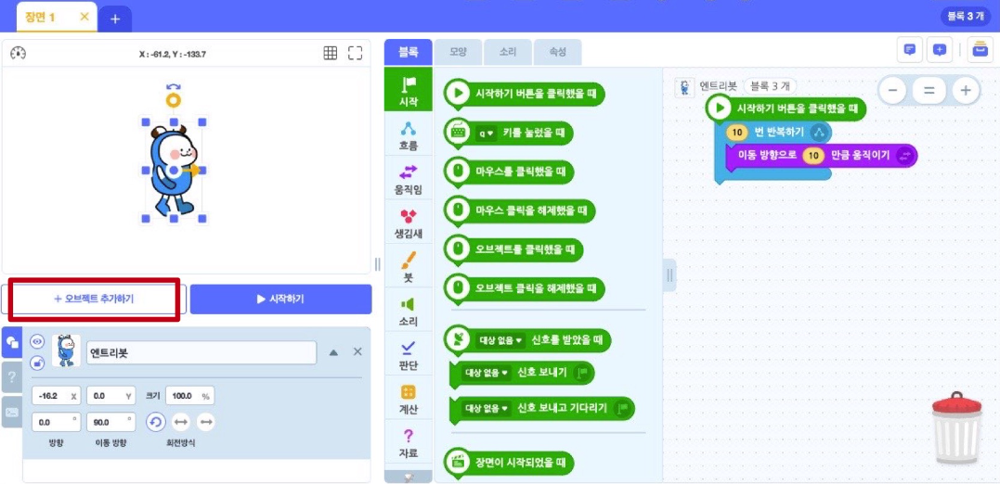 
   
  기본적으로 엔트리에서 제공하는 오브젝트를 사용할 수 있습니다. 이 외에도 파일 올리기, 새로 그리기를 통해 엔트리가 제공하지 않는 나만의 오브젝트를 사용할 수 있습니다.  
    

* 오브젝트 선택 : 엔트리에서 기본으로 제공하는 오브젝트로, 엔트리봇/사람/동물/식물/탈것 등 많은 종류가 있습니다.  

* 파일 올리기 : 자신이 원하는 오브젝트를 찾을 수 없는 경우, 엔트리 외부에서 사진파일을 가져와 추가할 수 있습니다.  

* 새로 그리기 : 기존 오브젝트에서도, 사진 파일 검색에서도 자신이 원하는 오브젝트를 찾을 수 없는 경우, 직접 그림을 그려서 추가할 수 있습니다.  

* 글상자 : 작품 내 글자가 필요할 때, 글상자를 사용합니다. (글상자도 오브젝트라는 것을 다시 한 번 말해줍니다.)  
    
  
  
  오브젝트 선택, 파일 올리기, 새로 그리기, 글상자에 대해 더 자세히 알아봅시다.
  

### **오브젝트 선택**

* 오브젝트 선택 메뉴에서 배경, 캐릭터, 음식 등 원하는 오브젝트를 선택합니다. 한 번에 여러 오브젝트를 선택할 수 있으며, 잘못 추가했더라도 삭제할 수 있습니다. 
  
  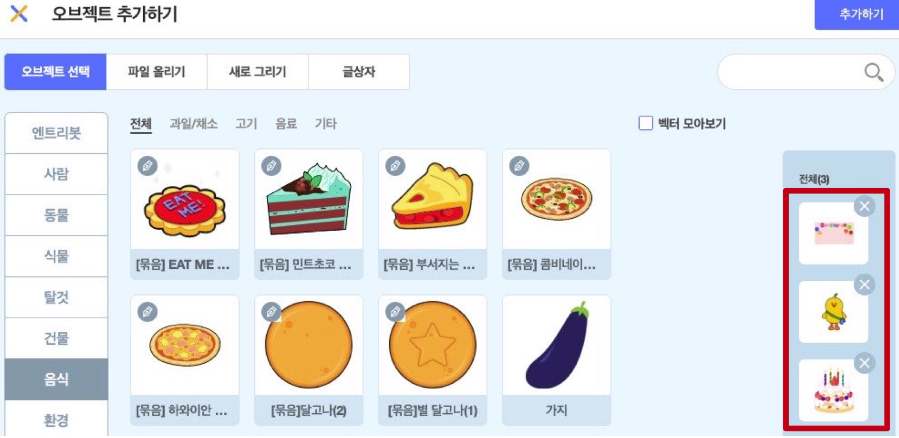 
   
  마우스로 오브젝트를 원하는 위치로 이동시킬 수 있고(좌표 이동), 크기도 변경시킬 수 있다는 것을 보여줍니다. 사용하지 않는 오브젝트는 삭제합니다. 
   
   
   
  🧱 원하는 오브젝트를 선택해 작품을 꾸며봅시다. 
   

### **파일 올리기**

* 오브젝트 선택 메뉴에서 내가 넣고 싶은 오브젝트를 찾을 수 없을 때 원하는 사진을 가져와서 오브젝트로으로 만들 수 있습니다.
* 원하는 사진을 검색 후 다운로드 합니다. 파일 올리기에서 저장한 파일을 가져옵니다. 
   
   
   
  사진의 배경을 지워서 오브젝트로 사용하고 싶을 때에는 [https://www.remove.bg/ko ](https://www.remove.bg/ko)를 사용하면 편리합니다. 
  파일 올리기를 통해 추가한 오브젝트도 엔트리에서 제공하는 기본 오브젝트와 마찬가지로 위치 이동과 크기 조절이 가능함을 보여줍니다. 
   
   
   
  🧱 원하는 배경과 사물을 찾아서 업로드 해봅시다. 
   

### **새로 그리기**

* 새로 그리기에서는 배경, 캐릭터, 사물 등 내가 원하는 오브젝트를을 그릴 수 있습니다. 나만의 오브젝트를 만들어보는 시간을 가집니다. 
   
  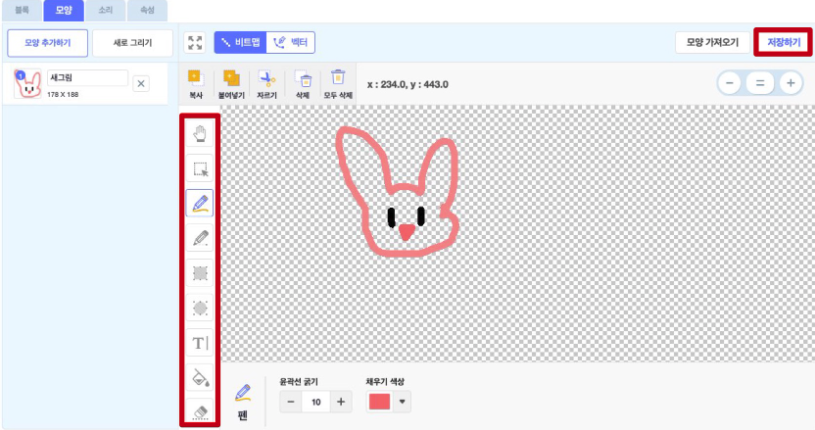 
  
  나만의 오브젝트를 그려 만들어보고 저장한 후, 작품에 추가하여 확인해봅니다. 
  새로 그리기를 통해 추가한 오브젝트도 엔트리에서 제공하는 기본 오브젝트와 마찬가지로 위치 이동과 크기 조절이 가능함을 보여줍니다. 
   
  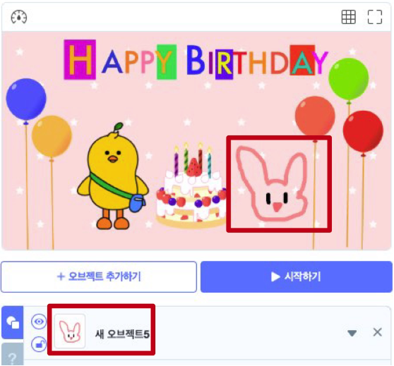 
   
  🧱 원하는 그림을 그려서 작품에 추가해봅시다. 
   

### **글상자**

* 작품에 추가하고 싶은 글이 있을 때, 글상자를 사용합니다. 글씨체, 굵기, 밑줄, 색깔 등을 다양하게 설정할 수 있습니다. 
   
  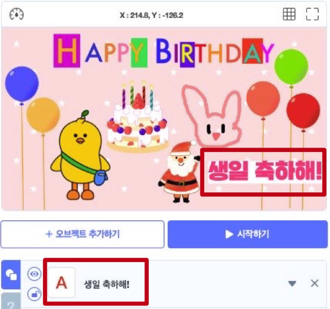 
   
  🧱 추가하고 싶은 글을 적어 취향대로 커스텀한 후 작품에 추가해봅시다. 
   
   

### **오브젝트 움직이기**

오브젝트 애니메이션화 하기 

* 애니메이션이란 정지된 이미지의 전환으로, 사람의 눈에 움직이는 듯한 착각이 들도록 하는 영상입니다. 
   
  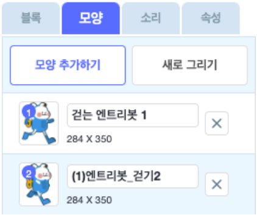 
   

* 엔트리봇의 그림이 다른 모습으로 2개 있습니다. 그림 모양을 번갈아가며 하나씩 클릭해보면 마치 연속하는 동작처럼 보이는데, 이것이 애니메이션의 기본적인 원리입니다. 

* 즉, 정지된 그림 여러장을 빠른 속도로 바꿔주면 마치 움직이는 동작처럼 보입니다. 
   
***
### 🤹🏻 [실습1] 뛰는 엔트리봇 만들기

실습하기

**🕹️ 마우스를 클릭할때마다 뛰는 엔트리봇**

 > 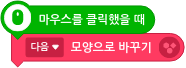 
- **'시작→마우스를 클릭했을 때'**  블록은 마우스를 클릭할때마다 아래에 연결되어있는 블록을 실행시켜주는 블록입니다. 
- **'생김새→다음모양으로 바꾸기** 블록은 오브젝트의 모양 내에서 다음 순서의 모양으로 변경시켜주는 블록입니다. 
  
- **[실행]** '시작하기' 버튼을 누르고 실행시켜보세요. 마우스를 클릭할 때 마다 엔트리의 모양이 변경되는 것을 확인할 수 있습니다. 

**🕹️ 계속 뛰는 엔트리봇**

 > 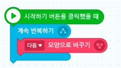 

- **'시작→시작하기 버튼을 클릭했을 때'**  블록은 **시작하기 버튼**을 클릭했을 때  아래에 연결되어있는 블록을 실행시켜주는 블록입니다. 
- **'흐름 → 계속 반복하기'** 블록은 감싸고 있는 모든 블록들을 무한으로 반복하여 실행시켜주는 블록입니다. 
- **'흐름 → 계속 반복하기'**  블록 사이에 **'다음 모양으로 바꾸기'** 블록을 조립하여 무한으로 모양이 변경되게 해주세요. 
- **[실행]** '시작하기' 버튼을 클릭하여 실행시켜보면, 엔트리봇이 뛰는 것처럼 보이지만 너무 빨라 자연스럽지 않습니다.

**[블록 추가]**
 > 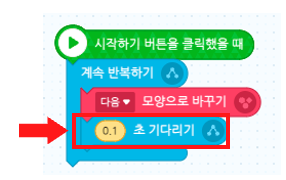 

- **'흐름 → 0.1초 기다리기'** 블록을 추가하여 동작 변경 속도를 조정하여 자연스럽게 만들어 주세요. 

   

   

   ***

## 3. 좌표란? 

좌표란 '위치'라고 할 수 있습니다. 어떤 오브젝트를 움직이고 싶다면 그것을 어느 위치로 이동시키고 싶은가를 알아야 합니다. 배경 위의 위치는 좌표로 알 수 있습니다. 
   
  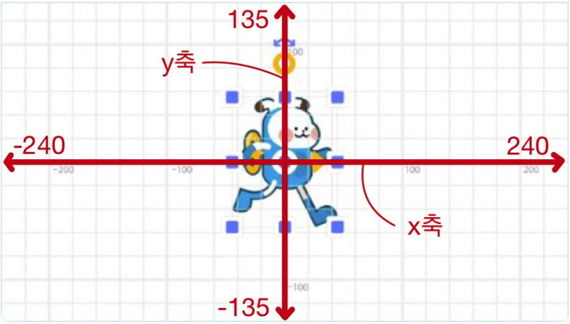 
   

* 좌표는 수평(가로) 위치와 수직(세로) 위치를 (x,y) 형태로 나타내는데, 정중앙에 위치한 점의 좌표가 (0,0)입니다. 

* 중앙 점을 기준으로 좌, 우 방향이 각각 x 축의 -와 + 방향이고, 상, 하 방향이 각각 y 축의 +와 - 방향입니다. 
   

* 좌표의 범위는 다음과 같습니다. 
  ﹒ x값: -240  ~ 240 
  ﹒ y값: -135  ~ 135 
   

### **상대좌표와 절대좌표**

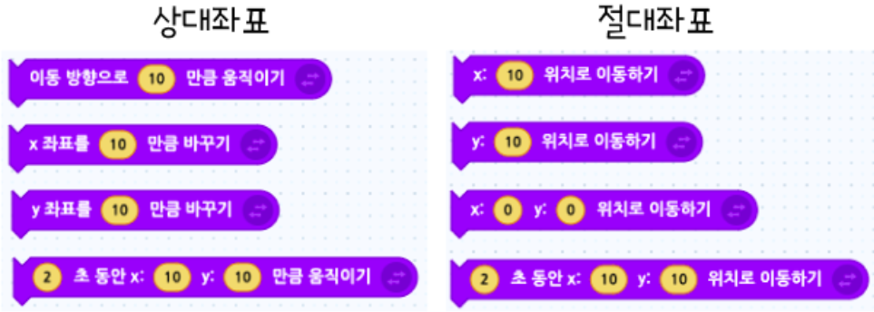 
 
움직임 분류에 속한 블록 중에 오브젝트 좌표 이동과 관련한 블록들이 있습니다. 위와 같은 블록들이 대표적입니다. 
 
- 상대좌표에 있는 블럭들은 오브젝트가 공란에 입력된 **x좌표 또는 y좌표 만큼** 이동합니다. 
- 절대좌표에 있는 블럭들은 오브젝트가 공란에 입력된 **x좌표 또는 y좌표로** 이동합니다. 

### 🤹🏻 [실습2] 이동하는 엔트리봇 만들기

실습하기

**🕹️ 절대 좌표 실습**   

 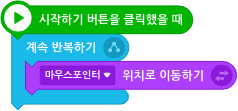 
   
* 이 코드는 엔트리봇이 나의 마우스 포인터를 따라오게하는 코드입니다. 
  

**🕹️ 상대 좌표 실습**   

 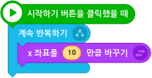 

  * 이 코드는 엔트리봇이 계속에서 오른쪽으로 이동하게 해주는 코드입니다. x좌표  이동값을 더 크게해주면 더 빠른 속도로 이동합니다. 

   

   

   

### 🤹🏻 [실습3] 계속 움직이는 엔트리봇 만들기

실습하기

양쪽 벽을 왕복하며 뛰는 엔트리봇을 만들어봅시다. 

> 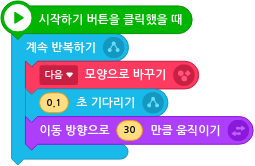 

- 위에서 실습한 내용을 바탕으로 다음과 같이 블록을 작성합니다. 
   
   *배경은 공간이 제한되어 있기 때문에 엔트리봇이 계속 한 방향으로 가다보면 벽을 통과해 사라지게 됩니다.

**[블록추가]**

> 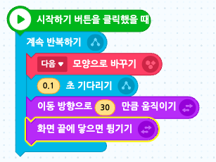 
- **'움직임 → 화면 끝에 닿으면 튕기기'** 블록을 추가하면, 화면에서 사라지지는 않고 벽을 왕복하며 뜁니다.
   
   *그러나, 벽에 튕겼을 때 엔트리봇의 상하좌우가 모두 바뀌는 것을 확인할 수 있습니다. 

**[블록추가]**

> 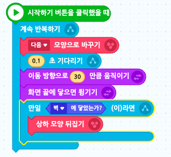 

  -  **'흐름 → 만약  ~라면', '판단 →  벽에 닿았는가?'** 블록을 사용하여 **"만일 벽에 닿았는가?"** 라는 조건을 추가해주세요. 
  -  해당 조건이 참일 때 **'생김새 → 상하 모양 뒤집기'** 블록을 추가해주세요. 

**[점프 기능 추가]**

스페이스키를 누르면 엔트리 봇이 점프하도록 하는 블록을 추가해봅시다.

> 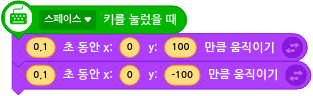

 
🧱 작품을 시작하여 완성된 결과를 확인해봅시다. 

 

<!-- 

추가 실습 예제 

 -->
