# 04. 상어를 피해라 

  

🎮  **오늘 만들 게임 완성본**   
[https://naver.me/FfAIduuz](https://naver.me/FfAIduuz) 

## 1. 게임 개요

- 이번 시간에는 방향키를 이용하여 움직이고 상어를 피해 먹이를 먹는 게임을 만들어봅니다.
- 변수를 설정하고 먹이 오브젝트에 닿으면 먹이 변수가 +1 되는 것, 상어 오브젝트에 닿으면 변수가 -1 되는 것 등의 기능을 만들어봅니다.

## 2. 게임 제작하기

### 🧩 오브젝트 추가하기
> 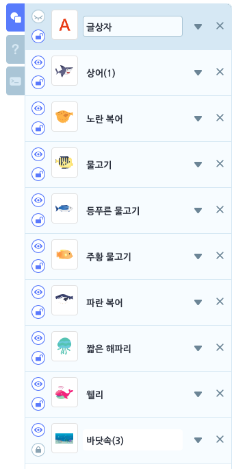
- '바닷속'(배경), 상어, 노란 복어, 물고기, 등푸른 물고기, 주황 물고기, 파란 복어, 짧은 해파리, 웰리 오브젝트를 추가해줍니다. 
- 오브젝트들의 크기를 조정해주세요.

### 🧩 신호 및 변수 추가하기

**📦 생명, 먹이 변수**

> 
- '생명', '먹이'라는 이름의 변수를 추가하세요. 

**🛜 게임 오버 신호**
- 게임 속성에서 'game over'라는 이름의 신호를 추가해주세요.
  
**🛜 게임 승리 신호**
- 게임 속성에서 'you win'라는 이름의 신호를 추가해주세요. 

### 🧩 웰리 
>    
- 웰리 오브젝트를 선택하세요

> 
- '먹이'변수를 0으로 초기화 해주세요 
- '생명' 변수는 3으로 초기화 해주세요. 
-  방향 키 클릭에 따라 웰리가 움직일 수 있도록 반복문과 조건문을 사용하여 코딩해주세요. 

### 🧩 물고기 
> 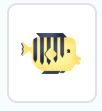
 - 물고기 오브젝트를 선택하세요

 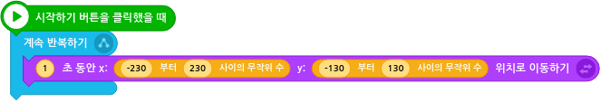
 - 물고기가 1.5초 동안 무작위 위치로 이동하도록 해주세요. 
  

> 
- '웰리'가 이 '물고기'에 닿은 경우, '물고기'를 숨겨주고 '먹이'변수에 1을 더해주세요.   
  *'물고기'가 '웰리'에 닿았는지는 계속 반복하며 무한으로 체크 해주어야하기에 '계속 반복하기' 블록을 사용합니다. 

- 더 생생한 게임을 위해 효과음도 추가해주세요. 
  
### 🧩 노란복어, 등푸른 물고기, 주황 물고기, 파란 복어, 짧은 해파리   
   

**노란복어, 등푸른 물고기, 주황 물고기, 파란 복어, 짧은 해파리** 오브젝트 에도 위에서 **물고기** 오브젝트에서 사용한 블록을 동일하게 사용해 줄 예정입니다. 

**모든 먹이에 동일 코드 적용**
- **물고기** 오브젝트의 블록을 모두 복사하여 **노란복어, 등푸른 물고기, 주황 물고기, 파란 복어, 짧은 해파리** 오브젝트에 각각 붙여넣어주세요.

**먹이별 코드 세부 수정**   

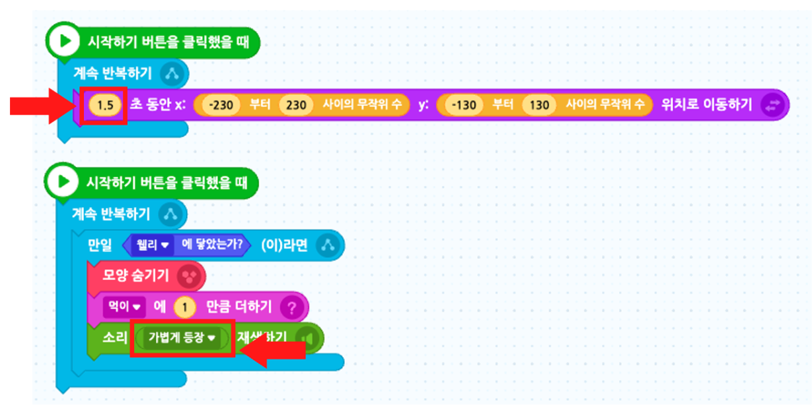
- 각 먹이별로 **이동 시간**과 '웰리'에 닿았을 때의 **효과음** 만 변경해주세요.
  - 이동시간 1.5/2/2.5/3/3.5 초 
  - 효과음 샤랑하고 등장/보글거리며 등장/또이/정답/상태 변경 알림3

    *해당 이동시간과 효과음은 예시일뿐, 자유롭게 변경해도 괜찮다는 것을 알려줍니다. 

### 🧩 상어 
> 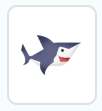
- 상어 오브젝트를 선택하세요
  
**상어의 움직임**
> 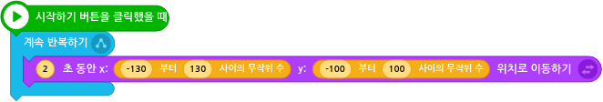
- 상어가 2초 간격으로 무작위의 위치로 이동하도록 해주세요. 

**생명감소시키기/게임종료신호보내기**
> 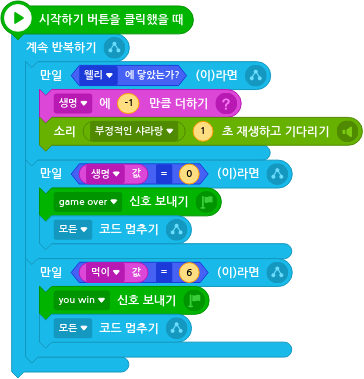

- **상어**는 유일하게 **웰리**에게 유해한 오브젝트에요. 그래서 웰리는 **상어**를 피해다녀야 합니다 !
- **상어**에 **웰리**가 닿았을 경우 **생명** 변수를 1만큼 감소 시켜주어야합니다. 
- (선택) 생명이 감소될 때 효과음도 추가해주세요

- **생명** 변수가 0이 되었을 때 **game over** 신호를 보내주세요.
- 이후, 모든 코드를 멈춰주어야합니다. 

- **먹이** 변수가 6이 되었을 때 **you win**  신호를 보내주세요.
- 이후, 모든 코드를 멈춰주어야합니다. 

### 🧩 종료 메세지 상자 만들기 
> 
- 글상자 오브젝트를 선택하세요

**글상자 크기 및 위치 조정** 

> 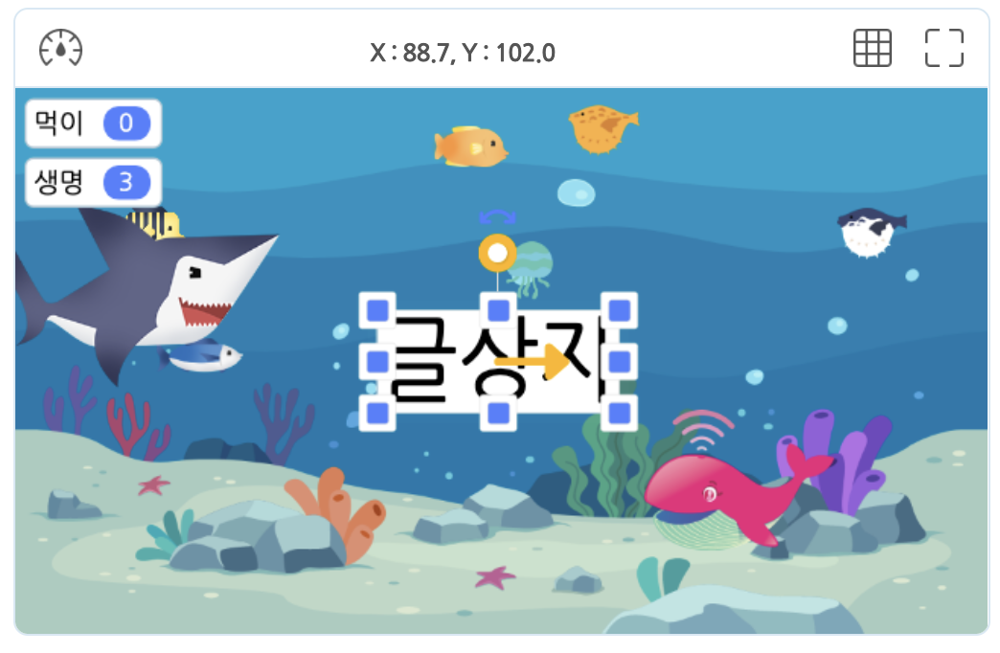 
- 글상자가 게임 화면의 가운데 오도록 위치시킨 후 적당한 크기로 조정하세요. 

**글상자 배경색 없애기**   
> > 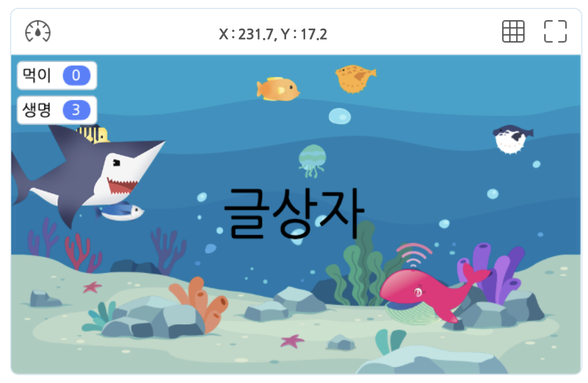

- **글상자** 설정에서 **배경색 설정** 버튼을 선택한 후 체크 해제하여 배경색이 투명색이 되도록 설정해주세요. 
  
**글상자 띄우기** 
> 
- 게임이 시작되었을 때는 글상자가 보이지 않도록 해주세요.

> 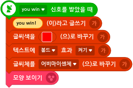
- **you win신호** 를 받았을 때, 메세지에 "you win" 메세지를 출력하게 하세요. 
- (선택) 글씨색, 볼드효과, 글씨체를 변경해주세요. 
- 숨겨져있던 글상자를 보이게 해주세요. 
  

> 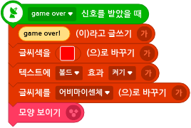
- **game over신호** 를 받았을 때, 메세지에 "game over" 메세지를 출력하게 하세요. 
- (선택) 글씨색, 볼드효과, 글씨체를 변경해주세요. 
- 숨겨져있던 글상자를 보이게 해주세요. 

<!-- 

 요약 

 -->