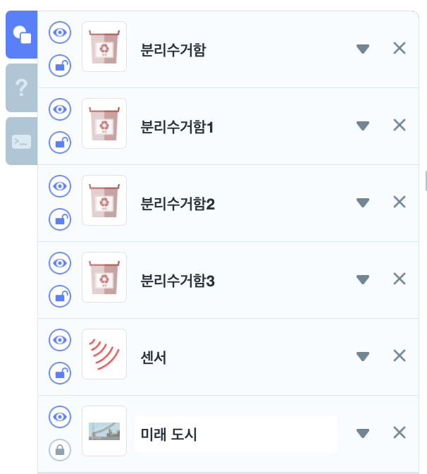
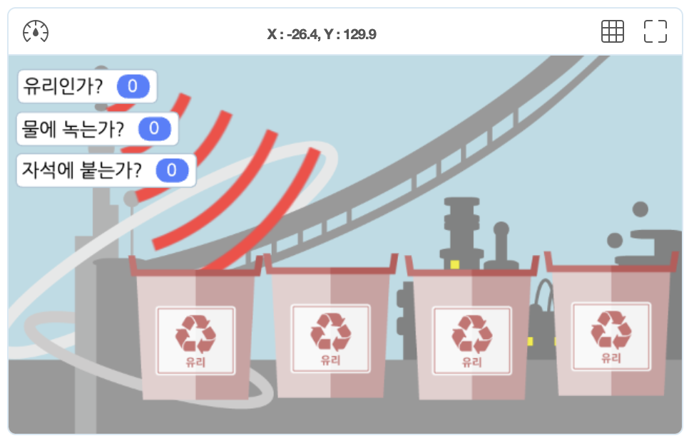
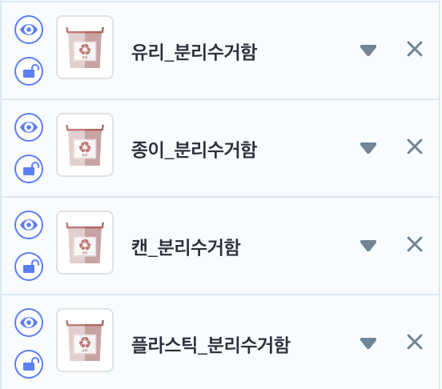
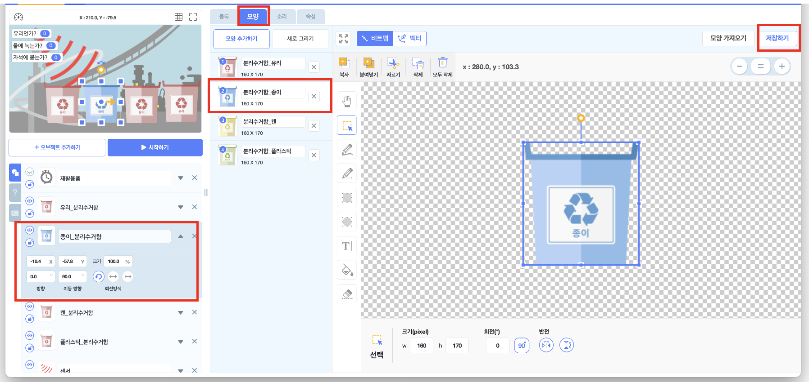
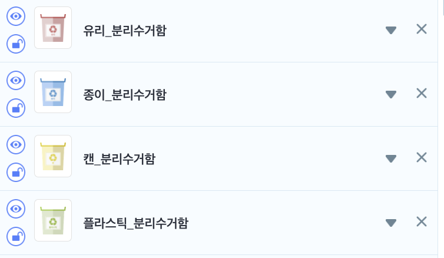
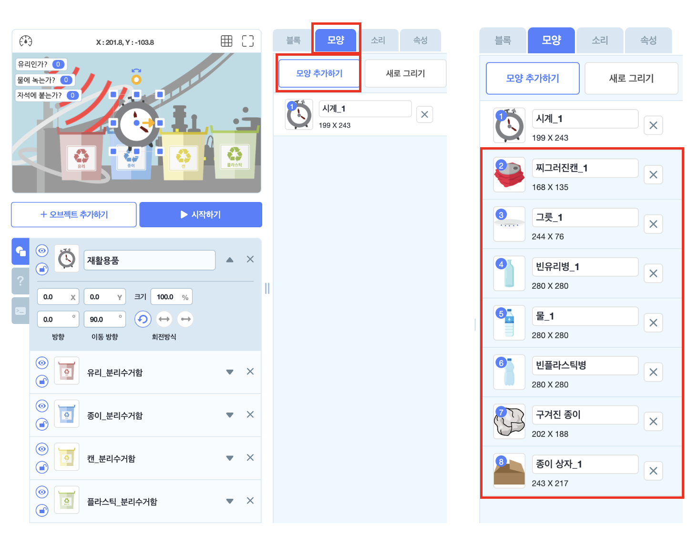
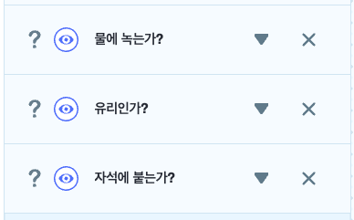
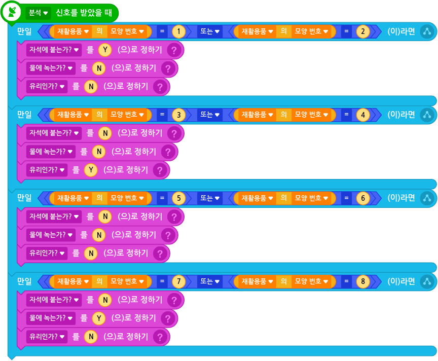
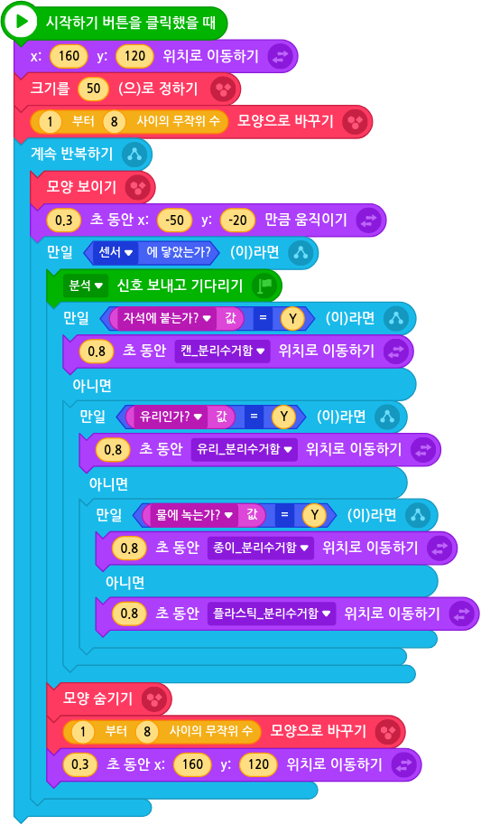

# 10. 자동 분리수거하기

🚩 

🎮  **오늘 만들 게임 완성본**   
[https://naver.me/5pwfSlFZ](https://naver.me/5pwfSlFZ) 

## 1. 게임 개요

- 자동 분리수거 기계를 만들어봅시다. 

## 2. 게임 제작하기

### 🧩 오브젝트 추가하기
> 
-  분리수거 오브젝트4개와 센서, 미래도시를 추가하세요.
-  분리수거 오브젝트는 1개를 생성 후, 복제하여 총 4개를 생성해주세요. 

- 센서와, 분리수거함들의 크기와 위치를 조정하여 배치시켜주세요. 

> 
- 분리수거함의 이름을 각각 '유리_분리수거함', '종이_분리수거함', '캔_분리수거함','플라스틱_분리수거함'으로 변경시켜주세요. 

> 

- 이후, '모양'탭에 들어가서 각 오브젝트의 이름에 맞는 모양을 선택한 후 '저장하기'를 눌러주세요. 
  
> 
- 이렇게 완성되어야해요. 

  **재활용품 추가**

> 
- 시계 오브젝트를 추가해주세요. 

> 
- 오브젝트의 이름을 '재활용품'으로 변경시켜주세요.
  
> 

- 모양탭에서 '모양추가'하기를 선택하여 다양한 재활용품 오브젝트를 추가해주세요. 
- 선생님 화면의 오브젝트 순서와 동일하게 해주세요. 

### 🧩 신호 및 변수 추가하기 

**🛜 분석 신호**
- 속성에서 '분석'이라는 신호를 추가해주세요.

**📦 변수 추가**
> 
- '물에 녹는가?' , '유리인가?', '자석에 붙는가?' 라는 3개의 변수를 추가해주세요. 

### 🧩 센서 코딩하기 
> 

### 🧩 재활용품 코딩하기 

> 

