# 11. 패턴의 미학 

🎮  **오늘 만들 게임 완성본**   
[https://naver.me/xeAjRW2B](https://naver.me/xeAjRW2B) 

## 1. 게임 개요
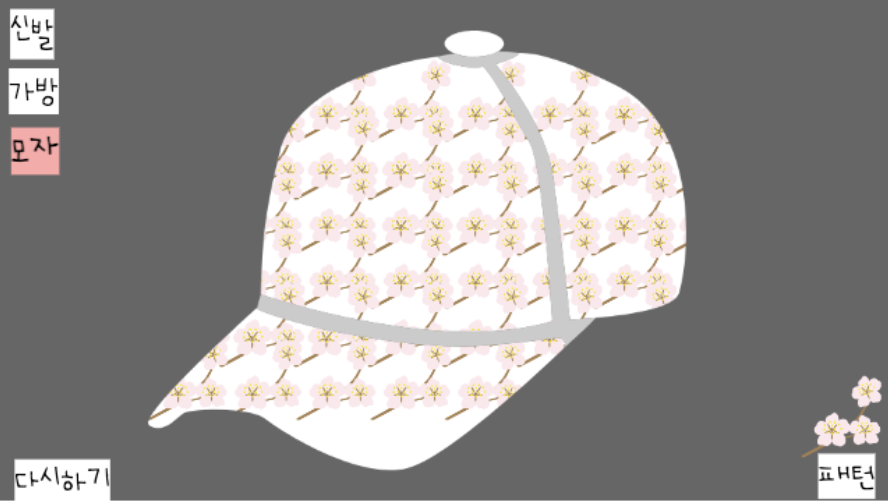
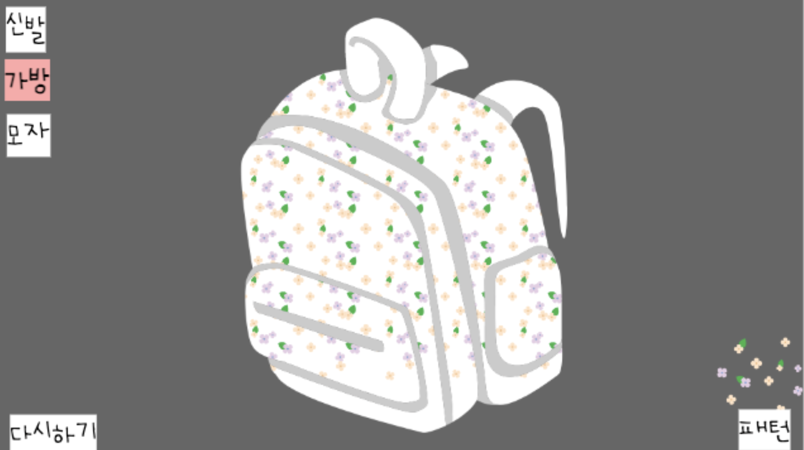

- 다양판 패턴을 활용하여 그 패턴으로 신발, 가방, 모자를 다채롭게 꾸며보는 프로그램
  

## 2. 게임 제작하기

### 🧩 오브젝트 추가하기
**글상자 추가** 
> 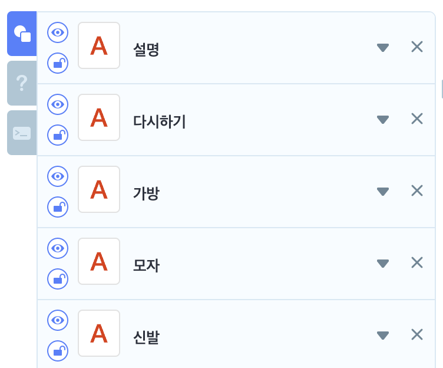
- 5개의 글상자 추가 및 글상자 이름 수정
  
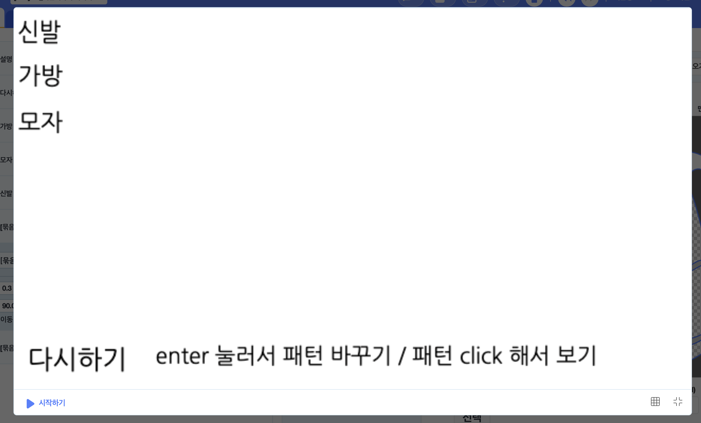
- 각 글상자 내용 수정 
  - 설명 : enter 눌러서 패턴 바꾸기 / 패턴 click 해서 보기 
  - 다시하기 : 다시하기
  - 가방 : 가방 
  - 모자 : 모자 
  - 신발 : 신발
  
> 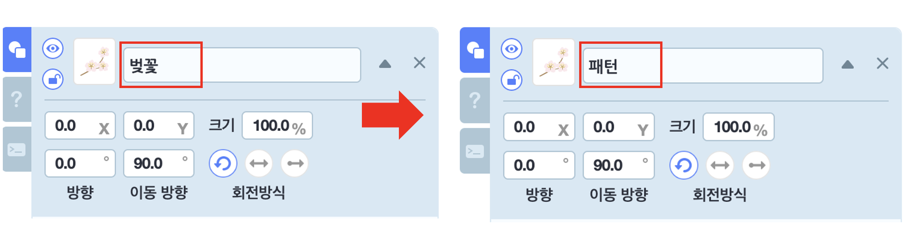
- 벚꽃 오브젝트 추가 후, 이름(패턴) 변경 

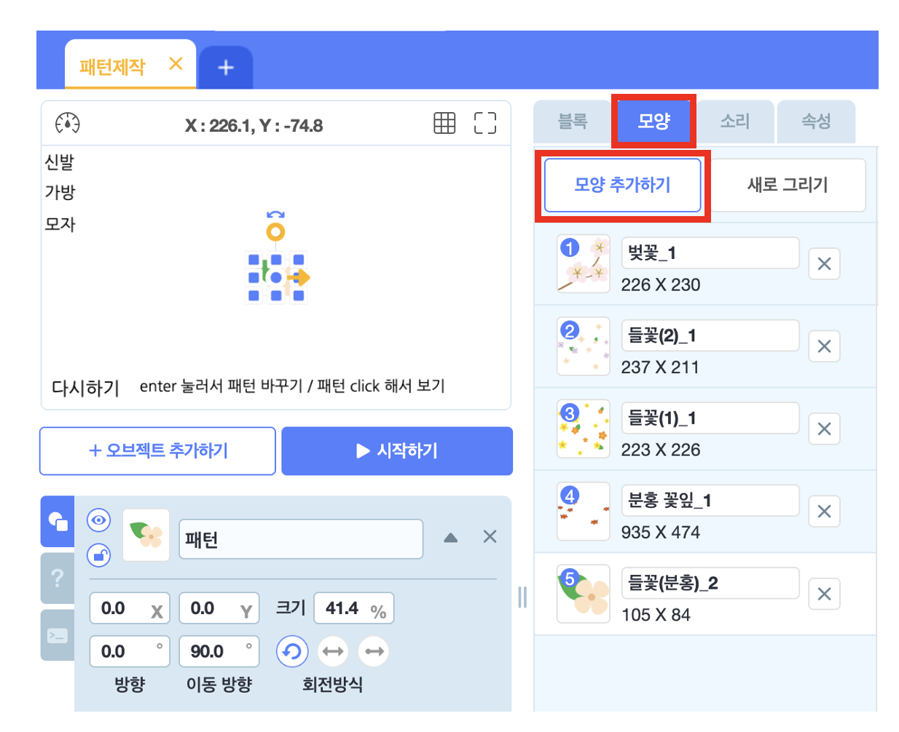
- '패턴' 오브젝트 내에 다양한 모양의 꽃 오브젝트 추가 
- 5개의 꽃 패턴의 크기를 일정하게 통일 후 저장 

(선택) 
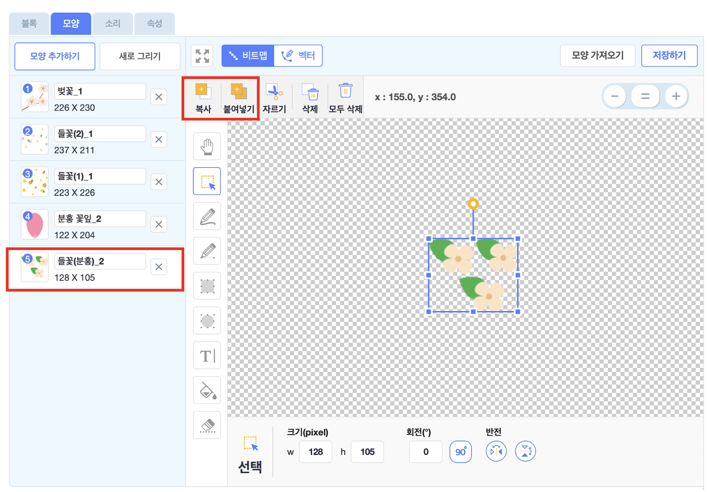
- '들꽃(분홍)_2' 모양을 복사/붙여넣기를 활용하여 3개로 이루어진 패턴으로 변경 

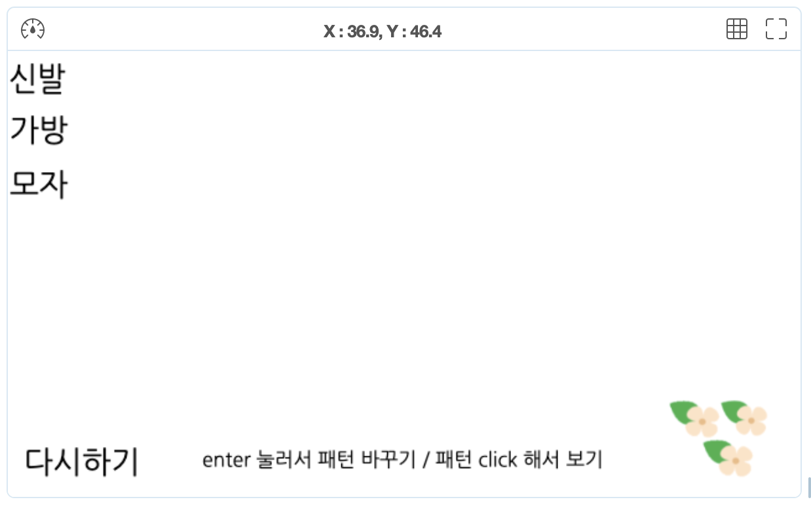
- 패턴 위치 변경 및 크기 조정 

> 
- 신발, 가방, 모자 프레임, 액차 추가
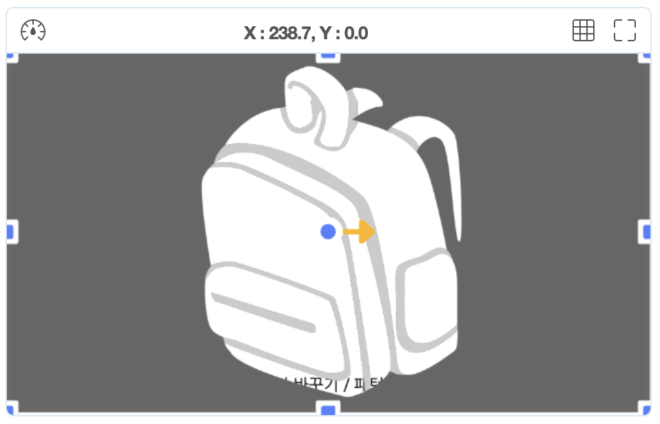
- 신발, 가방, 모자 프레임을 화면의 크기에 맞게 조정 
- 
> 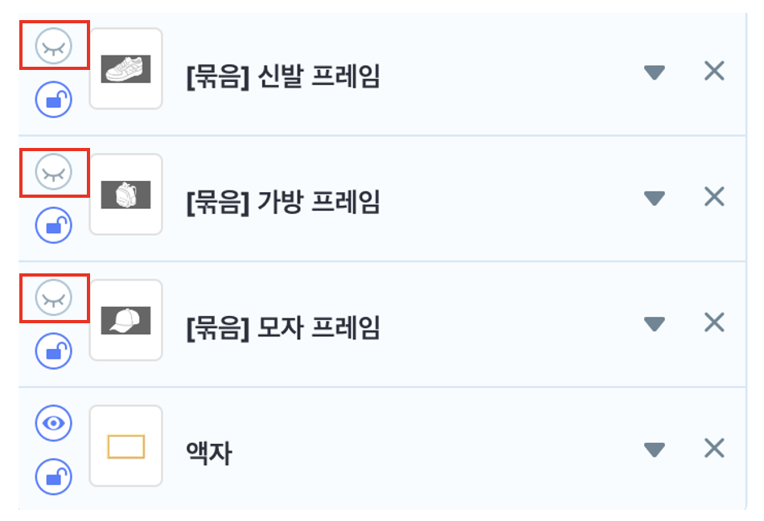
- 신발, 가방, 모자 프레임 숨기기 

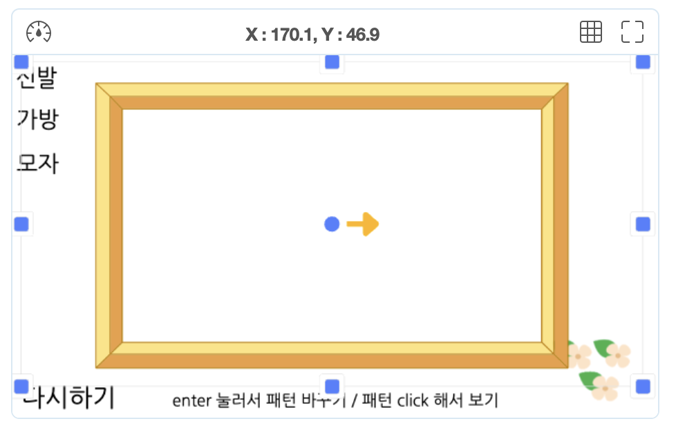
- 액자 크기 조정 

### 🧩 신호 및 변수 추가하기 

🛜 신호 추가 
> 
- 모자, 가방, 신발 신호 추가  

 요약 

