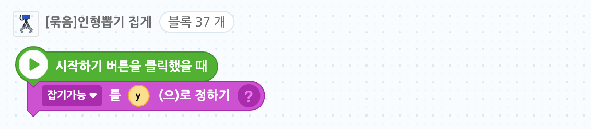
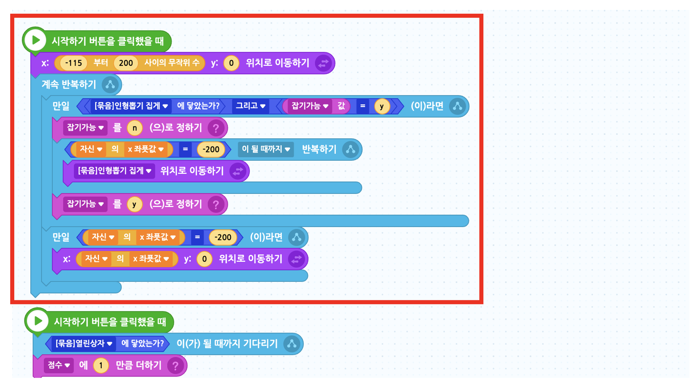

# 12. 인형뽑기 게임 

🙂 이번 시간에는 집게를 움직여 인형을 뽑는 프로그램을 만들어봅니다.
🚩 오브젝트 그리기, 좌표 이동, 다른 오브젝트의 좌표 따라가기, 오브젝트간의 상호작용에 대해 이해하고 활용할 수 있습니다.

### 🎮  **오늘 만들 게임 완성본**   
[https://naver.me/GfCgVq2Y](https://naver.me/GfCgVq2Y) 

## 1. 게임 개요

## 2. 게임 제작하기

### 🧩 오브젝트 추가하기

**배경추가** 

- 오브젝트 추가하기 > 새로그리기 에서 도형을 활용하여 배경을 직접 그려주세요. 
  
  
* 크기와 색상은 완벽히 똑같지 않아도 됩니다. 
* 그리기가 어려운 학생은 선생님에게 이미지 파일을 요청해주세요. 
  * 오브젝트 추가하기 > 파일 올리기에서 선생님께 받은 이미지를 업로드 해주세요. 

> 
- 배경 설정 완료 

**집게 추가 및 크기 설정** 

> 
- '[묶음]인형뽑기 집게'를 추가해주세요.

> 
- 크기는 60으로 설정해주세요.

- 집게는 왼쪽 위에 오도록 설정해주세요. 

**인형 추가 및 크기 설정**

> 
- 7개의 인형을 추가 해주세요.(원하는 인형을 추가하셔도 됩니다.)

> 
- 곰인형의 크기를  70으로 설정해주세요.

- 곰인형의 크기를 기준으로 다른 인형들의 크기는 수동으로(드래그하여) 조정해주세요. 
  - 인형들의 원래 크기가 모두 다르기에 모두 수치로 조정할 경우, 크기가 뒤죽박죽이 될 거에요. 

**박스추가** 

> 
- '[묶음]열린상자'를 추가해주세요

- 상자를 왼쪽 아래에 이동시켜주세요. 

**버튼추가** 

> 
- 이동버튼 2개와 결과확인버튼을 추가해주세요. 
- 이동버튼은 집게를 좌우로 이동하는 버튼, 결과확인버튼은 인형을 잡는 버튼으로 사용할거에요. 
  

- 이동버튼 중 하나는 '모양' 탭에 들어가서 '이동버튼_이전'을 선택한 다음 저장해주세요.
  

- 버튼의 크기는 각각 40,40,50으로 설정해주세요. 
  

- 버튼 3개 모두 오른쪽 아래로 이동시켜주세요. 

> 
- 버튼들의 이름을 각 기능에 따라 변경시켜주면 나중에 코딩을 할 때 더 편리하겟죠?

### 🧩 신호 및 변수 추가하기 

🛜 **신호추가**

> 
- '잡기' 신호 추가
  

📦 **변수추가**

> 

- 집게 초기위치x, 집게 초기 위치y, 점수, 방향, 기회 변수 추가 

-집게 초기위치x, 집게 초기 위치y, 방향 변수는 '숨기기' 설정을 해주세요.
  
### 🧩 이동버튼 코딩하기 

**⬅️ 왼쪽 이동 버튼**

> 
- '왼쪽 이동 버튼' 오브젝트를 클릭했을 때 방향 변수가 'L'이 되고, 클릭을 해제했을 때 방향 변수가 '0'이 되도록 설정해주세요. 

**➡️오른쪽 이동 버튼**

> 

-'오른쪽 이동 버튼' 오브젝트를 클릭했을 때 방향 변수가 'R'이 되고, 클릭을 해제했을 때 방향 변수가 '0'이 되도록 설정해주세요. 

### 🧩 잡기 버튼 코딩하기 

> 

- '잡기 버튼' 오브젝트를 클릭했을 때 집게가 인형을 잡을 수 있도록 '잡기' 신호를 보내주세요. 

### 🧩 집게 코딩하기 

**집게 위치 저장 및 모양 초기화**

> 
- 집게의 초기 위치를 기억하기 위해 '집게 초기 위치 x', '집게 초기 위치 y' 변수에 현재 집게 위치 좌표값을 저장해주세요.
- 해당 변수들은 다음에 사용할 예정이에요. 

**좌우로 움직이는 집게**

> 

- 이동 버튼 클릭에 따라 집게가 좌우로 움직이도록 블록을 조립해주세요. 

**인형을 잡는 집게**

인형을 잡는 코드는 순차대로 작성해 보려 합니다. 

**1. 기회 감소 (-1)**

- '잡기' 신호를 받았을 때 잡을 수 있는 기회를 저장하고 있는 '기회' 변수 값을 1만큼 감소시켜주세요. 
- 이 때, 집게 위치 및 모양에 대한 변화는 따로 없습니다. 

**2.하강**

- 집게가 아래로 내려가면서 벌려있던 집게가 모아진 모양으로 바뀌도록 해주세요. 

**3. 상승**

- 집게가 다시 위로 올라오도록 합니다.

**4. 좌로이동**

- 집게가 상자 위로 이동하도록 하고, 집게를 다시 벌리도록 해주세요. 

**5.원위치 복귀**

- 집게가 원위치록 이동하도록 해주세요. 

### 🧩 인형 코딩하기 

**인형 중심점 이동**

- 모든 인형들의 중심점을 위로 올려주세요. 

**인형 위치 랜덤으로 설정**

- 게임을 실행할 때마다 인형의 위치가 변하도록 설정해주세요.

**인형 잡기**

- 인형 오브젝트가 집게에 닿았다면 집게 위치로 이동하도록 해주세요.

- 인형 오브젝트가 상자 위로 이동했다면 인형이 상자 안으로 이동하도록 해주세요. 

- 인형 오브젝트가 상자 오브젝트에 닿았다면(상자안에 들어갔다면) 점수를 1점 더해주세요.

**인형 완성 코드**

다음 코드들을 복사하여 **모든 인형 오브젝트**에 붙여넣기 해주세요.

### 🧩 글상자 코딩하기 
> 

- 게임 종료를 알리는 글상자를 원하는 대로 디자인해주세요. 

- 게임 시작시에는 글상자가 보이지 않도록 설정해주세요. 
- 점수가 7점, 즉 모든 인형을 뽑았다면 '성공' 기회는 더 이상 없지만 점수가 7점 이하라면 '실패' 메세지가 보여지도록 해주세요.

## 게임 업그레이드 (ver2)

위 게임에서는 한번의 기회로 집게가 여러개의 인형을 뽑을 수 있었습니다.
'인형' 오브젝트들의 코드를 수정하여 한번에 인형 한개만 잡을 수 있도록 해봅시다. 

### 🧩 변수 추가 

> 

- '잡기가능'이라는 이름의 변수를 추가해주세요. 

### 🧩 집게 코드 추가

- '잡기가능'변수의 값을 'y'로 초기화 해주세요. 
- 잡을 수 있는 상태일 때는 yes의 'y' , 없는 상태일 때는 no의 'n'으로 설정해줄 예정입니다. 

### 🧩 인형 코드 변경

- 모든 인형들의 코드를 위와 같이 수정해주세요. 
  
- 인형은 집게에 닿았을 때, '집기가능' 변수값이 'y'일 때만 잡히도록 설정하고 인형을 이미 하나 집은 상태에서는 '집기가능' 변수를 'n' 으로 설정해줍니다. 
- 또한 인형을 상자 안으로 이동시킨 후에는 다시  '집기가능' 변수 값을 y로 변경시켜주면 됩니다. 

이제 집게는 한번에 한개의 인형만 잡을 수 있게 되었어요 ! 

### 🎮 **ver2 완성본**   
[https://naver.me/GPdzGist](https://naver.me/GPdzGist) 
