# 12. 인형뽑기 게임 (수정중)

🙂 이번 시간에는 집게를 움직여 인형을 뽑는 프로그램을 만들어봅니다.
🚩 오브젝트 그리기, 좌표 이동, 다른 오브젝트의 좌표 따라가기, 오브젝트간의 상호작용에 대해 이해하고 활용할 수 있습니다.

🎮  **오늘 만들 게임 완성본**   
[https://naver.me/G1sqWKBz](https://naver.me/G1sqWKBz) 

## 1. 게임 개요
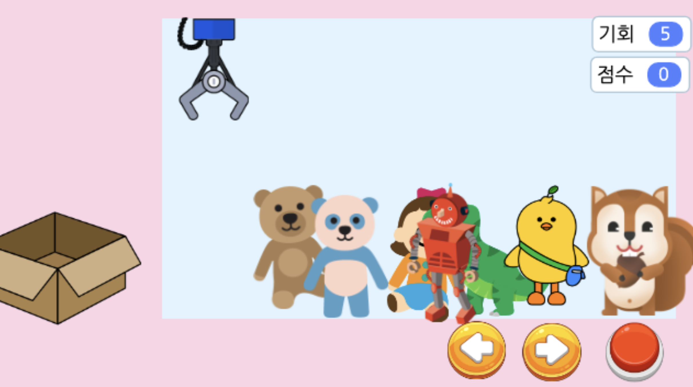

## 2. 게임 제작하기

### 🧩 오브젝트 추가하기

**배경추가** 

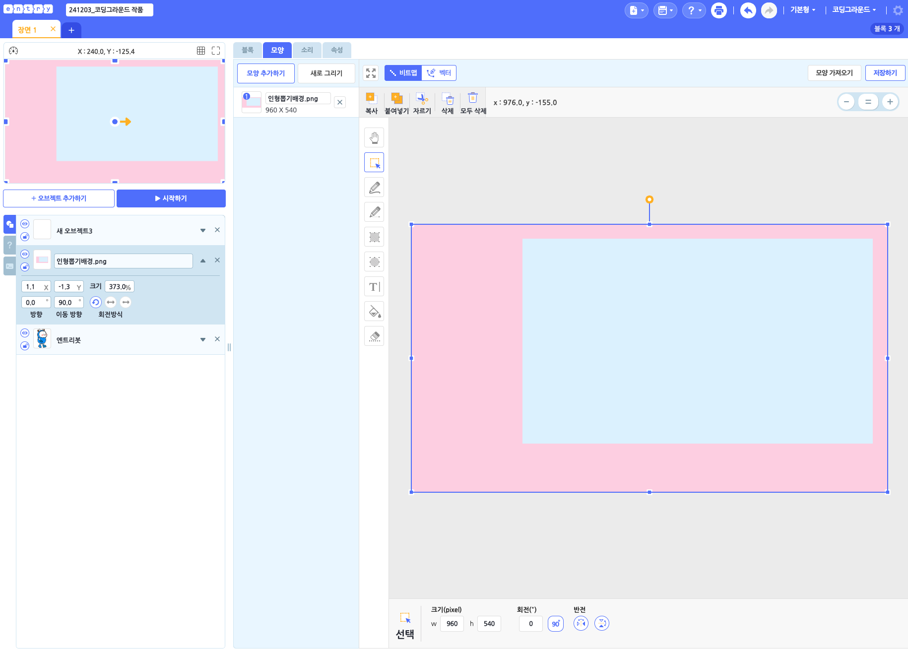

- 오브젝트 추가하기 > 새로그리기 에서 도형을 활용하여 배경을 직접 그려주세요. 
  
  
* 크기와 색상은 완벽히 똑같지 않아도 됩니다. 
* 그리기가 어려운 학생은 선생님에게 이미지 파일을 요청해주세요. 
  * 오브젝트 추가하기 > 파일 올리기에서 선생님께 받은 이미지를 업로드 해주세요. 

> 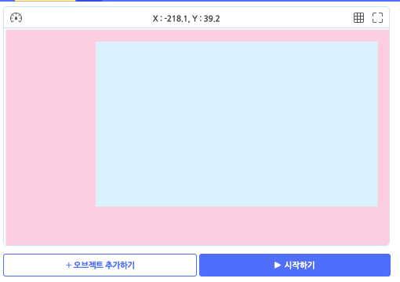
- 배경 설정 완료 

**집게 추가 및 크기 설정** 

> 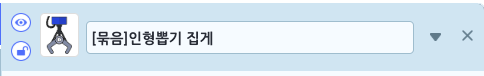
- '[묶음]인형뽑기 집게'를 추가해주세요.

> 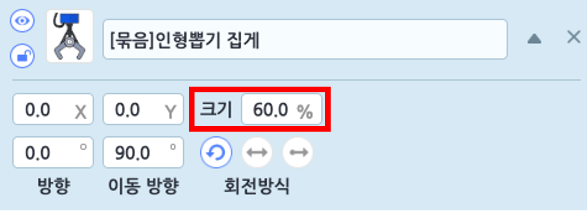
- 크기는 60으로 설정해주세요.

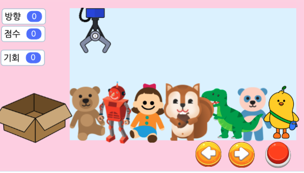
- 집게는 왼쪽 위에 오도록 설정해주세요. 

**인형 추가 및 크기 설정**

> 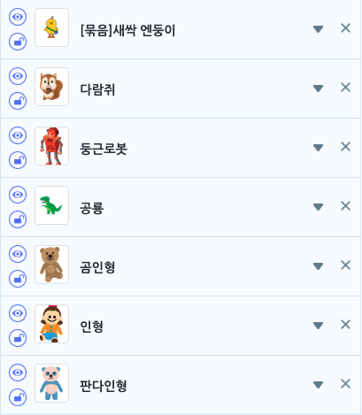
- 7개의 인형을 추가 해주세요.(원하는 인형을 추가하셔도 됩니다.)

> 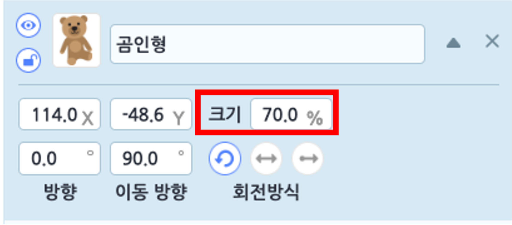
- 곰인형의 크기를  70으로 설정해주세요.

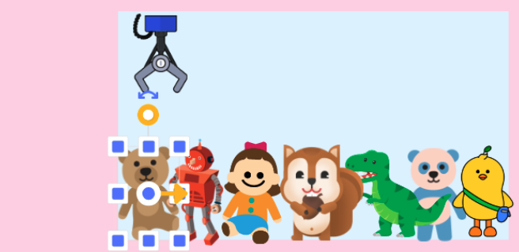
- 곰인형의 크기를 기준으로 다른 인형들의 크기는 수동으로(드래그하여) 조정해주세요. 
  - 인형들의 원래 크기가 모두 다르기에 모두 수치로 조정할 경우, 크기가 뒤죽박죽이 될 거에요. 

**박스추가** 

> 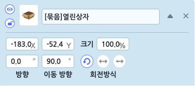
- '[묶음]열린상자'를 추가해주세요

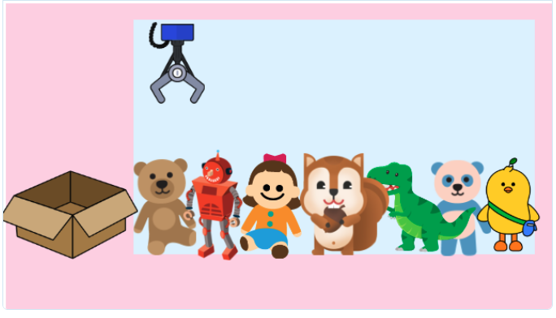
- 상자를 왼쪽 아래에 이동시켜주세요. 

**버튼추가** 

> 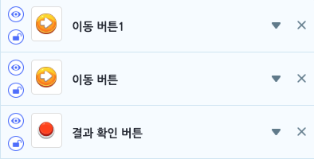
- 이동버튼 2개와 결과확인버튼을 추가해주세요. 
- 이동버튼은 집게를 좌우로 이동하는 버튼, 결과확인버튼은 인형을 잡는 버튼으로 사용할거에요. 
  
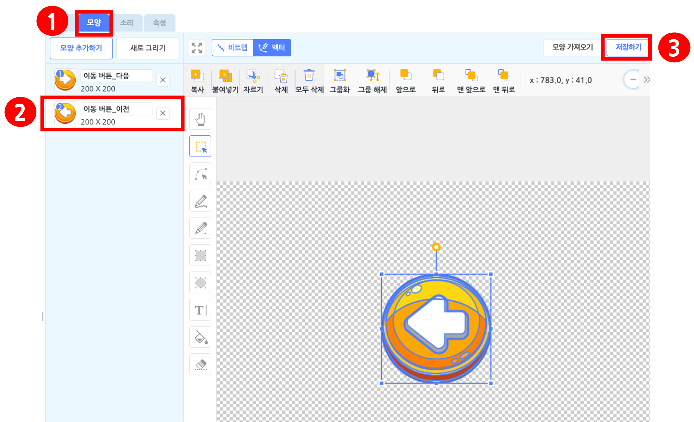
- 이동버튼 중 하나는 '모양' 탭에 들어가서 '이동버튼_이전'을 선택한 다음 저장해주세요.
  
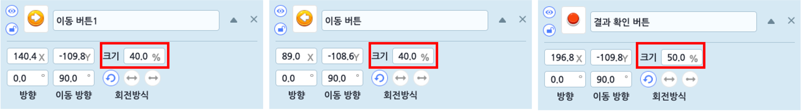
- 버튼의 크기는 각각 40,40,50으로 설정해주세요. 
  
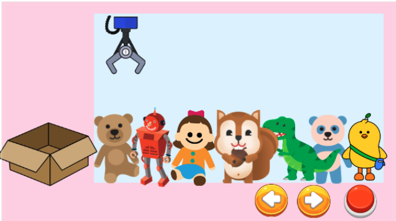
- 버튼 3개 모두 오른쪽 아래로 이동시켜주세요. 

> 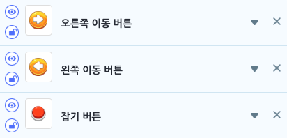
- 버튼들의 이름을 각 기능에 따라 변경시켜주면 나중에 코딩을 할 때 더 편리하겟죠?

### 🧩 신호 및 변수 추가하기 

🛜 **신호추가**

> 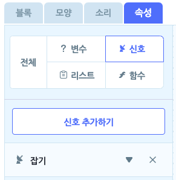
- '잡기' 신호 추가
  

🛜 **변수추가**

> 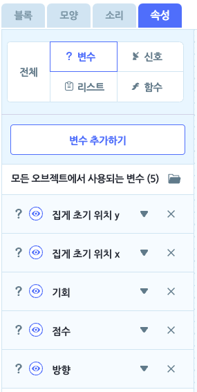

- 집게 초기위치x, 집게 초기 위치y, 점수, 방향, 기회 변수 추가 
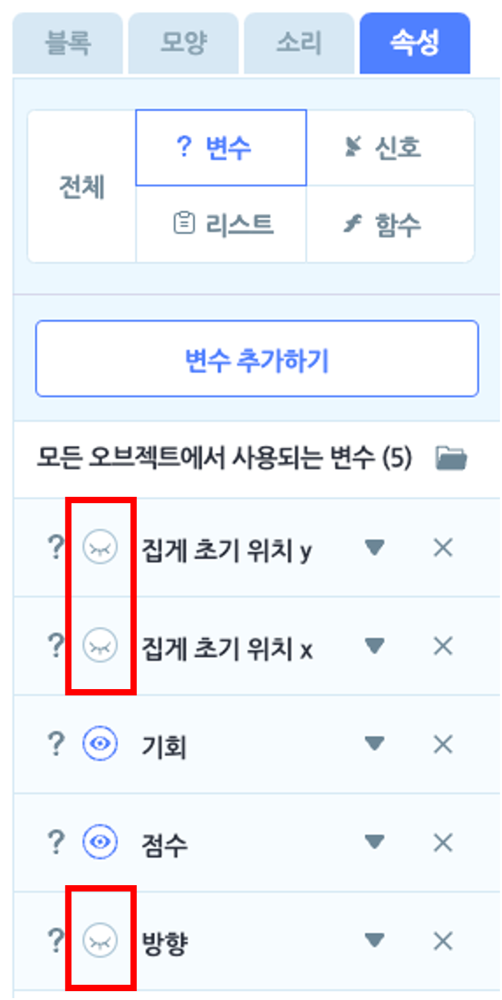

-집게 초기위치x, 집게 초기 위치y, 방향 변수는 '숨기기' 설정을 해주세요.
  
### 🧩 이동버튼 코딩하기 

**⬅️ 왼쪽 이동 버튼**

> 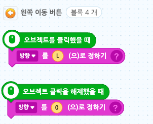

**➡️오른쪽 이동 버튼**

> 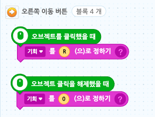

### 🧩 잡기 버튼 코딩하기 

> 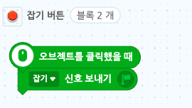

### 🧩 집게 코딩하기 

**집게 위치 및 모양 초기화**

> 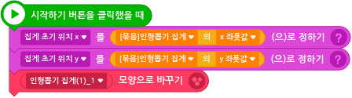

**좌우로 움직이는 집게**

> 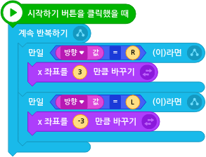

**인형을 잡는 집게**

인형을 잡는 코드는 순차대로 작성해 보려 합니다. 

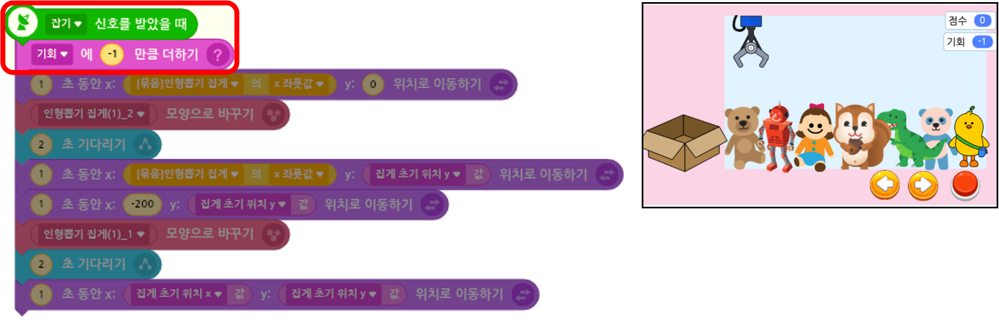

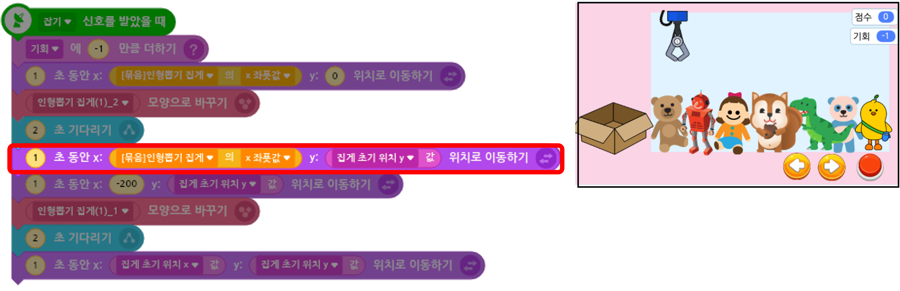

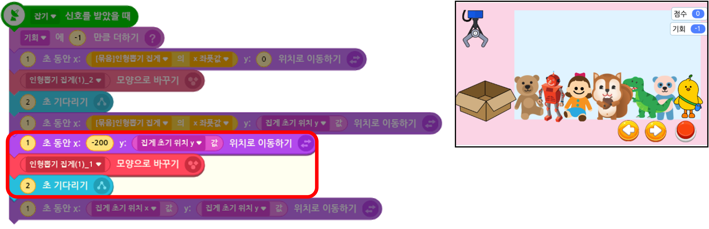

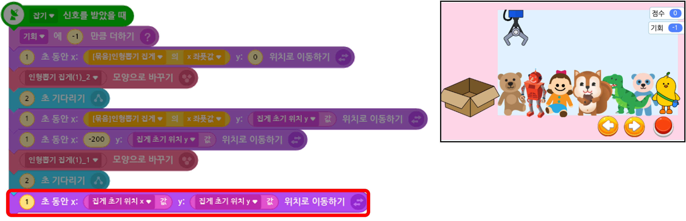

### 🧩 인형 코딩하기 

**인형 중심점 이동 **

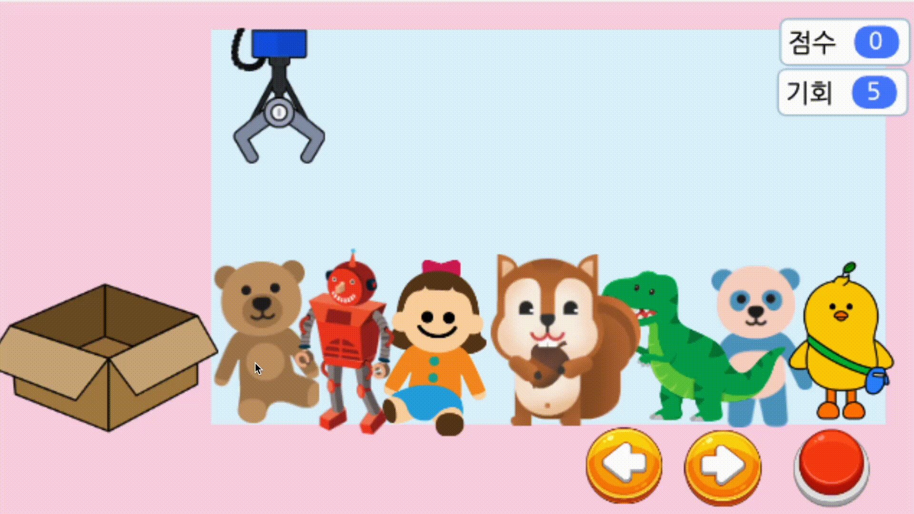
- 모든 인형들의 중심점을 위로 올려주세요. 

> 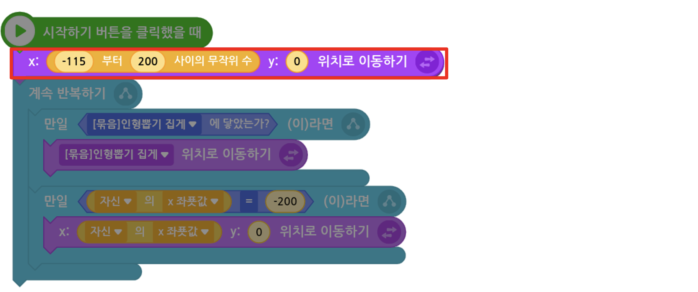

> 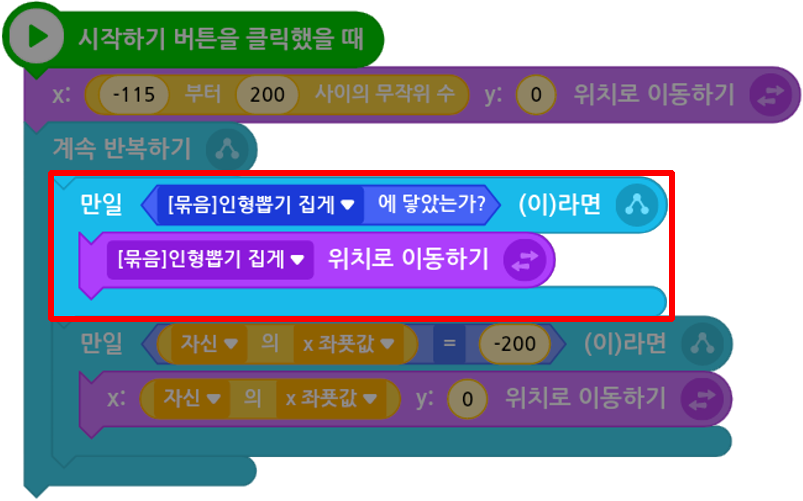

> 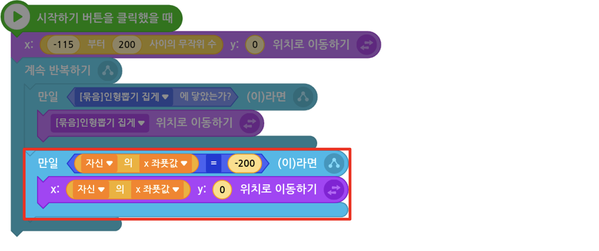

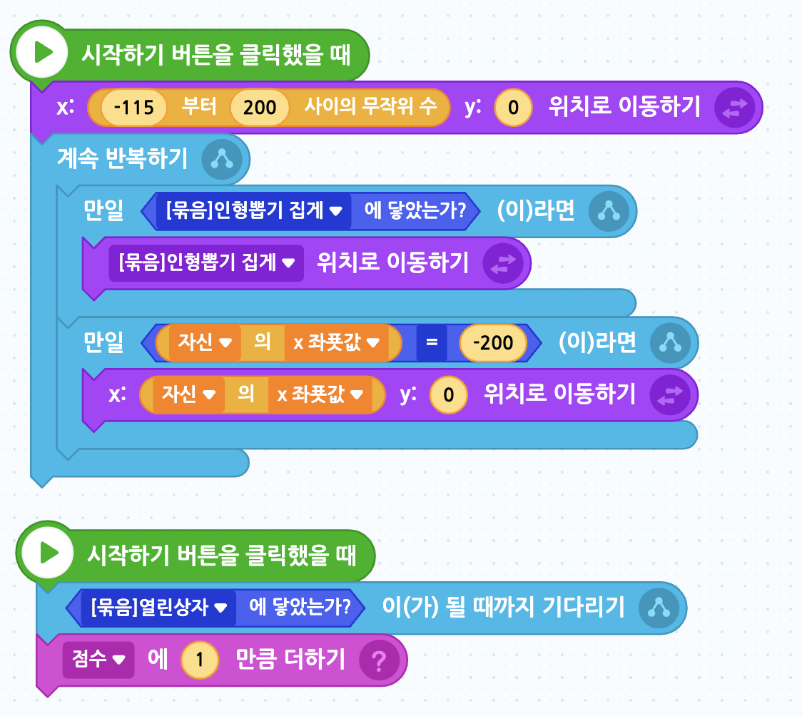

### 🧩 글상자 코딩하기 
> 

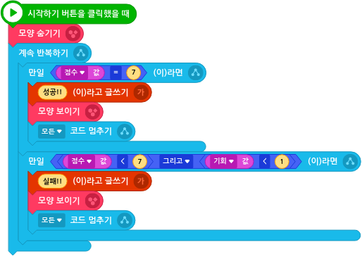

 요약 

