# 13. 애벌레 게임

🙂 이번 시간에는 애벌레가 적을 피해 아이템을 먹으면서 점수를 얻는 게임을 만들어봅니다.
🚩 오브젝트 그리기, 애벌레 모양대로 따라가기, 랜덤 움직이기, 랜덤 나타나기, 코드 멈추기 등을 사용할 수 있습니다.

🎮  **오늘 만들 게임 완성본**   
[https://naver.me/GwpYoOtK](https://naver.me/GwpYoOtK) 

## 1. 게임 개요

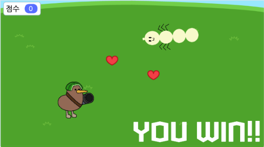
  

## 2. 게임 제작하기

### 🧩 오브젝트 추가하기

**🐛 애벌레 추가하기**

> 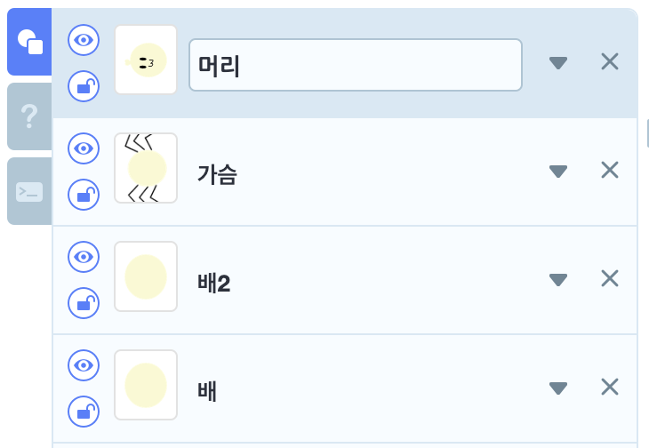
- 애벌레는 머리,가슴,배, 배2 4개의 오브젝트로 만들어줄거에요. 

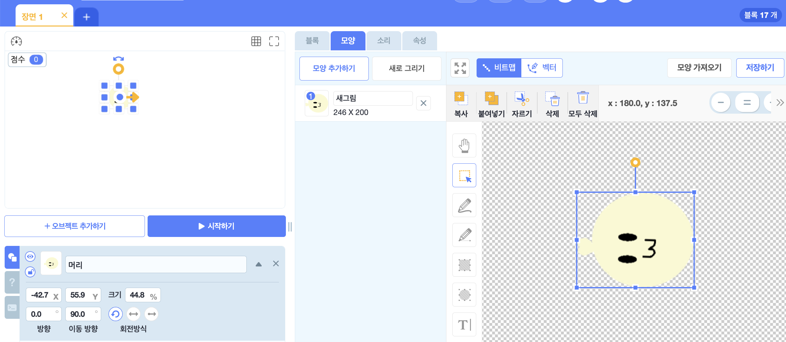
- 오브젝트 추가하기 > 새로 그리기 로 들어와서 애벌레 머리와 얼굴을 그린 후, 오브젝트의 이름을 '머리'로 설정해주세요. 

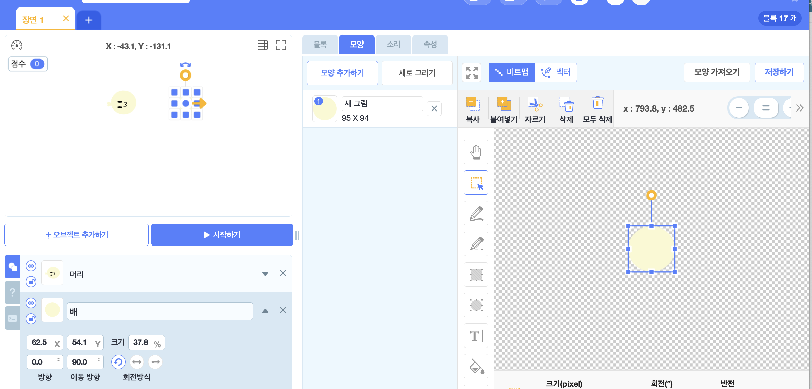
- 위와 같은 방식으로 애벌레의 배를 그려주고 오브젝트의 이름의 '배'로 설정해주세요.

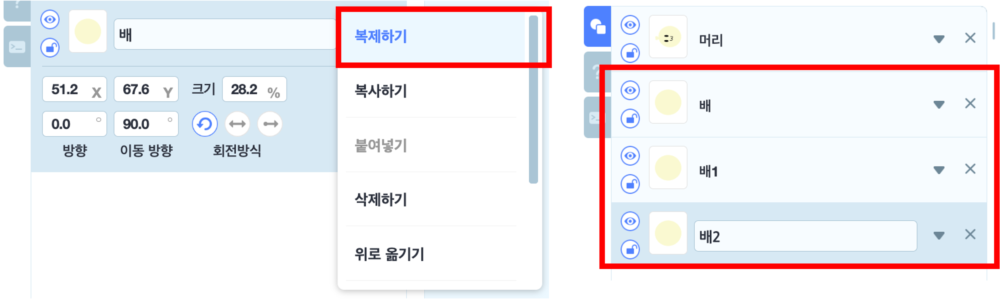
- 배 오브젝트를 2개 더 복제 해주세요. 

 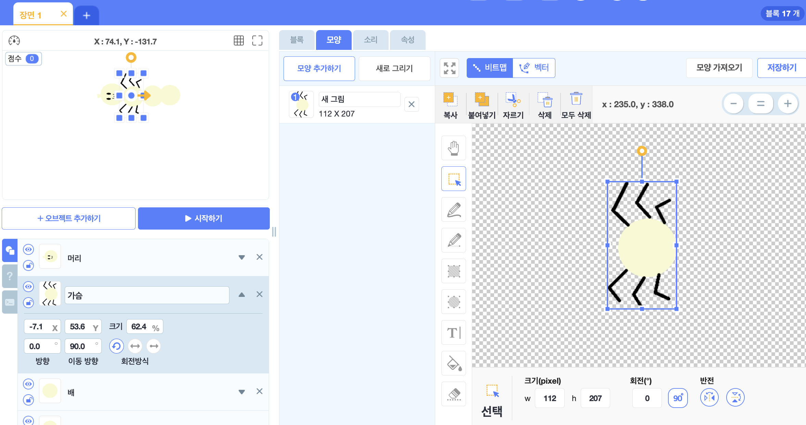
- 복제된 '배1' 오브젝트  모양에 다리를 추가로 그려 '가슴 오브젝트로 만들어주세요.

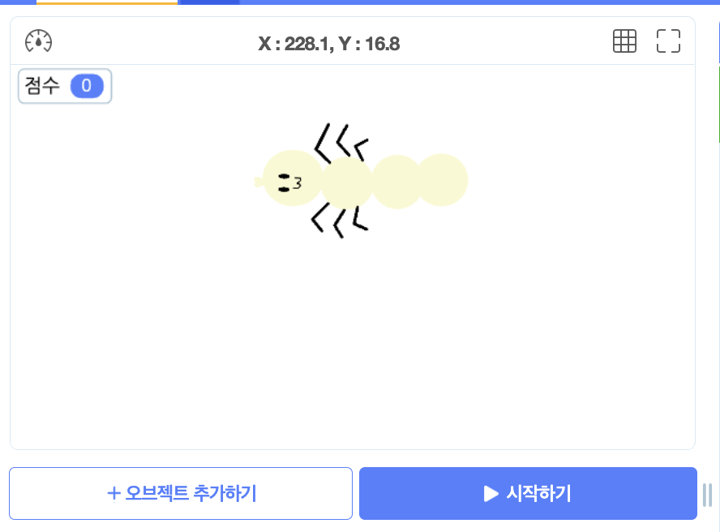
- 머리, 가슴, 배 오브젝트들의 위치와 크기를 조정하여 하나의 애벌레로 만들어주세요.
- 순서는 머리-가슴-배-배2 여야 합니다. 

**배경 및 기타 오브젝트 추가**
> 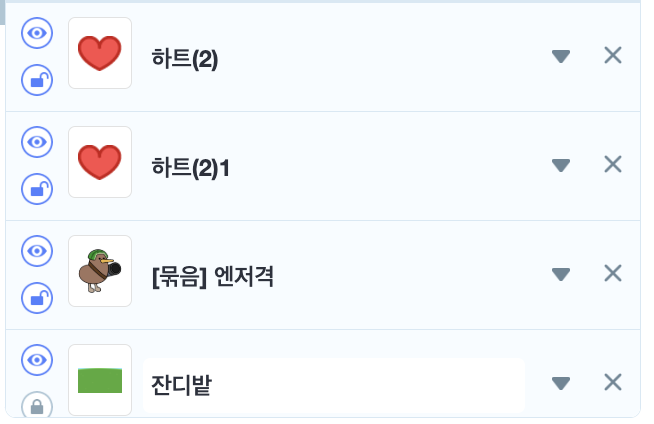
- '잔디밭' 배경과 2개의 '하트' 오브젝트, '엔저격' 오브젝트를 추가해주세요. 

> 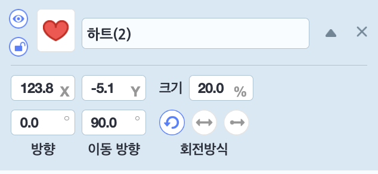
- 2개의 하트의 크기는 20으로 설정해주세요.

> 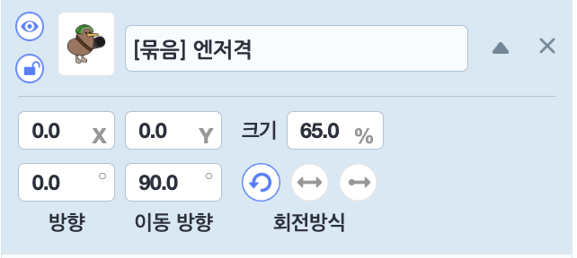
- 엔저격의 크기는 65로 설정해주세요.

> 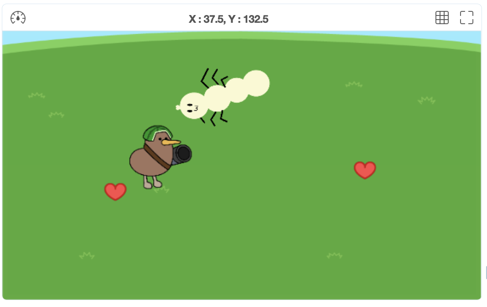
- 애벌레의 크기가 너무 크거나 작으면 '엔저격'과 비슷한 크기로 조정해주세요.

**글상자 추가**
> 
- 글상자를 하나 추가하고 원하는 디자인으로 설정해주세요.

### 🧩 신호 및 변수 추가하기 

🛜 **신호추가**
> 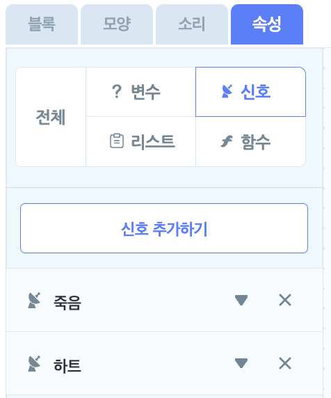
- '죽음'과 '하트' 신호를 추가해주세요.

📦 **변수추가**
> 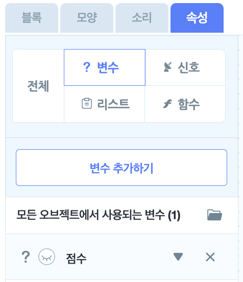

-'점수 변수를 추가해주세요.

### 🧩 애벌레 '머리' 코딩하기 
> 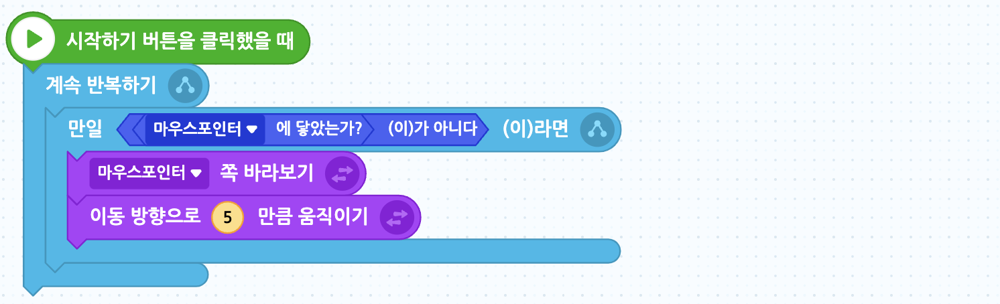
- 애벌레의 머리가 마우스 포인터를 따라 이동하도록 해줍니다.

> 
- 점수가 0점 이하가 되면, '죽음' 신호를 보내주세요. 

> 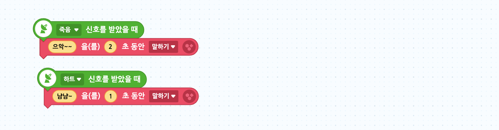
- '죽음'신호를 받았을 때는 '으악', '하트' 신호를 받았을 때는 '냠냠'을 말하도록 해주세요.

### 🧩 애벌레 '가슴' 코딩하기 
> 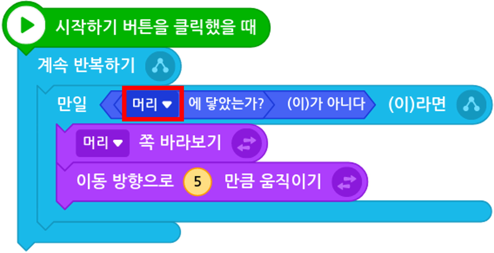
- 애벌레의 가슴은 애벌레의 머리를 따라 다니도록 해주세요.

### 🧩 애벌레 '배' 코딩하기 
> 
- 애벌레의 배는 애벌레의 가슴을 따라 다니도록 해주세요.

### 🧩 애벌레 '베2' 코딩하기 
> 
- 애벌레의 배2은 애벌레의 배를 따라 다니도록 해주세요.

  * 애벌레의 몸통 부위들은 자신을 기준으로 왼쪽 부위를 따라다니도록 설정해주어야해요.

### 🧩 하트 코딩하기 
> 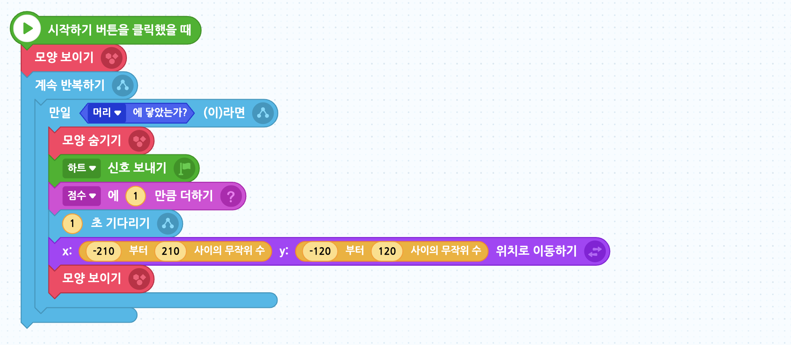
- 애벌레가 하트를 먹으면 점수를 1점 더해주고, 하트 신호를 보내주도록 해주고 모양을 숨겨주세요. 
- 이후 다시 하트가 랜덤 위치에 등장할 수 있도록 해주세요. 

### 🧩 글상자 코딩하기 
> 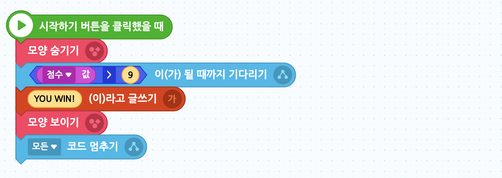
- 게임이 시작되었을 떄는 글상자가 안보이게 해주세요. 
- 애벌레 9점 이상 획득하면 글상자에 'YOU WIN'이라는 글을 쓰고 나타나게 해주세요. 
- 또한, 모든 코드가 멈추게 해주세요. 

> 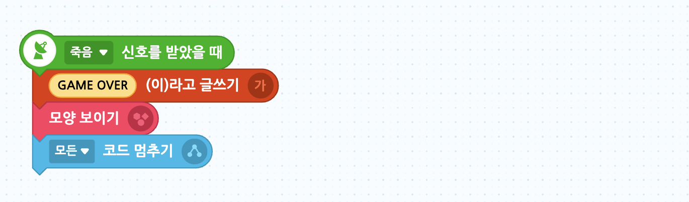
- '죽음' 신호를 받았을 때는 'GAME OVER'라는 글을 쓰고 나타나게 해주세요. 
- 이후 모든 코드가 멈추게 해주세요.