# 14. 스네이크 게임(수정중)

🙂 이번 시간에는 아이템을 먹으며 몸이 길어지는 스네이크게임을 만들어봅니다.
🚩 오브젝트 그리기, 랜덤 나타나기, 변수, 복제본 사용하기 등을 활용합니다.

🎮  **오늘 만들 게임 완성본**   
[https://naver.me/FTXAxxmE](https://naver.me/FTXAxxmE) 

## 1. 게임 개요
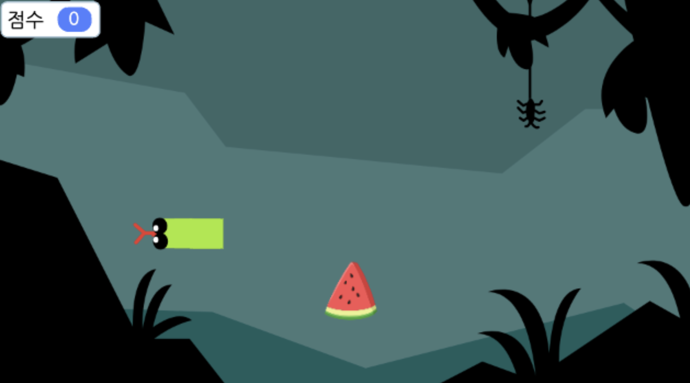
- 

## 2. 게임 제작하기

### 🧩 오브젝트 추가하기

**스네이크 추가하기**
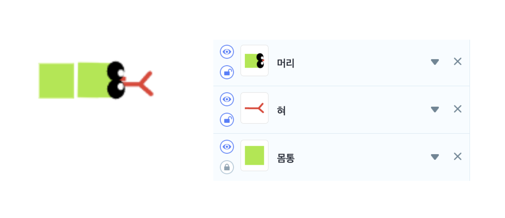
- 스네이크는 머리, 혀, 몸통 오브젝트가 따로 구성되어있습니다.

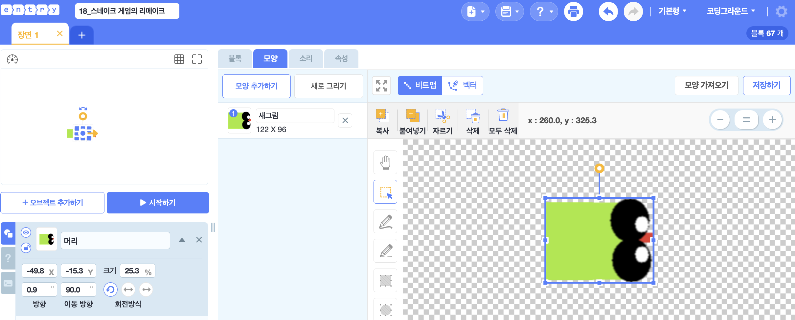
- 먼저 오브젝트 추가하기 > 새로 그리기에 들어가서 뱀의 머리와 얼굴을 그려주세요. 
- 오브젝트의 이름은 '머리'로 설정해주세요. 

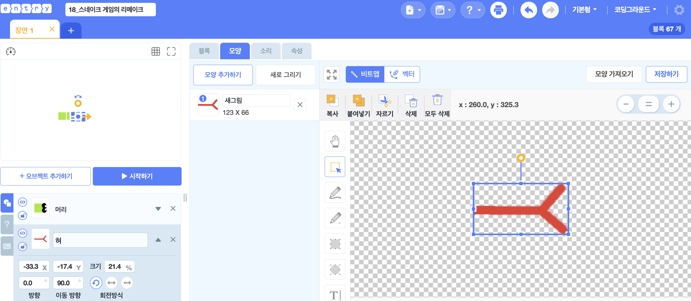
- 뱀의 혀도 직접 그려서 추가한 후 이름을 '혀'로 설정해주세요.

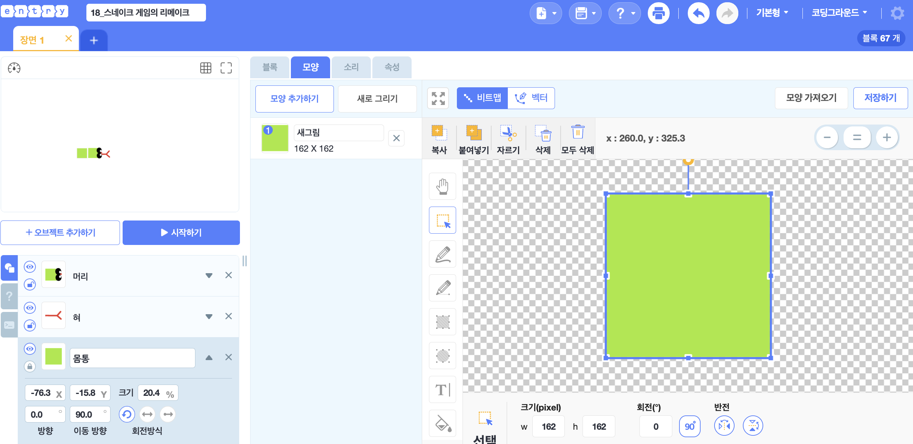

- 뱀의 몸통도 그려서 추가한 후 이름을 '몸통'으로 설정해주세요. 

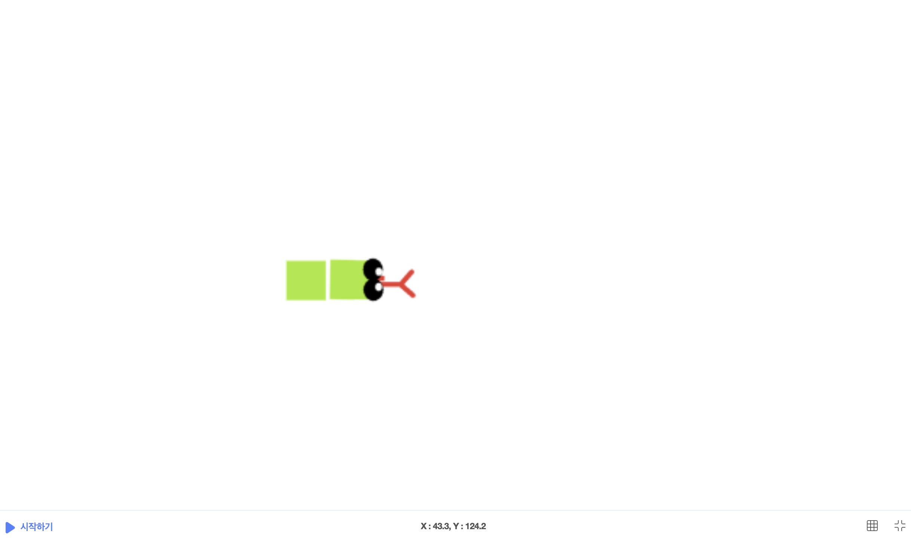
- 위와 같은 모양이 되도록 오브젝트들의 위치도 옮겨주고 크기도 조정해주세요. 

**수박 추가하기**
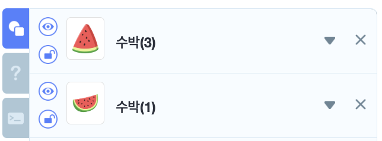
- 수박(1), 수박(3) 오브젝트를 추가해주세요.
- 크기는 50 으로 설정해주세요. 

**배경 추가하기**

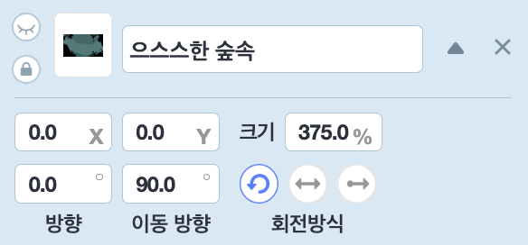
- '으스스한 숲속' 배경을 추가해주세요. 

**'다시하기' 버튼 추가하기**

- 글상자를 추가한 후 원하는 디자인으로 설정해주세요.

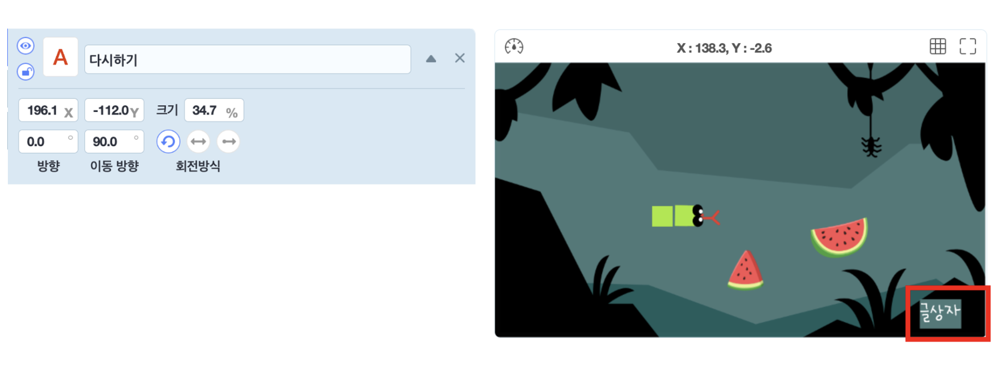
- 글상자 오브젝트의 이름은 '다시하기' 로 변경해주세요. 
- 글상자의 위치와 크기를 설정해주세요.

### 🧩 신호 및 변수 추가하기 

**신호추가**

> 

-'게임오버'라는 이름의 신호를 추가해주세요. 

**변수추가**

> 

-'점수'라는 이름의 변수를 추가해주세요. 

### 🧩 스네이크 '혀' 코딩하기 

- 화살표 버튼에 따라 혀의 방향이 변하도록 해주세요. 
  

- 반복해서 이동하도록 하고, 벽에 닿이면 '게임오버' 신호를 보내도록 해주세요. 

### 🧩 스네이크 '머리' 코딩하기 

- 키보드 화살표에 따라 뱀이 움직이도록 해주세요. 
  
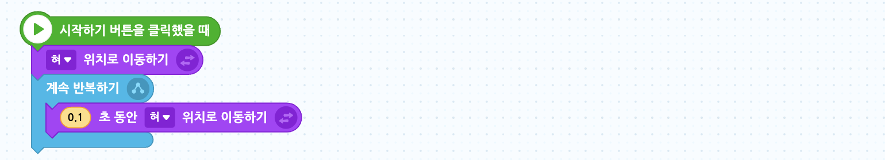
- 혀의 위치에 따라 이동하도록 해주세요. 
  

- 점수가 15점이 넘으면 '성장완료' 를 말하며 게임이 종료되게 해주세요. 

### 🧩 스네이크 '몸통' 코딩하기 

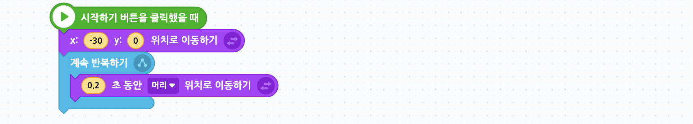
- 몸통은 '머리'를 따라 이동하도록 해주세요. 
  

- 점수를 초기화 해주고 복제본을 생성하는 코드를 작성해주세요.

- 점수에따라 몸통이 길게 늘어나도록 설정해주세요.

- 게임오버 신호를 받으면 모든 코드가 멈추게 해주세요. 

### 🧩'수박1' 코딩하기 

- 수박이 계속해서 랜덤한 위치로 이동하고 10초마다 등장하도록 해주세요. 

- 수박이 뱀의 혀에 닿으면 소리를 내고 점수가 더해지도록 해주세요. 
- 이후 다시 수박을 숨겨주세요.
  

- '게임 오버' 신호를 받으면 오브젝트가 안보이게 해주세요. 

### 🧩'수박2' 코딩하기 
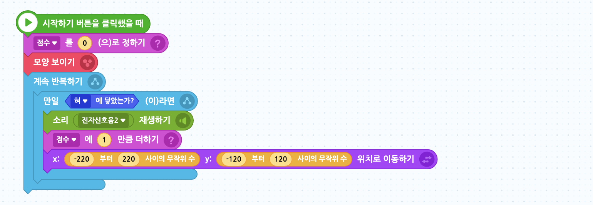
- 수박2도 계속해서 랜덤한 위치로 이동하도록 해주고, 
- 혀에 닿았을 때는 점수를 1점씩 추가해줍니다. 

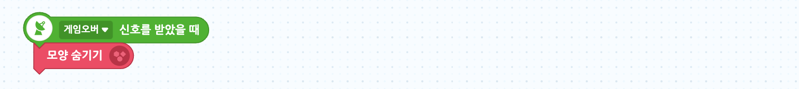

### 🧩'다시하기' 코딩하기 

- 시작하기 버튼을 눌렀을 때는 보이지 않도록 숨김 처리를 해 줍니다.
- 그리고 오브젝트를 클릭하면 코드를 처음부터 다시 실행합니다.

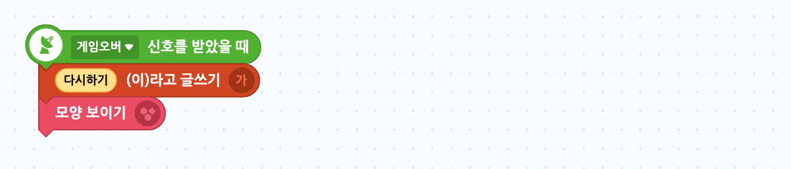
- 게임오버 신호를 받으면 '다시하기' 버튼이 등장하도록 해주세요. 

<!-- 

 요약 

 -->