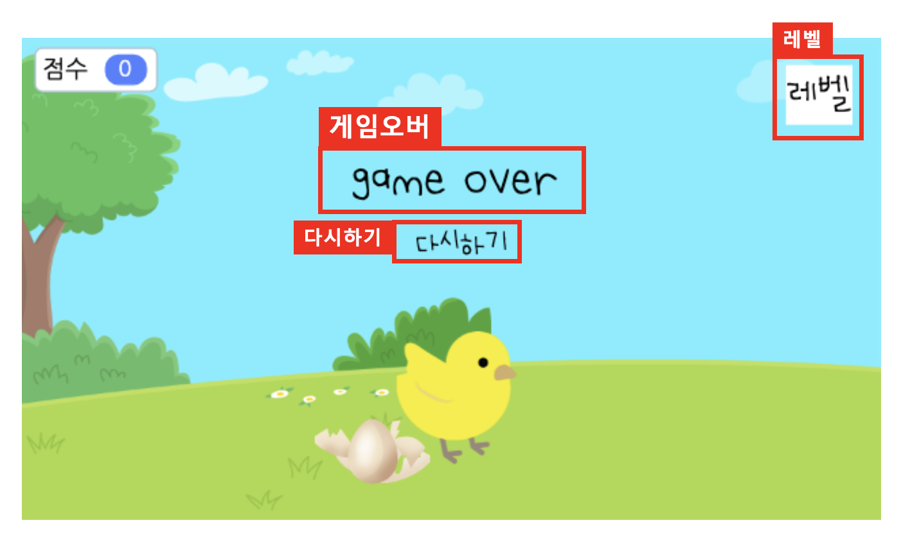

# 15. 병아리 점프 게임 

🙂 이번 시간에는 병아리가 계란을 뛰어넘는 점프게임을 만들어봅니다. 

🚩 점프 애니메이션을 만들 수 있습니다. 점수가 추가되는 조건을 생각해봅니다. 

🎮  **오늘 만들 게임 완성본**   
 

## 1. 게임 개요
 
- 

## 2. 게임 제작하기

### 🧩 오브젝트 추가하기

**배경 추가** 
>  
- '잔디 언덕(1)' 배경을 추가해주세요. 
  
 
- 잔디언덕(1) 배경에 모양>모양추가하기에서 '토끼와 거북이_출발점' 배경을 추가해주세요. 
* 꼭 '토끼와 거북이_출발점' 배경이 아니어도 되지만, 잔디언덕과 구분되는 배경으로 추가해주세요. 

**병아리 추가**
>  
- 병아리를 추가하고 크기는 70으로 설정해주세요. 

**계란 추가**

>  
- 계란을 추가하고 크기는 50으로 설정해주세요. 

  
- 모양 > 모양 추가하기에 들어가서 '깨진 계란'을 추가하고 저장해주세요. 

>  
- 계란을 하나 복제해주시고, 이름을 각각 계란1, 계란2로 설정해주세요. 

**글상자 추가**

>  
- 글상자를 3개 추가하고 이름을 위와 같이 설정해주세요.

 
- 각 글상자 위치를 위와 같이 배정하고 원하는 디자인으로 설정해주세요. 

### 🧩 신호 및 변수 추가하기 

**🛜 신호 추가하기**

> 
- 'you win', 'level2', '게임오버' 신호를 추가해주세요. 

**🛜 변수 추가하기**
> 
- '점수' 변수를 추가해주세요. 

### 🧩 병아리 코딩하기 

- 병아리의 초기 모양과 위치를 설정하고, 스페이스 버튼을 누를때마다 점프하도록 하는 코드를 작성해주세요. 

### 🧩 계란1 코딩하기 

- 계란의 초기 위치를 설정하고, 병아리가 계란을 피할때마다 점수에 1점을 더하는 코드를 작성해주세요. 
  

- 병아리가 계란에 닿으면 '게임오버' 신호를 보내며 게임이 종료되게 해주세요. 
- 병아리에 닿으면 계란이 깨진모양으로 바뀌게 해주어야합니다. 

### 🧩 계란2 코딩하기 

- 계란2는 초기에 숨겨주세요.

- 계란의 초기 위치를 설정하고, 병아리가 계란을 피할때마다 점수에 1점을 더하는 코드를 작성해주세요. 

- level2 신호를 받으면 초기 모양을 설정해주고 병아리에 닿으면  '게임오버' 신호를 보내며 게임이 종료되게 해주세요. 
- 병아리에 닿으면 계란이 깨진모양으로 바뀌게 해주어야합니다. 

### 🧩 배경 코딩하기 

- 초기 배경은 잔디언덕으로 설정하고, level2가 되면 배경이 바뀌게 해주세요. 

### 🧩 다시하기 글상자 코딩하기 

- 초기에는 글상자를 숨겨주고 게임오버 신호를 받았을 때 글상자 내용을 '다시하기'로 설정해주세요. 
- 다시하기 버튼을 클릭하면 게임을 다시 할 수 있도록 해주세요. 

### 🧩 레벨 글상자 코딩하기 

- 레벨 글상자가 레벨이 바뀔 때마다 바뀌도록 해주세요. 
- 점수가 10점이 되면 레벨2가 되고 점수가 20점이되면 승리 합니다. 

### 🧩 게임오버 글상자 코딩하기 

- 초기에는 글상자를 숨겨주고 승리 신호를 받으면 'you win', 오버 신호를 받으면 'game over'로 바뀌게 해주세요.

<!-- 

 요약 

 -->