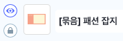
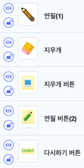

# 16. 그림판 

 🙂이번 시간에는 붓 블록을 활용하여 그림판을 만들어봅니다. 
🚩 그리기, 지우기, 투명도, 굵기, 색깔을 바꾸는 등 붓 블록들을 활용하여 그림판에 다양한 기능을 만들어낼 수 있습니다. 

🎮  **오늘 만들 게임 완성본**   
 

## 1. 게임 개요

## 2. 게임 제작하기

### 🧩 오브젝트 추가하기

>  

>  

>  

>   

- 배경, 글상자(굵기), 글상자(투명도), 업다운 버튼 각 2개씩, 글상자(굵기 숫자 표시), 글상자(투명도 숫자 표시)
- 다시하기 버튼, 지우개 버튼, 연필 버튼
- 마우스 따라다니는 연필과 지우개
- <b>이때 마우스를 따라다니는 연필과 지우개는 오브젝트 목록 중 맨 위에 위치하여야 합니다.</b> (오브젝트 목록에서 드래그하여 위로 위치시킵니다.)
- 배경이 계속 클릭되어 불편하니, 자물쇠를 클릭하여 고정시켜줍니다. 

### 🧩 신호 및 변수 추가하기 

