### 🤹🏻 [실습] 엔트리봇 음식 먹기 게임 만들기

* 이번 시간에는 엔트리봇에게 음식을 주는 프로젝트를 만들어 봅시다. 
   

### 🤹🏻 프로젝트 개요

 
🧩 ver1. 숨기기, 보이기, 말하기를 배웁니다. 
엔트리봇이 '안녕!' 2초간 인사한다. 
 
🧩 ver2. 조건문에 대해 알아봅니다. 
엔트리봇이 음식에 닿았을 때와 닿지 않았을 때 다른 글상자가 나타난다. 
 
🧩 ver3. 변수를 사용해봅니다. 
엔트리봇이 먹은 음식 수를 카운팅할 수 있다. 
 

숨기기, 보이기, 말하기

* step1. 배경, 엔트리봇 오브젝트를 추가하고 크기 및 위치를 조정합니다. 
   
  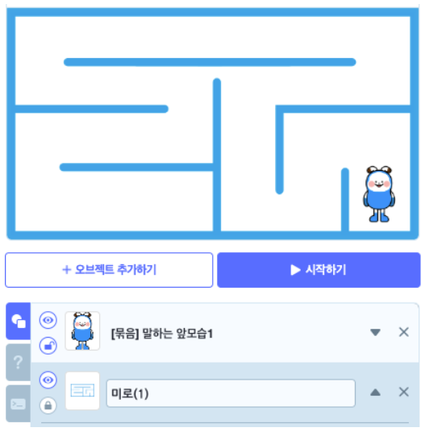 
   

* step2. 프로젝트를 시작했을 때는 엔트리봇이 보이지 않게 하기 위해 숨기기 블록을 사용합니다. 
   
  블록 → 생김새 → 모양 숨기기 
   

* step3. 아무곳이나 마우스를 클릭했을 때 엔트리봇이 나타납니다. 
   
  블록 → 생김새 → 모양 보이기 
   

* step4. 엔트리봇을 클릭하면 '안녕!'이라고 2초간 인사합니다. 
   
  블록 → 생김새 →  ~을  ~초 동안 말하기 
   

### 🎱 결과

* 프로젝트를 시작하면 배경만 있는 상태에서, 아무 곳이나 마우스를 클릭하면 엔트리봇이 나타납니다. 엔트리봇을 클릭하면 '안녕!'이라고 2초간 말합니다. 
   
  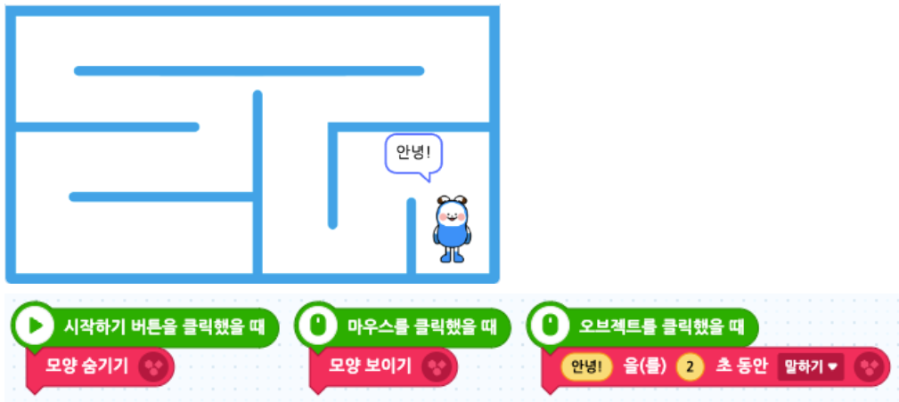 
   

조건문 알아보기 

* step0. 이전에 배운 블록들을 활용해서 키보드 방향키를 누르면 엔트리봇이 상하좌우로 움직이도록 만들어봅시다. 
   
  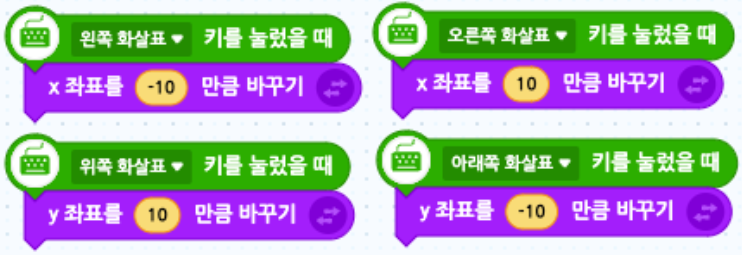 
   

* step1. 음식 오브젝트를 추가하여 위치와 크기를 조정하고 말풍선을 만듭니다. 
   
  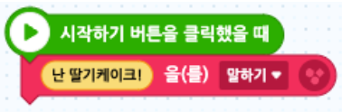 
   

* step2. 엔트리봇과 만났을 때는 음식이 사라져야하므로 조건 반복문을 사용합니다. 
   
  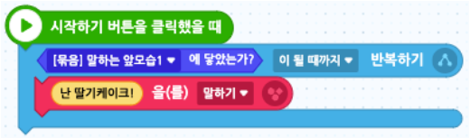 
   

* step3. 음식이 엔트리봇에 닿으면 사라지게 만듭니다. 
   
  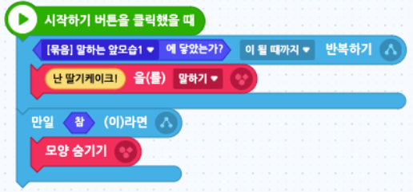 
   

* step4. 엔트리봇의 블록을 먼저 정리해줍니다. 
   
  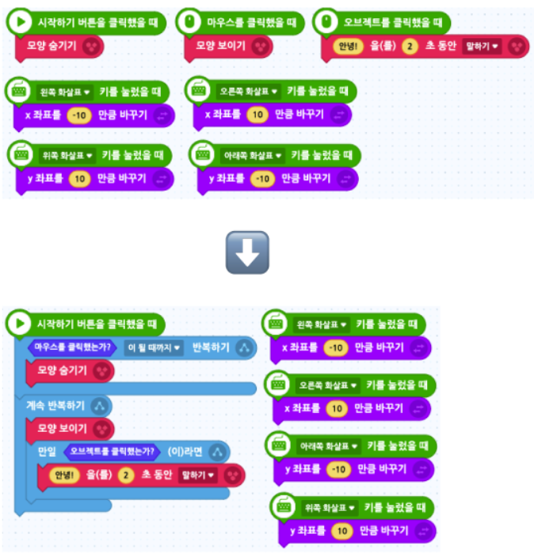 
   

* step5. 엔트리봇이 음식에 닿았을 때 '맛있다!'라고 2초간 말합니다. 
   
  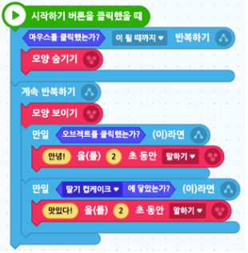 
   
  엔트리봇과 음식이 닿았을 때 음식이 사라지는 시점이 동일하기 때문에 엔트리봇이 '음식과 닿았음'을 인식하지 못하는 문제점이 있습니다. 
   

* step6. 마지막 문제를 해결하기 위해 음식이 엔트리봇과 닿았을 때 0.01초 기다렸다가 사라지도록 블록을 수정합니다. 
   
  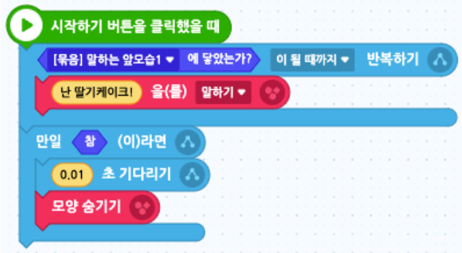 
   

### 🎱 결과

* 프로젝트를 시작하면 음식이 말을 하고있고, 아무 곳이나 마우스를 클릭하면 엔트리봇이 나타납니다. 엔트리봇을 클릭하면 '안녕!'이라고 2초간 말합니다. 

* 엔트리봇이 음식에 닿게 되면 음식은 사라지고 엔트리봇이 '맛있다!'라고 2초간 말합니다. 
   
  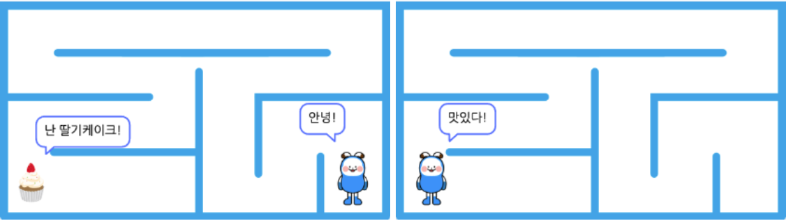 

변수 사용하기 

* 변수란 '변하는 수'라는 뜻입니다. 변수에는 숫자, 글자 등이 들어갑니다. 
   

* step1. 엔트리봇이 움직이며 먹은 음식의 갯수를 세기 위해 변수를 생성합니다. 
   
  속성 → 변수 → 변수 추가하기 
  프로젝트 화면에 변수가 보입니다. 변수 기본값을 0으로 설정해놓았기 때문에 0으로 표시됨을 알려줍니다. 
   
  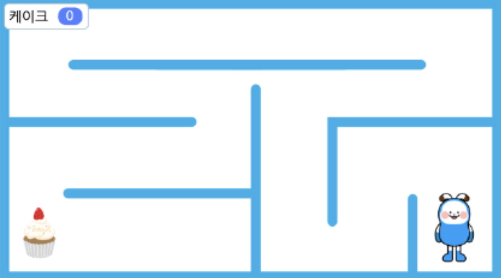 
   

* step2. 음식 오브젝트를 추가해 음식 갯수를 늘려줍니다. 처음 만든 컵케이크의 코드와 유사하기 때문에, 코드를 복사하고 붙여넣는 방법을 알려줍니다. 
   
  새로 추가한 음식 오브젝트들의 코드 블럭을 다음과 같이 만들어주고, 기존의 음식 코드 블럭에는 변수에 1을 더하는 블록만 추가해줍니다. 
  블록 → 자료 →  ~에  ~만큼 더하기 
   
  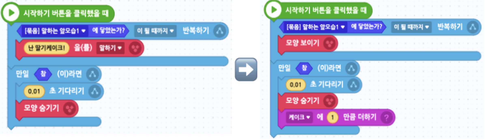 
   

### 🎱 결과

* 프로젝트를 시작하면 음식이 말을 하고있고, 아무 곳이나 마우스를 클릭하면 엔트리봇이 나타납니다. 엔트리봇을 클릭하면 '안녕!'이라고 2초간 말합니다. 

* 엔트리봇이 음식에 닿게 되면 음식은 사라지고 변수는 1씩 증가합니다. 마지막 음식을 먹었을 때 엔트리봇이 '맛있다!'라고 2초간 말합니다. 

* 음식을 먹은 갯수만큼 변수의 점수가 올라갑니다. 
   
  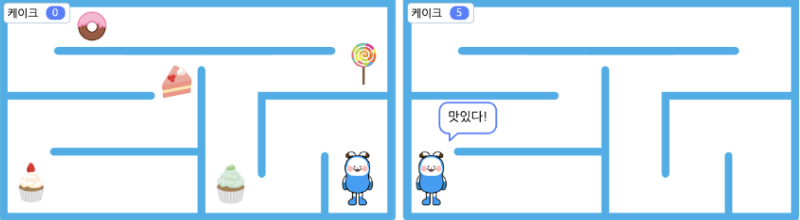 
   
