 # 05. 아기새를 지켜라 

🚩 오브젝트를 이동시키고, 숨기거나 보일 수 있으며 조건문, 변수, 타이머, 신호, 소리 등을 사용할 수 있습니다.

🎮  **오늘 만들 게임 완성본**   
[https://naver.me/G1sqWKBz](https://naver.me/G1sqWKBz) 

## 1. 게임 개요

- 이번 시간에는 오브젝트를 무작위 위치로 보내고, 변수와 타이머를 활용하여봅니다. 
- 아기새를 따라다니는 박쥐를 클릭하여 공격할 수 없게 만들어주고, 생명을 다 잃지 않고 30초를 버티면 승리합니다.

## 2. 게임 제작하기

### 🧩 오브젝트 추가하기
> 
- '구름세상'(배경), 글상자, EAT ME 쿠키, 박쥐, 새 오브젝트를 추가하세요.

### 🧩 신호 및 변수 추가하기 
**🛜 승리 신호** 
- 속성에서 **'win'** 이라는 신호를 추가하세요. 

**🛜 패배 신호**
- 속성에서 **'game over'** 이라는 신호를 추가하세요. 

**🛜 닿음 신호**
- 속성에서 **'hit'** 이라는 신호를 추가하세요. 

  
**📦 생명 변수**
- 속성에서 '생명'이라는 변수를 추가해주세요.   
'생명'변수는 아기 새의 생명을 의미합니다.

### 🧩 타이머 설정하기

> 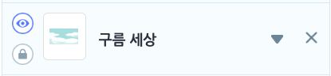
> 
타이머는 오브젝트에 코딩하지 않고, 배경 오브젝트에서 코딩을 해 줄 예정입니다.

> 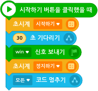
- 시작하기 버튼을 클릭했을 때 **초시계**를 시작시키세요. 
- 30초를 기다린 후, 'win' 신호를 보내주세요. 
- 이후, 초시계를 정지하고 모든 코드를 멈춰 게임을 종료시켜주세요. 

### 🧩 박쥐 코딩하기

> 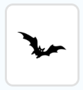
- 박쥐 오브젝트를 선택하세요. 

> 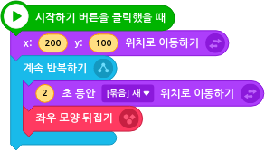
- 초기 위치를 x:200, y:100으로 설정해주세요
- 몸 방향을 좌우로 변경시켜주며 '새' 오브젝트 위치로 이동하는 동작을 계속 반복시켜주세요. 
  
박쥐를 클릭하면 모양이 바뀌면서 공격하지 못하는 상태로 변하게 해 줄 예정이에요.

> 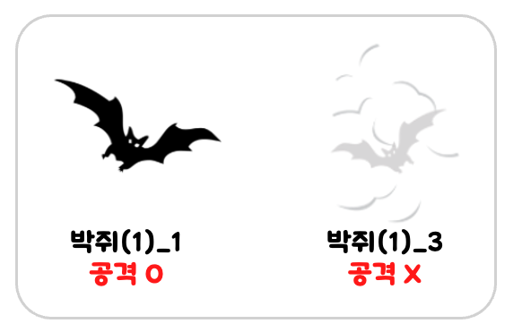

**박쥐 모양 변경시키기**

> 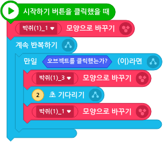
- 박쥐의 초기 모양은 1번 모양인 '박쥐(1)_1'로 설정해주세요. 
- 박쥐 오브젝트를 클릭하면 모양이 '박쥐(1)_3'으로 바뀌게 한 후, 2초후 다시 '박쥐(1)_1' 모양으로 바뀌게 해주세요. 

** 🔊 소리 추가** 
- '새 지줘기는 소리'를 추가해주세요. 
  
  
**박쥐->아기새 공격하기**   

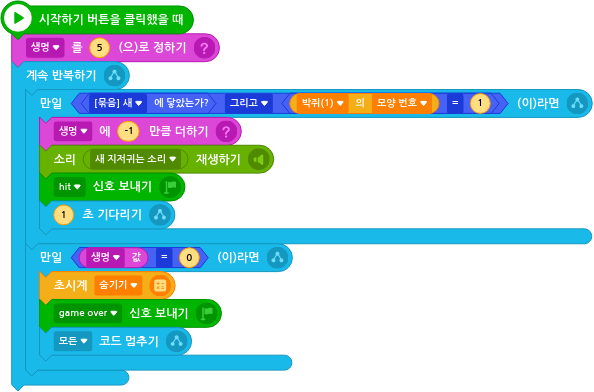
- '생명' 변수를 5로 설정해주세요. 

- '박쥐'에 '새'가 닿았을 때 '박쥐'의 모양이 모양번호가 1번인 **박쥐(1)_3** 일 때,
  - 생명을 1 감소시키고 
  - '새 지저귀는 소리' 효과음을 재생시키고, 
  - 'hit' 신호를 보내주세요. 
- '생명'변수의 값이 0이 되었을 때
  - 초시계를 숨겨주고 
  - 'game over'신호를 보낸 후
  - 모든 신호를 멈춰주세요. 
  

### 🧩 새 코딩하기
> 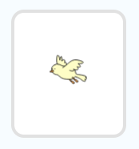
- '새' 오브젝트를 선택하세요

> 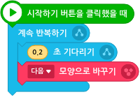
- 새가 날개짓을 하는 효과를 내주기 위해 0.2초 간격으로 다음 모양으로 변경되게 해주세요. 

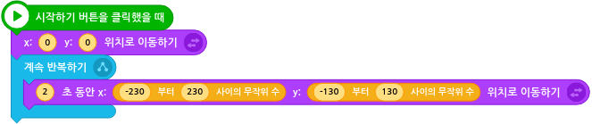
- 초기 위치는 x:0 y:0 으로 설정해주세요. 
- 계속해서 무작위 위치로 이동하도록 해주세요. 

> 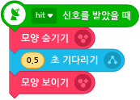
- 'hit' 신호를 받았을 때 (박쥐에 닿였을 때), 0.5초 동안 숨겨준 후 다시 나타나게 해주세요. 

### 🧩 쿠키 코딩하기
아기새가 쿠키에 닿으면 생명이 1개 추가되도록 해줄 예정입니다.

> 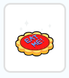
- 쿠키 오브젝트를 선택하세요. 

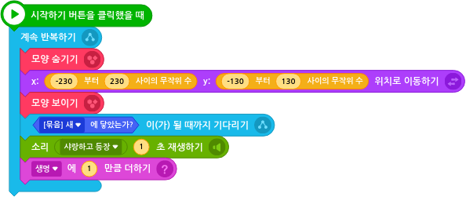
- 아기새가 쿠키에 닿기전에 무작위의 위치로 이동시켜 준 후, 아기새에 닿으면 
  - 생명 변수에 1을 더해주고
  - 효과음도 추가해주세요. 

### 🧩 글상자 만들기 

> 
- 글상자 오브젝트를 선택하세요.
  
**글상자 크기 및 위치 조정 및 배경색 없애기** 

> 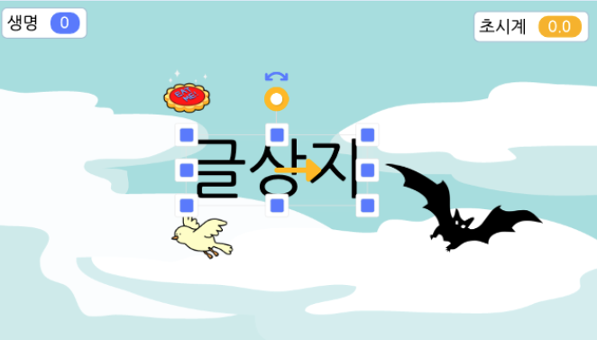
- 글상자가 게임 화면의 가운데 오도록 위치시킨 후 적당한 크기로 조정하세요. 
    
- **글상자** 설정에서 **배경색 설정** 버튼을 선택한 후 체크 해제하여 배경색이 투명색이 되도록 설정해주세요. 

> 
- 초기에는 글상자를 숨겨주세요. 

> 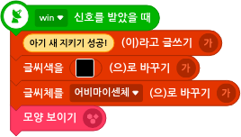
- 'win' 신호를 받았을 때 '아기 새 지키기 성공!'이라는 메세지를 출력하도록 설정해주세요.
- (선택) 글씨색, 글씨체를 설정해주세요. 
- 글상자가 보이도록 해주세요. 

> 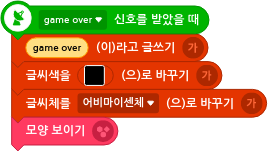
- 'game over' 신호를 받았을 때 'game over'이라는 메세지를 출력하도록 설정해주세요.
- (선택) 글씨색, 글씨체를 설정해주세요. 
- 글상자가 보이도록 해주세요. 