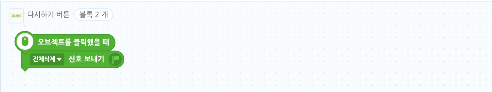

# 16. 그림판

🙂이번 시간에는 붓 블록을 활용하여 그림판을 만들어봅니다. 🚩 그리기, 지우기, 투명도, 굵기, 색깔을 바꾸는 등 붓 블록들을 활용하여 그림판에 다양한 기능을 만들어낼 수 있습니다.

🎮 **오늘 만들 게임 완성본**\
[https://naver.me/xeAx0PlM](https://naver.me/xeAx0PlM)

## 1. 게임 개요

## 2. 게임 제작하기

### 🧩 오브젝트 추가하기

**배경 추가**

> 

* 배경이 계속 클릭되어 불편하니, 자물쇠를 클릭하여 고정시켜줍니다.

**업다운 버튼추가**

> 

* '화살표 버튼'을 추가한 후 크기는 15로 설정해주세요.

> 

* 위에서 추가한 버튼을 3번 복제하여 4개의 버튼을 만들어주신후 이름을 각각 굵기다운, 굵기업,투명도다운, 투명도업, 투명도다운으로 설정해주세요.

* 굵기업, 투명도업 버튼은 \[모양] 탭에서 '화살표버튼\_오른쪽'을 선택한 후 '저장하기' 버튼을 클릭해주세요.

* 각 버튼의 위치를 위와 같이 설정해주세요.

**글상자 추가**

> 

* 4개의 글상자를 추가해주고, 이름을 위와 같이 설정해주세요.

> 

* 각 글상자의 디자인과 위치, 크기를 위와 같이 설정해주세요. (정확한 수치대로 하지 않으셔도 됩니다.)

**연필, 지우개, 지우개 버튼, 연필버튼, 다시하기 버튼 추가**

> 

* 연필, 지우개, 지우개 버튼, 연필버튼, 다시하기 버튼 을 추가해주세요.

* 각 오브젝트들을 위와 같이 배정 시켜주세요.

> 

* 연필의 크기는 40, 지우개 크기는 35를 추천드립니다.
* 마우스가 클릭하여 그림을 그려야하기 때문에, 연필/지우개 오브젝트가 방해되지 않도록 중심점을 오브젝트 밖으로 변경해줍니다.

> 

* 이때 연필과 지우개는 오브젝트 목록 중 맨 위에 위치하여야 하도록 오브젝트 목록에서 드래그하여 위로 위치시킵니다.
* 배경이 계속 클릭되어 불편하니, 자물쇠를 클릭하여 고정시켜줍니다.\

**색상 오브젝트 추가**

* 오브젝트 추가하기 > 새로 그리기에 들어와서 원하는 색상을 지정하여 사각형을 하나 그려줍니다.
* 크기는 40,40으로 설정하고 저장해주세요.

* 위와 같은 방식으로 색상 오브젝트를 5개 더 추가한 후, 색상에 맞춰 오브젝트의 이름도변경해주세요.

**점 오브젝트 추가**

* 오브젝트 추가하기 > 새로 그리기 에 들어가서 아무것도 그리지 않은 채 저장을 해줍니다.
* 오브젝트의 이름은 '점'으로 설정해주세요.
* 연필은 그저 사용자가 그림을 그린다고 알 수 있게 보여주는 수단이며, 사실 그림을 그리는 것은 점입니다

### 🧩 변수 및 신호 추가하기

**변수추가**

> 

* 굵기와 투명도 변수를 추가해주세요.

**신호추가** 

* 신호들을 추가해주세요.

### 🧩 연필 코딩하기

* 연필이 마우스를 따라다닐 수 있게 합니다. 
* 펜 신호를 받으면 보이게하고, 지우개 신호를 받으면 보이지 않게 합니다.

### 🧩 연필 버튼 코딩하기

* 연필 버튼을 누르면 신호가 갈 수 있도록 해줍니다.

### 🧩 지우개 코딩하기

* 시작하기 버튼을 클릭하면 일단 연필이 먼저 보이게 하기 위해, 시작하기 버튼을 눌렀을 때 지우개는 보이지 않게 해줍니다.
* 지우개가 마우스를 따라다닐 수 있게 합니다.
* 지우개 신호를 받으면 보이게하고, 펜 신호를 받으면 보이지 않게 합니다.

### 🧩 지우개 버튼 코딩하기

* 지우개 버튼을 누르면 신호가 갈 수 있도록 해줍니다.

### 🧩 투명도수 코딩하기

* 투명도 글상자를 투명도 값에 따라 변경시켜줍니다.

### 🧩 투명도업 코딩하기

* 투명도 업 버튼을 누를때마다 1씩 증가하게 하되, 10을 넘어서지 않게 합니다.
* '투명하게' 신호도 보내주세요.

### 🧩 투명도다운 코딩하기

* 투명도 다운 버튼을 누를때마다 1씩 감소하게 하되, 0보다 작아지지않게 합니다.
* '불투명하게' 신호도 보내주세요.

### 🧩 굵기수 코딩하기

* '굵기수' 글상자를 굵기 값에 따라 변경시켜줍니다.

### 🧩 굵기업 코딩하기

* 굵기업 버튼을 누를때마다 1씩 증가하게 해줍니다.
* '굵게' 신호도 보내주세요.

### 🧩 굵기다운 코딩하기

* 굵기다운 버튼을 누를때마다 1씩 감소하게 하되, 0보다 작아지지않게 합니다.
* '얇게' 신호도 보내주세요.

### 🧩 색상 코딩하기

**연핑크**

> 

* 색상 판을 눌렀을 때 해당 색상 신호를 보내게 해주세요.
* 또한 색상판에 클릭되었다는 효과도 주세요.

\*아래 코드 내용도 '색상신호'를 제외하고 모두 같습니다.

**연두**

>  **주황**

>  **보라**

>  **검정**

>  **하늘**

> 

### 🧩 점 코딩하기

* 연필은 그저 사용자가 그림을 그린다고 알 수 있게 보여주는 수단이며, 사실 그림을 그리는 것은 점입니다.

* 프로젝트를 시작하면 디폴트값으로 그리기굵기는 1로, 색은 검정색으로 설정되게 해줍니다. 프로젝트를 시작할 때마다 다음과같이 초기화됩니다.
* 마우스를 클릭한 경우에만 그릴 수 있도록 합니다.

* 펜신호를 받으면 색상을 검정, 굵기를 굵기 값으로 설정해주세요.
* 지우개 신호를 받았을 때 배경과 같은 색상으로 설정해주고 굵기는 20으로 설정해주세요.
* 전체 삭제 신호를 받으면 모든 그림을 지워줄 예정입니다.

* 색상 신호를 받을 때 마다 펜의 색이 변경되게 해줍니다.

* 투명도, 굵기 버튼을 클릭했을 때 펜의 투명도와 굵기도 변하게 해줍니다.

### 🧩 다시하기 버튼 코딩하기

* '다시하기' 버튼을 누르면 '전체삭제' 신호를 보내도록 합니다.
