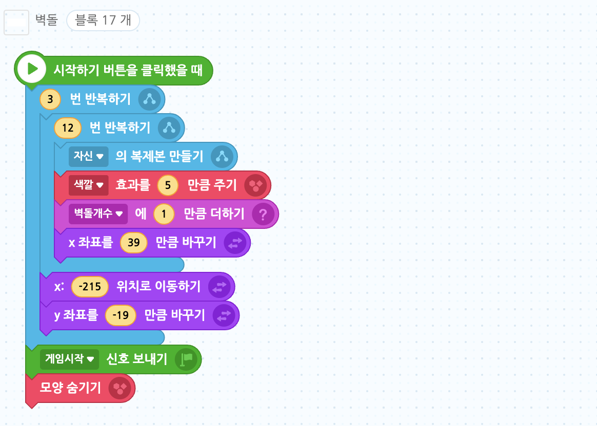
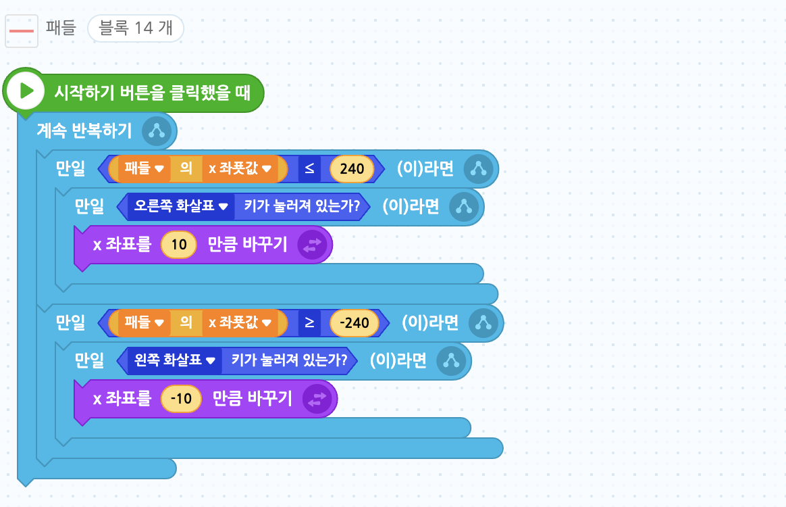
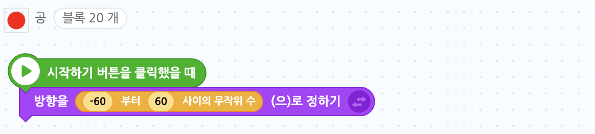
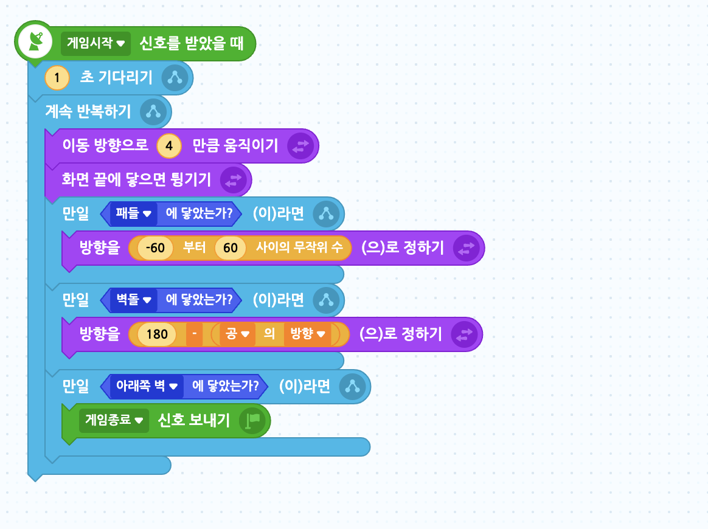
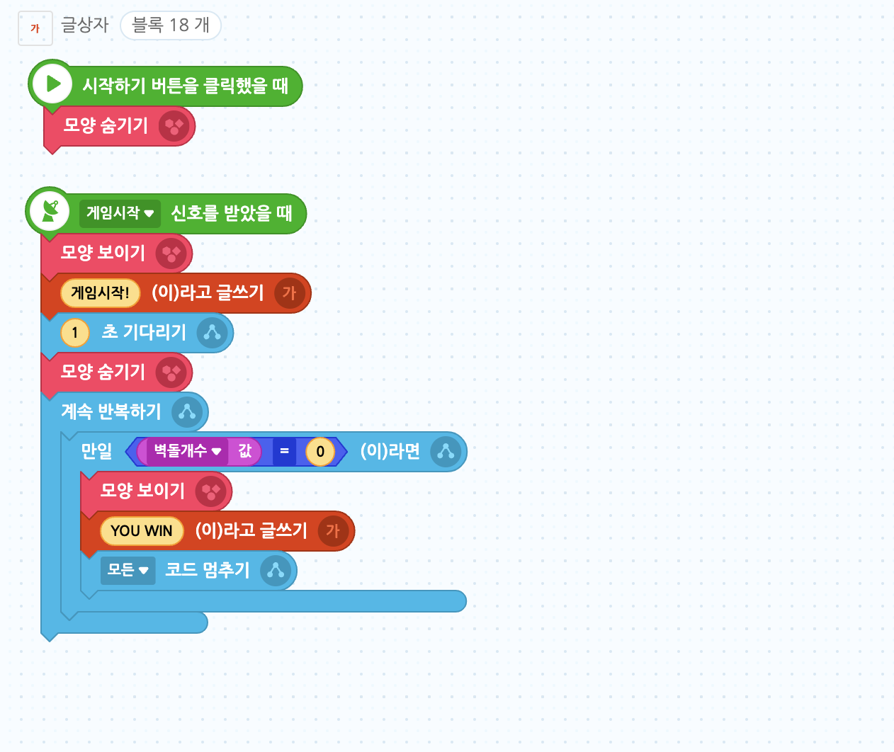
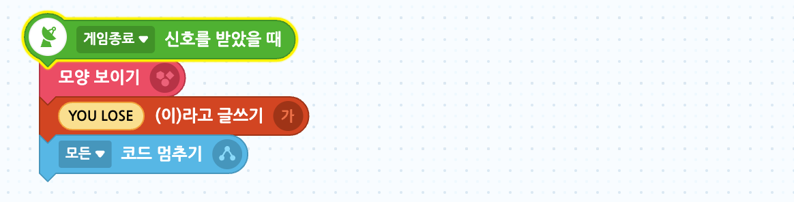

# 17. 벽돌깨기 게임(수정중)

🙂 이번 시간에는 패들로 공을 받아가며 벽돌을 깨는 게임을 만들어봅니다.  
🚩 복제본을 사용하여 벽돌을 생성할 수 있고, 공이 벽돌에 닿았다는 조건문을 활용해 복제본을 삭제할 수 있습니다. 

🎮  **오늘 만들 게임 완성본**   
[https://naver.me/x2jut0VZ](https://naver.me/x2jut0VZ) 

## 1. 게임 개요

- 

## 2. 게임 제작하기

### 🧩 오브젝트 추가하기

**배경추가**

> 
- '별 헤는 밤' 이라는 배경을 추가해주세요.

**벽돌추가하기**

- 오브젝트 추가하기 > 새로그리기에 들어가서 크기가 128*54인 흰색 사각형을 그려준 후, 저장해줍니다.
- 오브젝트의 이름은 '벽돌'로 설정해주세요.

> 
- '벽돌'오브젝트의 위치와 크기 수치를 조정해주세요. 

**공 추가하기**

- 오브젝트 추가하기 > 새로그리기에 들어가서 크기가 40*40 인 빨간색 원을 그려준 후, 저장해줍니다.
- 오브젝트의 이름은 '공'으로 설정해주세요.

> 
- '공'오브젝트의 위치와 크기, 이동방향 수치를 조정해주세요. 

**패들 추가하기**

- 오브젝트 추가하기 > 새로그리기에 들어가서 크기가 380*44 인 분홍색 사각형을 그려준 후, 저장해줍니다.
- 오브젝트의 이름은 '패들'로 설정해주세요.
> 
- '패들'오브젝트의 위치와 크기 수치를 조정해주세요. 

**글상자 추가하기**

- 글상자를 추가한 후, 화면에 가운데로 옮겨주고 자유롭게 디자인해주세요.

### 🧩 신호 및 변수 추가하기 

**변수추가**

> 
- '벽돌개수' 변수를 추가하고, 눈모양 버튼을 눌러 안보이게 해주세요.

**신호추가** 

> 
- '게임종료', '게임시작' 변수를 추가해주세요.

### 🧩 벽돌 코딩하기

- 벽돌이 복제되도록 해주고 벽돌 개수를 세서 '벽돌개수' 변수값을 변경시켜 줍니다. 
- 복제 될 때마다 x 좌표 값이 변경되도록 하고,  
- 한 줄을 다 채우고나면, x좌표 원위치로 돌아가고, 한 단 내려가기 위해 y좌표를 적당한 크기만큼 내려줍니다.

- 모든 복제본 오브젝트들이 '공' 오브젝트에 닿으면 삭제되고, '벽돌개수' 변수도 감소시켜주세요. 

### 🧩 패들 코딩하기

- 패들이 오른쪽 벽을 넘어가기 전까지, 즉 x좌표가 240이하라면 오른쪽 화살표를 눌렀을 때 패들이 x좌표가 10만큼 바뀌게 해줍니다.
- 패들이 왼쪽 벽을 넘어가기 전까지, 즉 x좌표가 -240이상이라면 왼쪽 화살표를 눌렀을 때 패들이 x좌표가 -10만큼 바뀌게 해줍니다.

### 🧩 공 코딩하기

- 공의 방향을 -60부터 60사이의 무작위수로 설정해주세요.
  

- 블록이 다 나타나기까지 약 2초간 기다렸다가 이동방향으로 3만큼 움직이기를 계속 반복합니다.
- 화면 끝에 닿으면 튕기게 합니다.
- 만일 공이 **패들**에 닿으면, 다시 방향을 '-60부터 60만큼 무작위'로 튕겨지게 합니다.
- 만일 공에 **벽돌**에 닿으면, 방향을 '180 - 공의 방향' 으로 정합니다. 

### 🧩 글상자 코딩하기

- 게임이 시작되었을 때는 글상자를 숨겨주세요.
- 글상자는 게임시작 신호를 받았을 때 계속 기다리다가, 벽돌개수가 0개, 즉 모든 벽돌을 없앴을 때 YOU WIN이라고 쓴 글상자가 보이게 하고 모든 코드를 멈춰줍니다.

- 게임종료 신호를 받으면, YOU LOSE라는 글상자를 보이게 한 후 모든 코드를 멈춥니다.  

<!-- 

 요약 

 -->