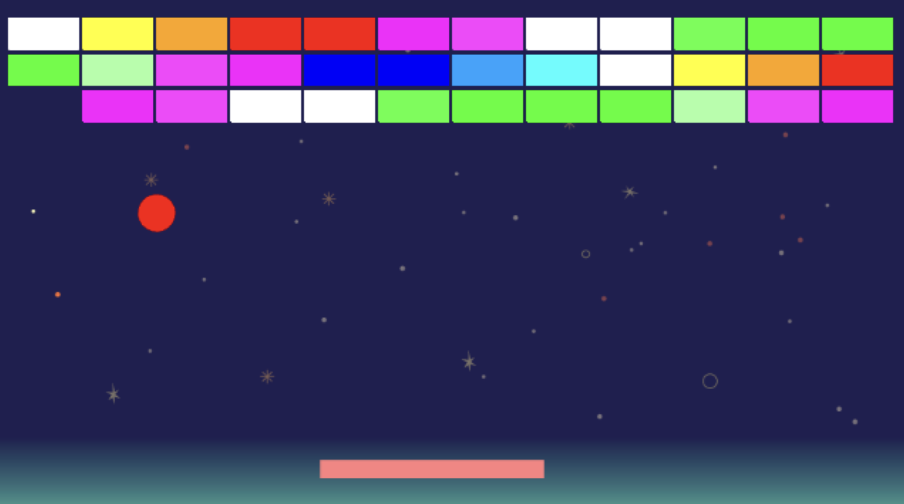
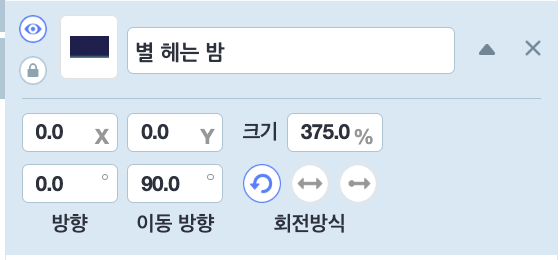
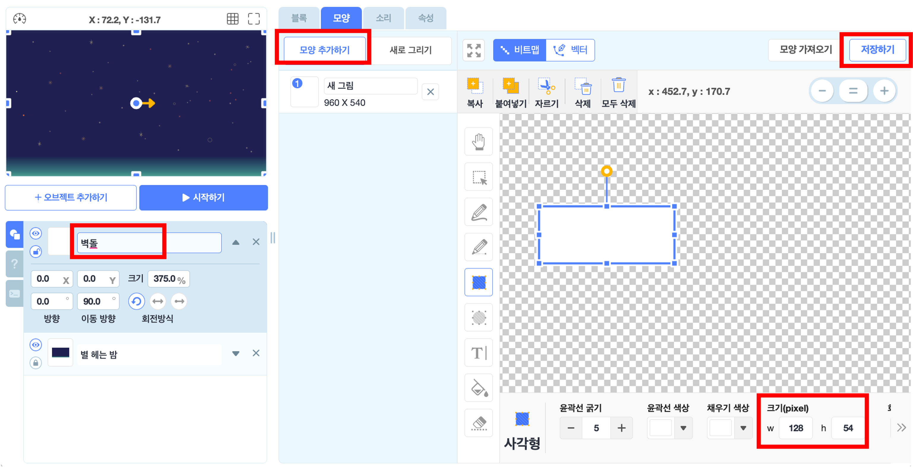
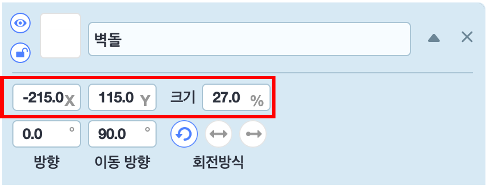
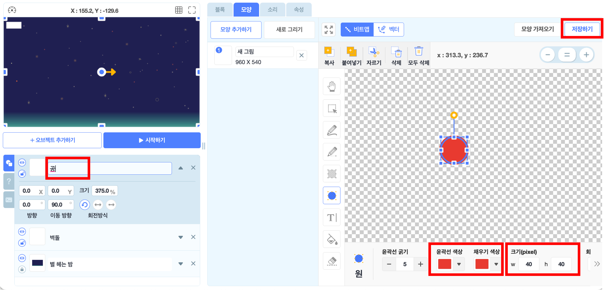
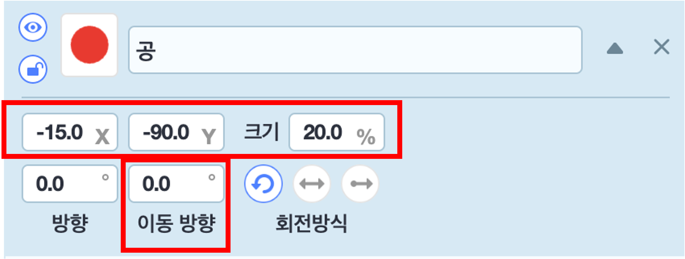
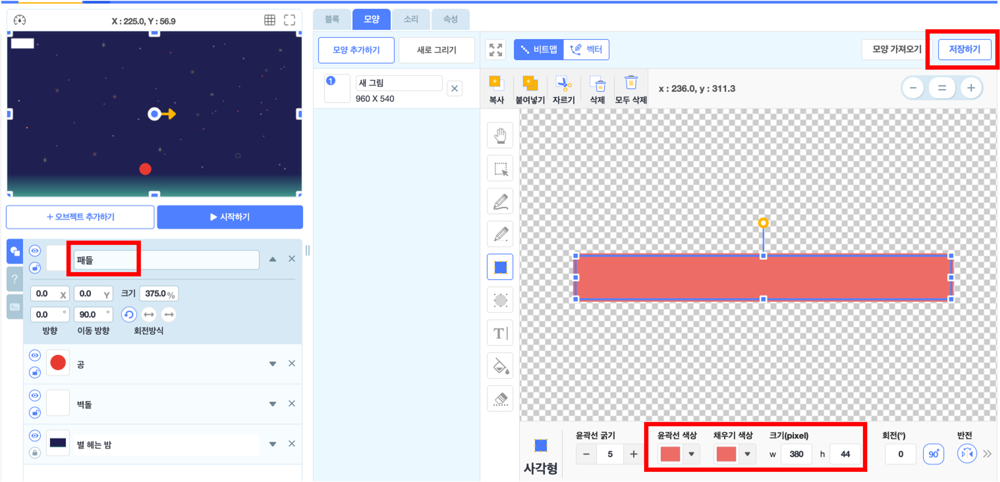
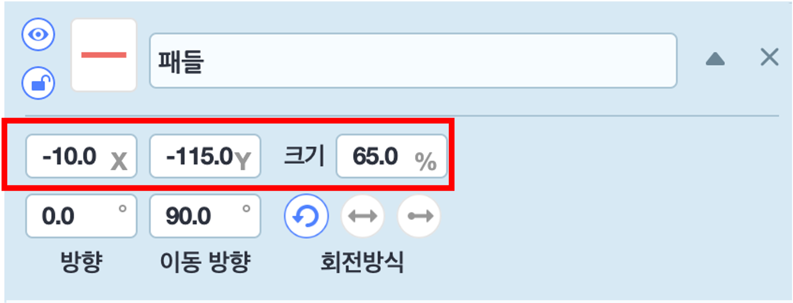
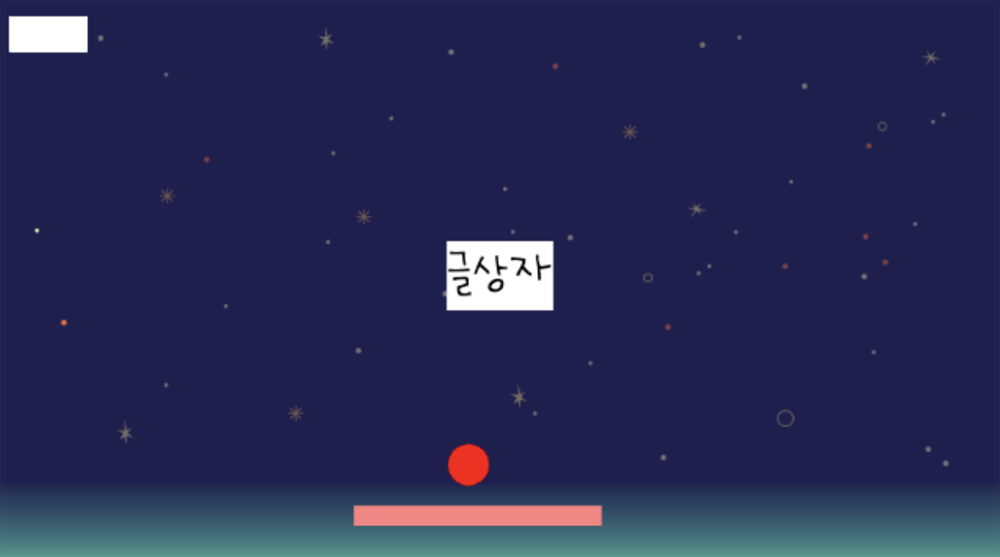
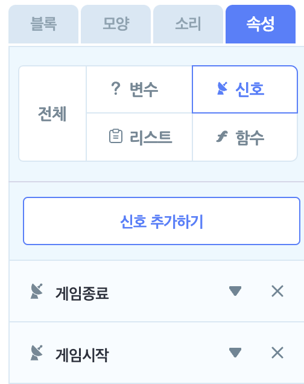

# 17. 벽돌깨기 게임(수정중)

🙂 이번 시간에는 패들로 공을 받아가며 벽돌을 깨는 게임을 만들어봅니다.  
🚩 복제본을 사용하여 벽돌을 생성할 수 있고, 공이 벽돌에 닿았다는 조건문을 활용해 복제본을 삭제할 수 있습니다. 

🎮  **오늘 만들 게임 완성본**   
 

## 1. 게임 개요

- 

## 2. 게임 제작하기

### 🧩 오브젝트 추가하기

**배경추가**

> 
- '별 헤는 밤' 이라는 배경을 추가해주세요.

**벽돌추가하기**

- 오브젝트 추가하기 > 새로그리기에 들어가서 크기가 128*54인 흰색 사각형을 그려준 후, 저장해줍니다.
- 오브젝트의 이름은 '벽돌'로 설정해주세요.

> 
- '벽돌'오브젝트의 위치와 크기 수치를 조정해주세요. 

**공 추가하기**

- 오브젝트 추가하기 > 새로그리기에 들어가서 크기가 40*40 인 빨간색 원을 그려준 후, 저장해줍니다.
- 오브젝트의 이름은 '공'으로 설정해주세요.

> 
- '공'오브젝트의 위치와 크기 수치를 조정해주세요. 

**패들 추가하기**

- 오브젝트 추가하기 > 새로그리기에 들어가서 크기가 380*44 인 분홍색 사각형을 그려준 후, 저장해줍니다.
- 오브젝트의 이름은 '패들'로 설정해주세요.
> 
- '패들'오브젝트의 위치와 크기 수치를 조정해주세요. 

**글상자 추가하기**

- 글상자를 추가한 후, 화면에 가운데로 옮겨주고 자유롭게 디자인해주세요.

### 🧩 신호 및 변수 추가하기 

**변수추가**

> 
- '벽돌개수' 변수를 추가해주세요.

**신호추가** 

> 
- '게임종료', '게임시작' 변수를 추가해주세요.

### 🧩 벽돌 코딩하기

### 🧩 공 코딩하기

### 🧩 패들 코딩하기

### 🧩 글상자 코딩하기

<!-- 

 요약 

 -->