# 18. 전투기 슈팅게임1 (수정중)

🙂 이번 시간에는 슈팅게임을 만들어봅니다. 

🚩 변수, 신호, 복제본 등 다양한 요소를 활용해 게임을 완성할 수 있습니다. 변수를 활용해 공격과 체력을 계산하고 복제본을 사용해 미사일을 구현할 수 있습니다. 

🎮  **오늘 만들 게임 완성본**   
 

## 1. 게임 개요
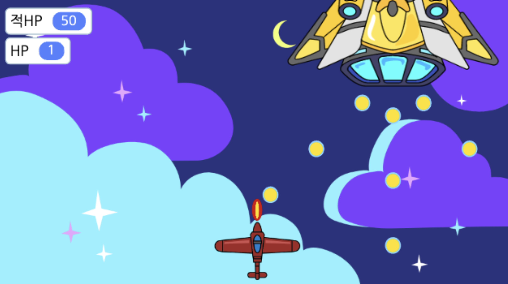
  

## 2. 게임 제작하기

### 🧩 오브젝트 추가하기
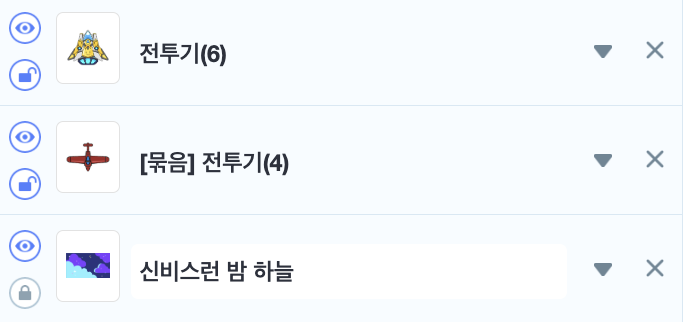
- 전투기(6), [묶음]전투기(4), 신비스런 밤하늘(배경) 을 추가해주세요

- 노란색 전투기의 중심점을 가운데 아래로 옮겨주세요.

> 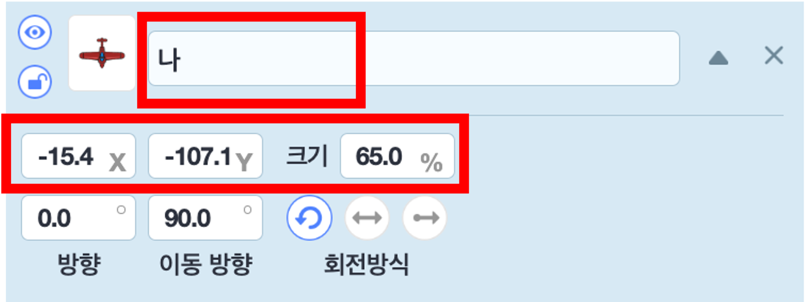
- [묶음]전투기(4)의 이름을 **나**로 변경시키고 위치 및 크기도 조정해주세요. 

> 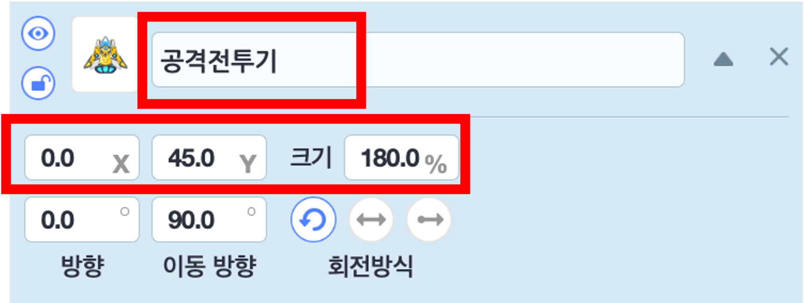
- 전투기(6)의 이름을 **공격전투기**로 변경시키기고 위치 및 크기도 조정해주세요.

> 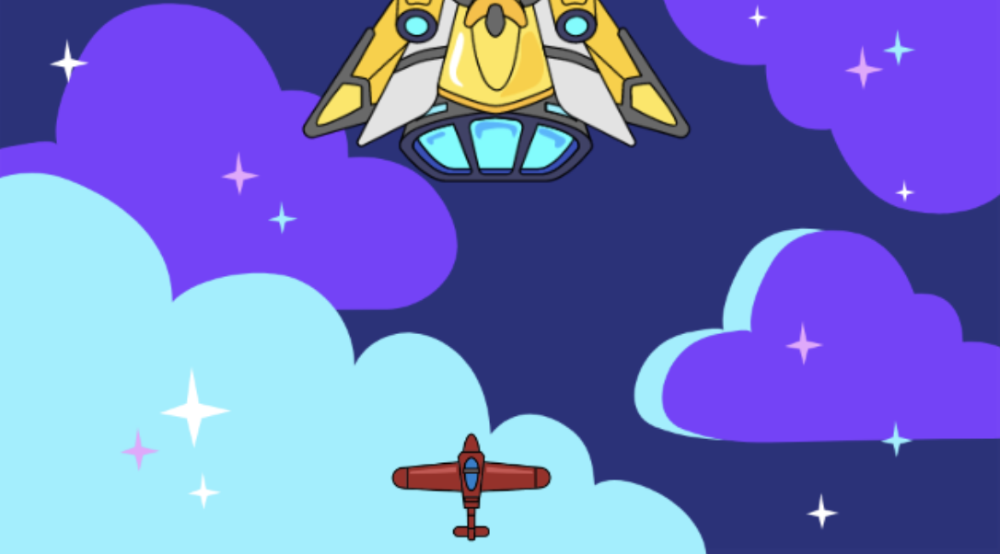
- 나 (전투기)를 180도 회전 시켜 위를 향하도록 변경해주세요.

**글상자추가**

> 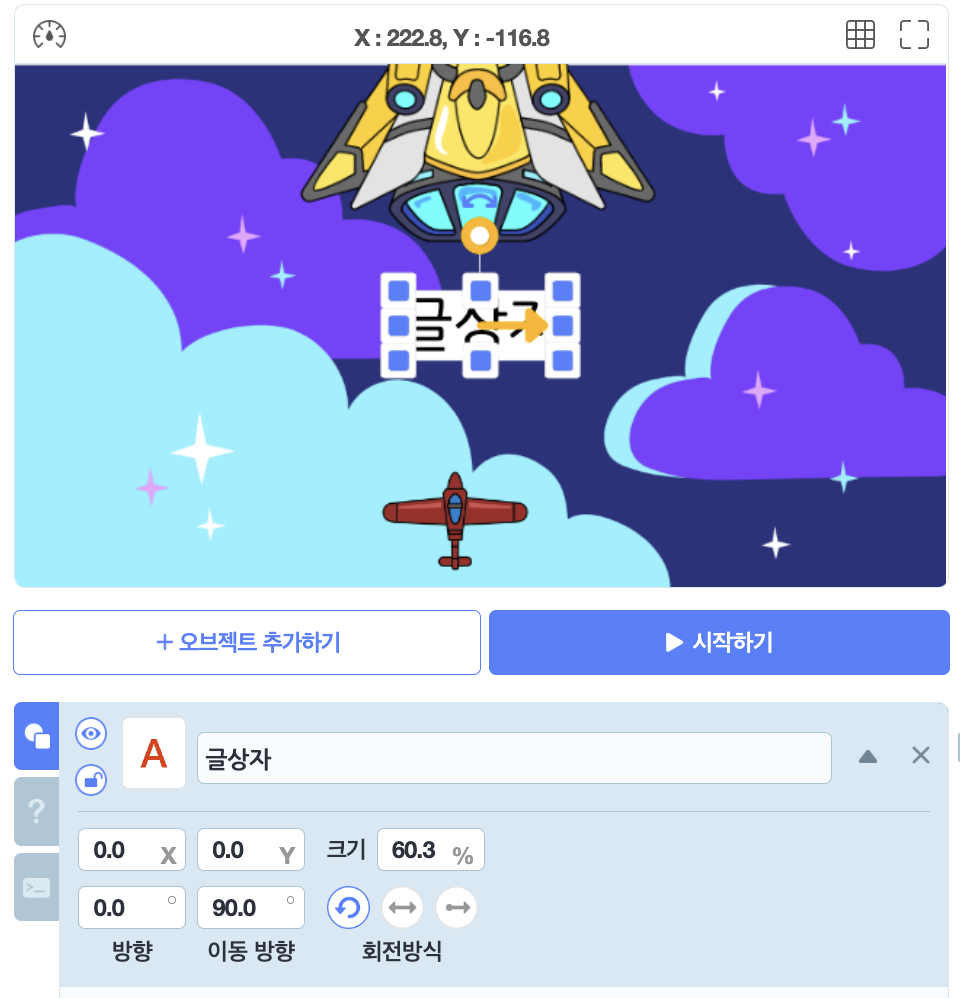
- 글상자를 추가하고 가운데 위치시켜주세요.

**적미사일추가**

> 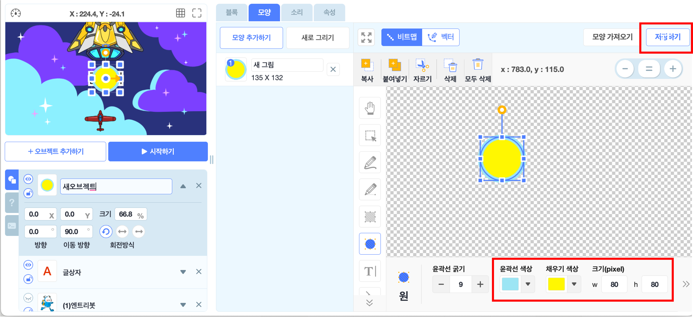
- 오브젝트 추가하기 > 새로그리기로 들어가서 위와 같은 색, 크기를 가진 원을 하나 그리고 저장해주세요. 

> 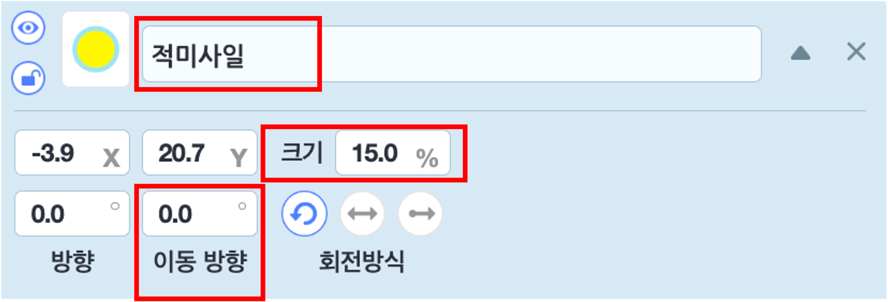
- 오브젝트의 이름을 **적미사일**로 변경하고 크기와 이동방향을 변경해주세요. 

**미사일추가**

> 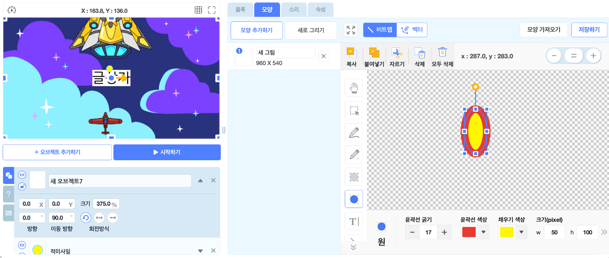
- 오브젝트 추가하기 > 새로그리기로 들어가서 위와 같은 색, 크기를 가진 원을 하나 그리고 저장해주세요. 
> 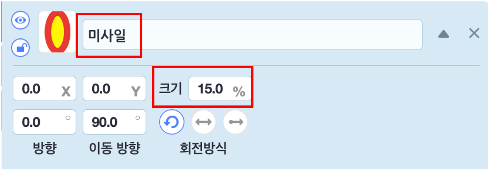
- 오브젝트의 이름을 **미사일**로 변경하고 크기를 변경해주세요. 

**오브젝트 순서조정**
> 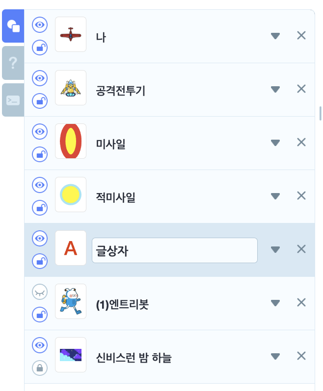
- 여기서 나, 공격전투기 오브젝트가 오브젝트 리스트의 제일 상단에 위치하도록 드래그하여 이동시켜주세요. 

### 🧩 신호 및 변수 추가하기 

**변수추가**

> 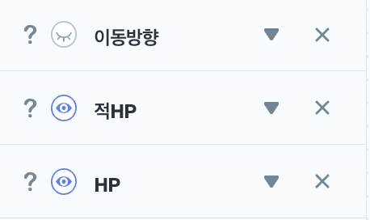

- 이동방향, 적HP, HP 변수를 추가해주세요.
  
  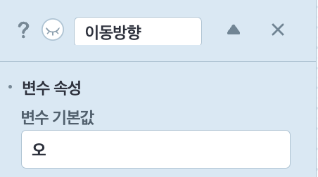
- 이동방향 변수는 숨겨주고 기본 값을 '오'로 설정해주세요. 

**신호추가**
> 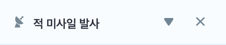
- '적미사일발사'라는 신호를 추가해주세요. 

### 🧩 나 코딩하기 
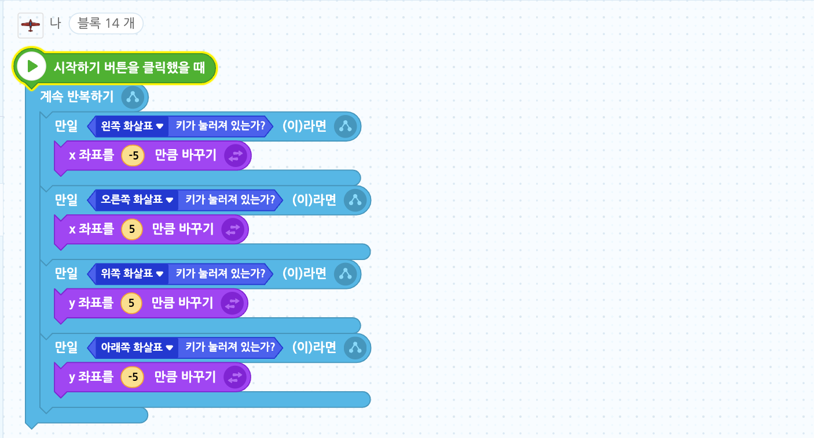
- 내 전투기가 방향키에 따라 움직이도록 '~키를 눌렀는가' 조건문을 사용하여 설정해줍니다.

### 🧩 공격전투기 코딩하기
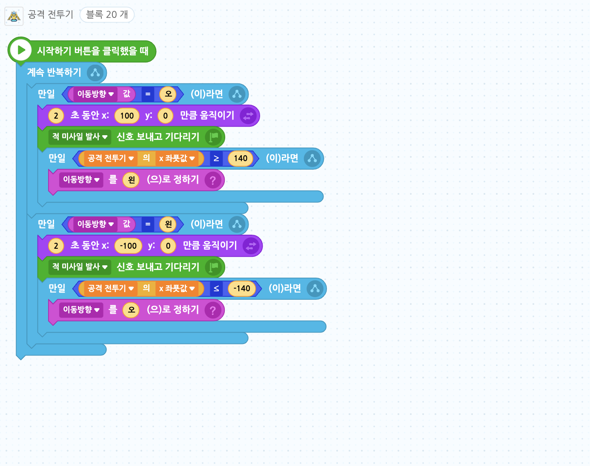
- '이동방향'이라는 변수를 추가하고 기본값을 '오'라고 설정합니다.
- 이동방향이 오른쪽이면 계속해서 쭉 오른쪽으로 이동하도록, 이동방향이 왼쪽이면 계속해서 쭉 왼쪽으로 이동하도록 합니다.
- 적 전투기는 '이동방향' 변수값에 따라 이동하기 때문에, 오브젝트의 x좌표가 140이 이상이 되면 변수값을 '왼'으로 바꾸어 적 전투기가 왼쪽으로 이동하도록 합니다.
- 반대로 오브젝트의 x좌표가 -140 이하면 변수값을 '오'로 바꾸어 적 전투기가 오른쪽으로 이동하도록 합니다
### 🧩 미사일 코딩하기

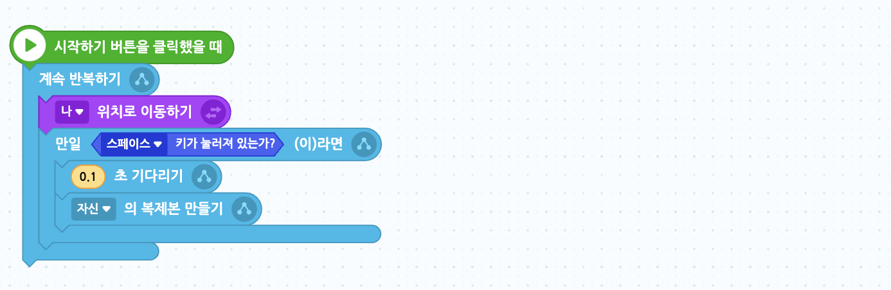
- 게임이 시작되면 '나' 위치로 이동하게 해주세요. 
- 스페이스키를 누르면 자신의 복제본을 만들어줍니다.
  
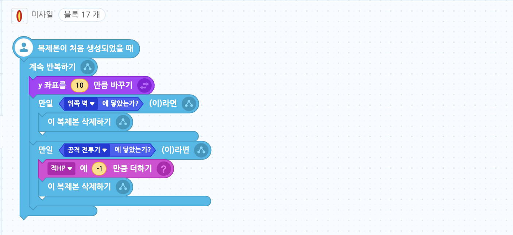
- 만들어진 복제본은 y좌표를 10만큼 바꾸기를 반복하며 위로 쭉 올라갑니다.
- 미사일이 위쪽 벽에 닿거나 공격전투기에 닿으면 생성된 복제본을 삭제해줍니다.
- 미사일이 공격전투기에 닿으면 적hp 변수를 1 줄여줍니다.

### 🧩 적 미사일 코딩하기
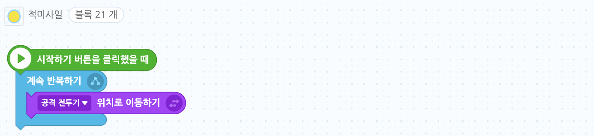
- 게임이 시작되면 '공격전투기' 위치로 이동하게 해주세요. 
  
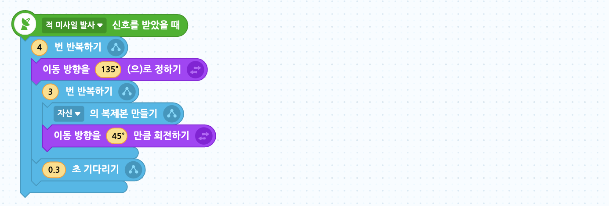

- 적 미사일 발사 신호를 받으면, 총 4번 미사일을 쏘게 합니다.
- 이동방향을 135로 정하고, 한 번 미사일을 쏠 때 3개가 발사되도록 3번 반복하기 블록을 사용합니다.
- 쏠 때 자신의 복제본을 만들고 45도 회전합니다.

  
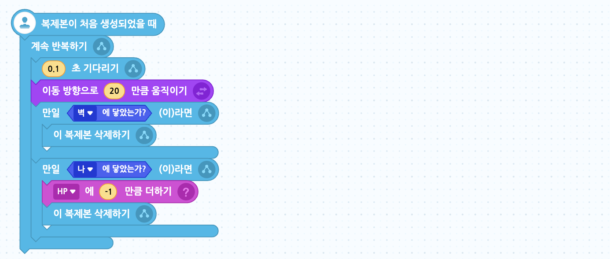

- 만들어진 복제본은 이동방향으로 20만큼 움직이고, 만약 벽이나 내 전투기에 닿으면 복제본이 사라지게 되며, 내 전투기에 닿으면 HP가 -1 됩니다. 
- 신호를 받았을 때 0.3초 기다리기 블록은 4번의 미사일 발사 사이의 간격을 정합니다. 0.3보다 큰 수를 쓰면 미사일이 천천히 4번 발사됩니다.
- 복제본이 생성되었을 때 쓰이는 0.1초 기다리기 블록은 미사일의 속도를 정합니다. 0.1보다 작은 수를 쓰면 미사일이 더욱 빠르게 발사됩니다.

### 🧩 글상자 코딩하기
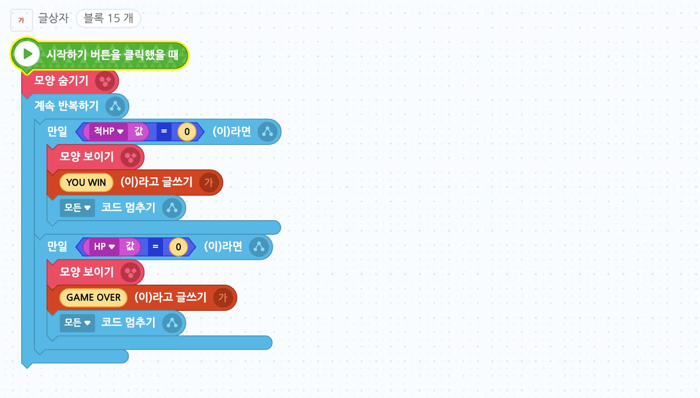
- 게임이 시작되었을 때는 안보이게 해주세요.
- 적HP 값이 0이되면 모양이 나타나고 글상자 내용을 'YOU WIN'으로 바꿔준 후, 모든 코드를 멈추게 합니다. 
- HP 값이 0이되면 모양이 나타나고 글상자 내용을 'GAME OVER'으로 바꿔준 후, 모든 코드를 멈추게 합니다. 