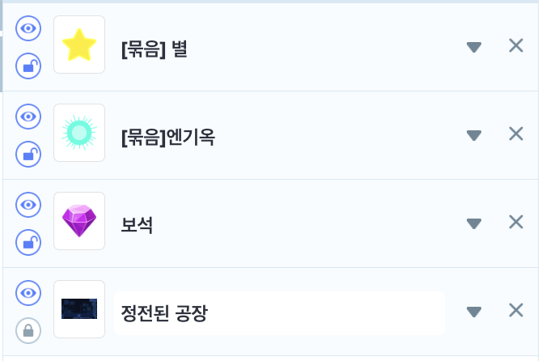
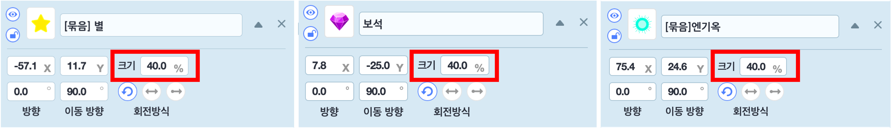
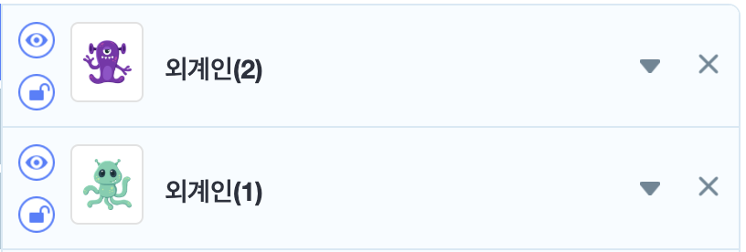
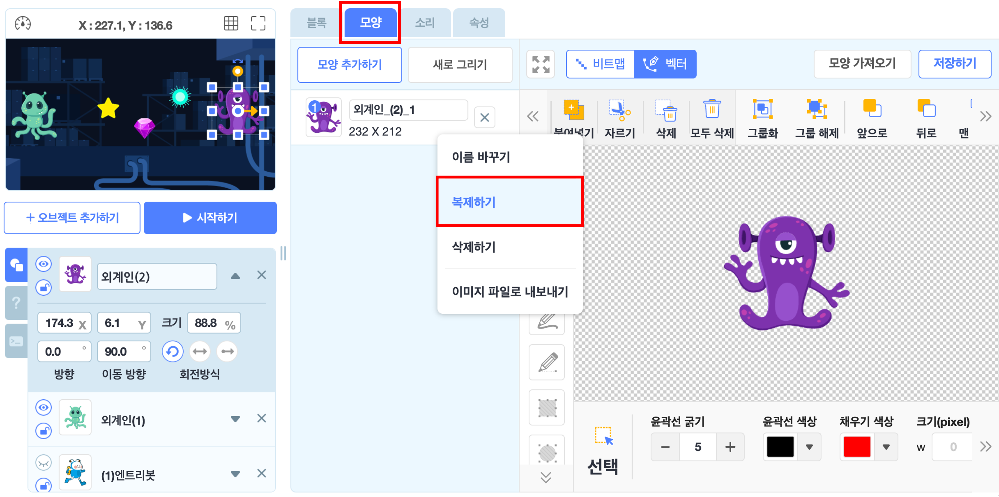
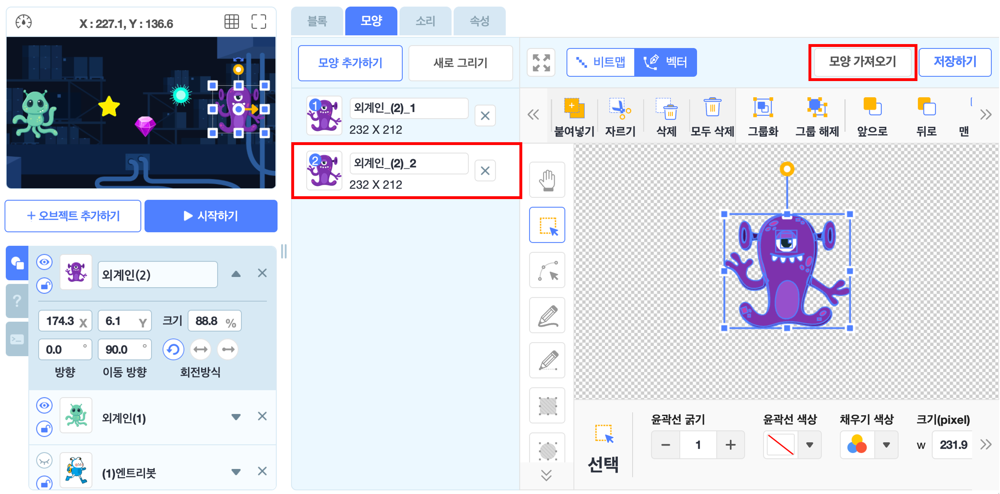
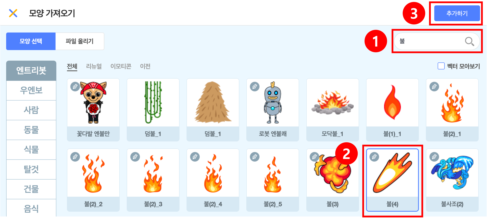
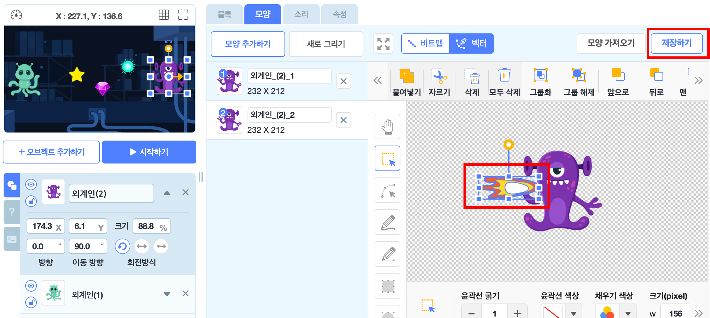
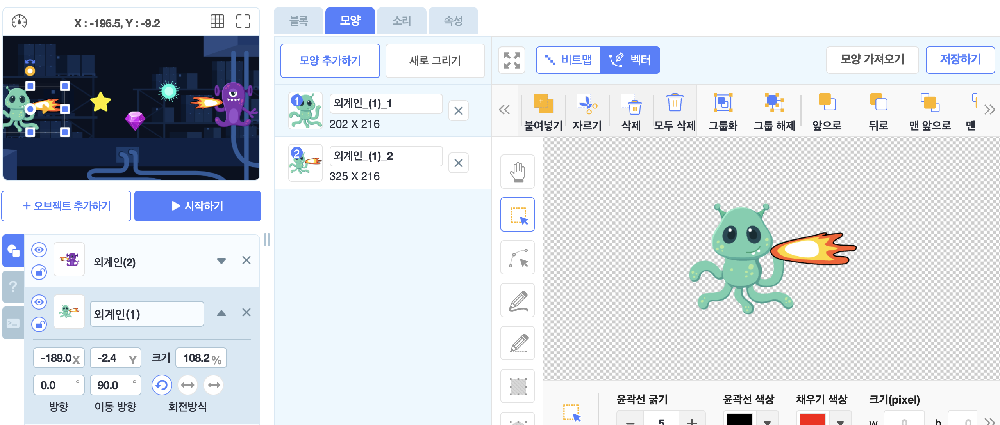
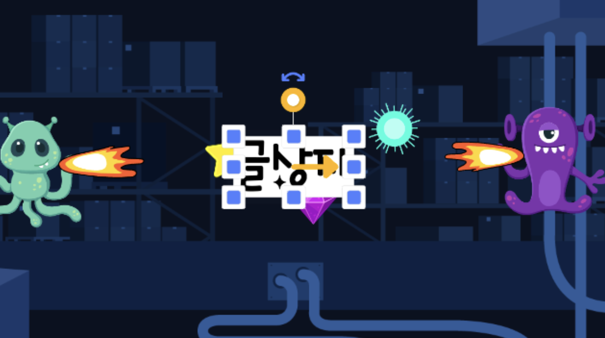

# 2인 외계인 게임(수정중)

🙂 이번 시간에는 2인이 플레이 할 수 있는 게임을 만들어봅니다. 
🚩 한 오브젝트를 복제하고 이를 변형한 오브젝트를 추가한 후, 서로에게 공격하여 변수를 줄어들게 할 수 있으며 아이템을 추가하고 아이템을 통해 변수가 증가하게 만들 수 있습니다. 

🎮  **오늘 만들 게임 완성본**   
[https://naver.me/G1sqWKBz](https://naver.me/G1sqWKBz) 

## 1. 게임 개요

- 

## 2. 게임 제작하기

### 🧩 오브젝트 추가하기
> 
-  [묶음]별, [묶음]엔기옥, 보석, 정전된 공장(배경) 오브젝트를 추가해주세요. 

- 별, 엔기옥, 보석 오브젝트들의 크기는 모두 40으로 설정해주세요. 

> 
- 외계인(1), 외계인(2) 오브젝트를 추가해주세요. 

**불을 뿜는 외계인 만들기**

- 1. 외계인(2) 오브젝트를 선택한 후 '모양' 탭에 들어가서 '외계인_(2)_1'을 선택한 후 마우스 오른쪽 버튼을 클릭하여 '복제하기'를 선택해주세요.

- 2. 복제가 된 '외계인_(2)_2'오브젝트를 선택 후 '모양가져오기'를 선택해주세요. 

- 3. 오브젝트 리스트에서 '불'을 검색한 후 '불(4)'를 선택한 후 '추가하기'를 눌러주세요.

- 4. '불' 오브젝트의 크기 및 위치, 방향을 조정하여 왼쪽으로 불을 뿜는 모양이되게 해주세요. 

- 외계인(1)도 1~4과정을 똑같이 수행하되, 불을 뿜는 방향이 오른쪽이 되도록 해주세요. 

**글상자추가** 

- 글상자를 추가한 후, 화면 가운데에 오게 설정해주세요. 

### 🧩 신호 및 변수 추가하기 

**변수추가**

> 

**신호추가**

> 