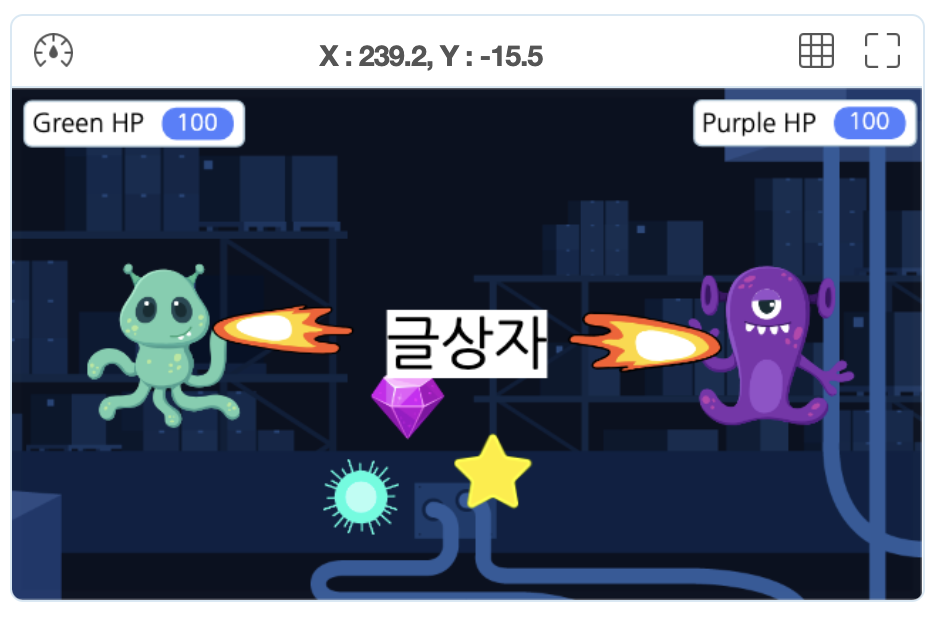
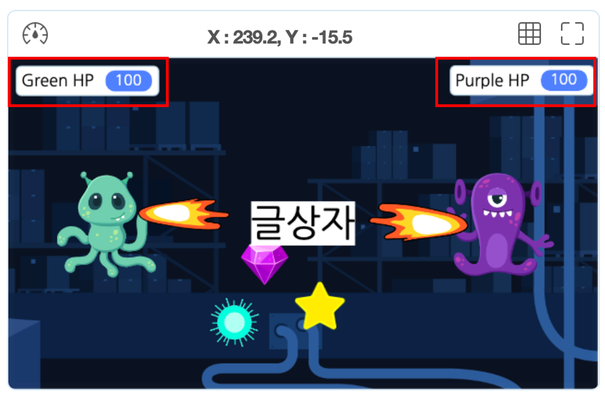
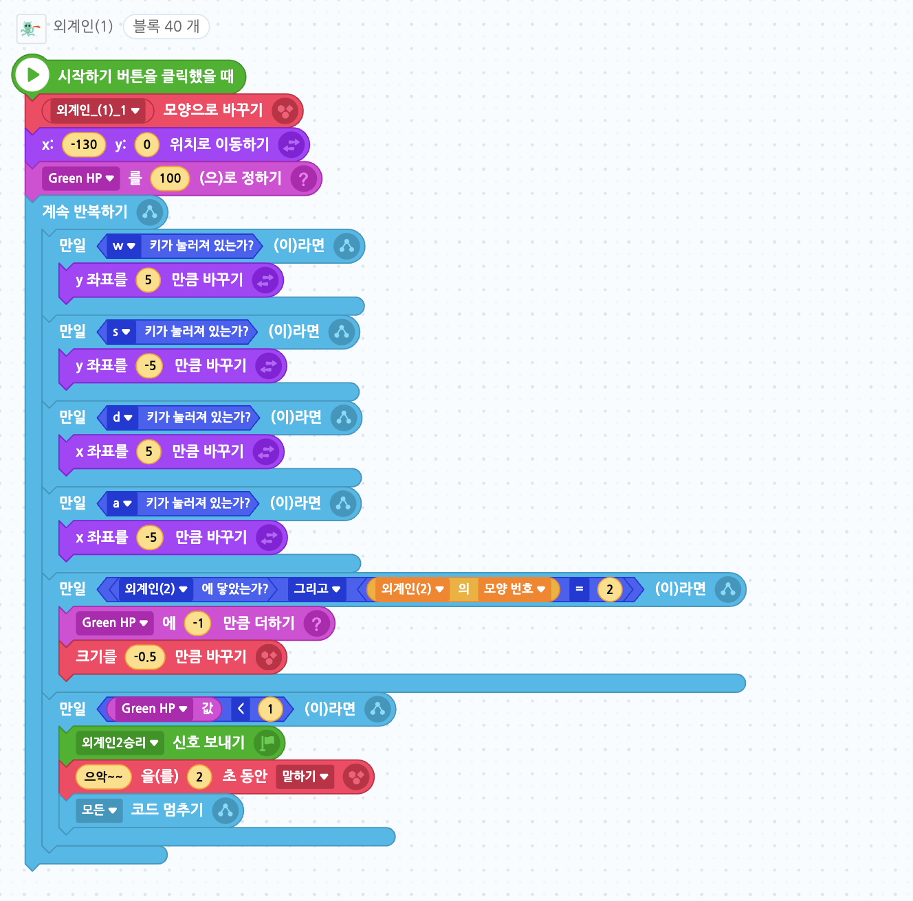
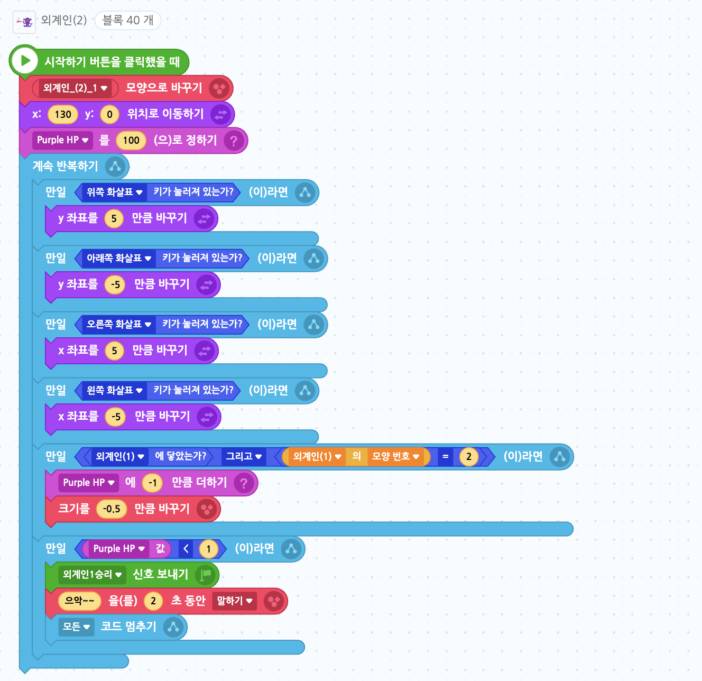

# 2인 외계인 게임

🙂 이번 시간에는 2인이 플레이 할 수 있는 게임을 만들어봅니다. 

🚩 한 오브젝트를 복제하고 이를 변형한 오브젝트를 추가한 후, 서로에게 공격하여 변수를 줄어들게 할 수 있으며 아이템을 추가하고 아이템을 통해 변수가 증가하게 만들 수 있습니다. 

🎮  **오늘 만들 게임 완성본**   
[https://naver.me/5EUF7Lsr](https://naver.me/5EUF7Lsr) 

## 1. 게임 개요

  

## 2. 게임 제작하기

### 🧩 오브젝트 추가하기
> 
-  [묶음]별, [묶음]엔기옥, 보석, 정전된 공장(배경) 오브젝트를 추가해주세요. 

- 별, 엔기옥, 보석 오브젝트들의 크기는 모두 40으로 설정해주세요. 

> 
- 외계인(1), 외계인(2) 오브젝트를 추가해주세요. 

**불을 뿜는 외계인 만들기**

- 1. 외계인(2) 오브젝트를 선택한 후 '모양' 탭에 들어가서 '외계인_(2)_1'을 선택한 후 마우스 오른쪽 버튼을 클릭하여 '복제하기'를 선택해주세요.

- 2. 복제가 된 '외계인_(2)_2'오브젝트를 선택 후 '모양가져오기'를 선택해주세요. 

- 3. 오브젝트 리스트에서 '불'을 검색한 후 '불(4)'를 선택한 후 '추가하기'를 눌러주세요.

- 4. '불' 오브젝트의 크기 및 위치, 방향을 조정하여 왼쪽으로 불을 뿜는 모양이되게 해주세요. 

- 외계인(1)도 1~4과정을 똑같이 수행하되, 불을 뿜는 방향이 오른쪽이 되도록 해주세요. 

**글상자추가** 

- 글상자를 추가한 후, 화면 가운데에 오게 설정해주세요. 

### 🧩 신호 및 변수 추가하기 

**변수추가**

> 
- Purple HP, Green HP 변수를 추가해주세요. 

-  Purple HP는 외계인2,  Green HP 는 외계인1의 각각의 포인트를 의미합니다. 
-  게임 중 실시간으로 HP 확인이 가능하도록 변수의 위치를 외계인 위로 옮겨주세요.
  

**신호추가**

> 
- 외계인1승리, 외계인2승리 신호를 보내주세요.
  
### 🧩 보석 코딩하기 

- 보석이 5초마다 무작위의 위치로 이동하게 해주세요. 

- 외계인1에 닿으면 GreenHP, 외계인2에 닿으면 Purple HP값에 10씩 더해주고 사라지게 해주세요. 
  
### 🧩 별 코딩하기 

- 별이 4초마다 무작위의 위치로 이동하게 해주세요. 

- 외계인1에 닿으면 GreenHP, 외계인2에 닿으면 Purple HP값에 10씩 더해주고 사라지게 해주세요. 

### 🧩 엔기옥 코딩하기 

- 엔기옥이 3초마다 무작위의 위치로 이동하게 해주세요. 

- 외계인1에 닿으면 GreenHP, 외계인2에 닿으면 Purple HP값에 10씩 더해주고 사라지게 해주세요. 

### 🧩 외계인(1) 코딩하기 

- f 키를 누르면, 불을 뿜는 모양으로 잠시 바꼈다 원래 모양으로 돌아오게 해주세요. 
  

- 외계인 초기 위치와 HP를 설정해주세요. 
- wsad 키에 따라 상하좌우로 이동하게 해주세요. 
- 외계인2가 2번 모양(불을 뿜는 상태)일때, 외계인 2에 닿았다면, GreenHP(자신의 HP)를 1만큼 감소시키고 크기도 0.5만큼 감소시켜주세요. 
- GreenHP(자신의 HP)가 1보다 작아졌다면, '외계인2'승리 신호를 보내고 '으악'을 외쳐준 후 모든 코드를 멈쳐주세요. 

### 🧩 외계인(2) 코딩하기 

- 스페이스 키를 누르면, 불을 뿜는 모양으로 잠시 바꼈다 원래 모양으로 돌아오게 해주세요. 
  

- 외계인 초기 위치와 HP를 설정해주세요. 
- 방향 키에 따라 상하좌우로 이동하게 해주세요. 
- 외계인1이 2번 모양(불을 뿜는 상태)일때, 외계인 1에 닿았다면, PurpleHP(자신의 HP)를 1만큼 감소시키고 크기도 0.5만큼 감소시켜주세요. 
- PurpleHP(자신의 HP)가 1보다 작아졌다면, '외계인1'승리 신호를 보내고 '으악'을 외쳐준 후 모든 코드를 멈쳐주세요. 

### 🧩 글상자 코딩하기 

- 게임이 시작되었을 때는 글상자를 숨겨주세요. 

- 글상자의 내용을 '외계인1승리' 신호를 받으면 '외계인1승리'로 '외계인2승리'신호를 받으면 '외계인2승리' 로 바꿔주세요.