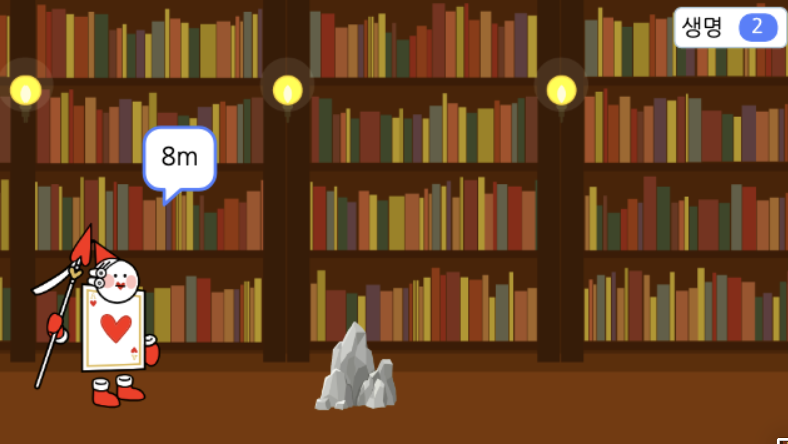

# 20. 점프 게임 2(수정중)

🙂 이번 시간에는 배경이 움직이게 만들고, 다양한 방법으로 장애물을 피하게 해봅니다. 

🚩 회전하며 점프하거나, 슬라이드하는 애니메이션을 만들 수 있습니다. 장애물에 닿을 때마다 목숨이 줄어들도록 변수를 사용하고, 타이머를 사용해 이동한 거리를 표시합니다.

🎮  **오늘 만들 게임 완성본**   
[https://naver.me/5oEHa2TV](https://naver.me/5oEHa2TV) 

## 1. 게임 개요

## 2. 게임 제작하기

### 🧩 오브젝트 추가하기
> 
-  카드병사, 책, 바위장애물, 도서관(배경)2개를 추가해주세요. 

- 카드병사의 '모양' 탭에서 1,5번 모양을 모두 제외하고 삭제해주세요. 

> 
- 각 모양의 이름을 '서있는 카드병사', '쓰러지는 카드병사' 로 변경해주세요.

- 서있는 카드병사의 모양을 좌우반전 시켜주세요. 
  

- 쓰러지는 카드병사도 모양을 좌우반전 시켜주세요. 
  

- 카드병사, 바위, 책의 크기와 위치를 위와 같이 조정해주세요. 

### 🧩 글상자 추가하기 
> 
- 글상자를 추가하고 화면에 가운데 위치시켜주세요. 

### 🧩 신호 및 변수 추가하기 
> 
- 생명과 거리 변수를 추가해주세요. 

> 
- '쿵' 신호를 추가해주세요.

### 🧩 도서관1 코딩하기 

- 배경이 오른쪽에서 왼쪽으로 움직일 수 있도록 코드를 만들어봅니다.
- x좌표를 -3만큼 이동하기를 무한반복합니다.
- 배경의 x좌표가 -480이라면 왼쪽으로 사라진 상태이기 때문에, 다시 오른쪽 끝으로 갈 수 있도록 배경의 x좌표를 480으로 설정해줍니다.

### 🧩 도서관 코딩하기 

-  하지만 배경이 움직일 때 빈 화면이 보이는 것을 확인할 수 있습니다.
- 그래서 배경을 두 개 이어주어야 합니다.
- 이 배경 오브젝트는 시작점을 (0,0)이 아닌 (480, 0)으로 설정해줍니다.
- 똑같이 x좌표를 -3만큼 바꿔주면서, 역시 배경의 x좌표가 -480이 되면 (480, 0)으로 이동하게 해줍니다.

### 🧩 바위 코딩하기 

- 장애물 오브젝트를 추가합니다.
- 장애물은 계속 나와야하기 때문에 '자신의 복제본 만들기' 블록을 사용합니다.
- 장애물을 장면 오른쪽에 위치시키고 숨긴 후, '1~5 무작위 수'초 기다렸다가 나오게 합니다.

- 복제되었을 때 보이게 하고, 장애물이 왼쪽으로 계속 이동하게 합니다. 
- 왼쪽 벽에 닿을 때까지 또는 장애물이 끝까지 움직였을 때까지 x좌표를 -7만큼 바꿔 움직이게 합니다.
- 장애물이 캐릭터에 닿으면 닿았다는 신호를 보내고 사용한 복제본은 삭제해줍니다.
- 캐릭터에 닿지 않았어도 왼쪽벽에 닿아도 복제본을 삭제합니다.

### 🧩 책 코딩하기

- 책 장애물도 계속 나와야하기 때문에 '자신의 복제본 만들기' 블록을 사용합니다.
- 장애물을 장면 오른쪽에 위치시키고 숨긴 후, '1~5 무작위 수'초 기다렸다가 나오게 합니다.
  

- 복제되었을 때 보이게 하고, 장애물이 왼쪽으로 계속 이동하게 합니다. 
- 왼쪽 벽에 닿을 때까지 또는 장애물이 끝까지 움직였을 때까지 x좌표를 -7만큼 바꿔 움직이게 합니다.
- 장애물이 캐릭터에 닿으면 닿았다는 신호를 보내고 사용한 복제본은 삭제해줍니다.
- 캐릭터에 닿지 않았어도 왼쪽벽에 닿아도 복제본을 삭제합니다.

### 🧩 카드병사 코딩하기 

- 카드병사의 초기 모양과 초기 위치를 설정해주세요. 
- 거리변수를 0으로 초기화하고 변수를 숨겨주세요. 
  
- 거리를 구하기 위해서 사실은 타이머를 사용합니다.
- 소수점이 나오지 않도록 반올림을 사용합니다.
- 몇 미터를 달렸는지 말할 수 있도록 변수와 '말하기'를 결합하여 표시합니다.
  
- 스페이스키를 누르면 회전하면서 점프하도록하고, 
- 아래쪽 화살표를 누르면 쓰러지면서 아래로 이동하도록 해주세요. 
  

- 장애물에 닿아서 쿵 신호를 받으면 생명이 1 감소하게 해주세요. 

### 🧩 글상자 코딩하기 

- 생명을 5로 초기화해주세요. 
- 생명이 0이 되면, 이동거리를 보여주며 모든 코드가 종료되게 해주세요.