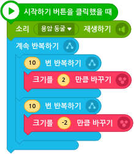
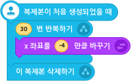

# 21. 웨이브 게임 

🚩 

🎮  **오늘 만들 게임 완성본**   
[https://naver.me/G1sqWKBz](https://naver.me/G1sqWKBz) 

🎮  **엔트리 템플릿 파일 다운받기**   
[https://naver.me/Gq8Ay1ZZ](https://naver.me/Gq8Ay1ZZ)

## 1. 게임 개요

## 2. 게임 설계하기

## 오브젝트 선정하기 

### 🎞️ 시작화면 

> 

### 🎞️ 게임화면 

> 
  
### 🎞️ 종료화면 

> 
  

## 필요한 기능 생각해보기

게임을 완성하기 위해서 각 오브젝트마다 어떤 기능들이 필요할까요?

### 🎞️ 시작화면 
- 제목 
  - 크기가 커졌다 작아지는 애니메이션
- 시작버튼
  - 마우스 포인터가 버튼 위로 올라가면 투명해지는 애니메이션 
  - 버튼을 클릭하면 투명해지고 시작 소리를 재생하고 게임 시작화면으로 전환하기 
- 애니메이션 
  - 화면에서 배경에 애니메이션 보여주기

### 🎞️ 게임화면 

- 점수화면 
  - 시간에 따라 점수보여주기 
- 화살표 
  - 게임을 시작하면 단계나 위쪽, 아래쪽에 닿았을때 게임 끝내기
  - 스페이스키,마우스를 누르면 45도 위를 보기
  - 스페이스키, 마우스를 누르지 않았을때 45도 아래보기
  - 점수 계산하기
  - 타이머 초기화 및 시작 
  - 게임종료 시, 효과음 재생하기
  - 게임종료 시, 자신의 다른 코드와 다른 오브젝트들의 코드 멈추기 
  - 게임 종료시, 점점 커지며 사라지는 애니메이션 
- 꼬리 
  - 화살표가 움직이는 방향에 따라서 꼬리 길게 만들기
- 단계 
  - 화살표의 이동에 따라 움직이기 

  
### 🎞️ 종료화면 
- 재시작 .
  - 버튼을 누르면 다시 게임 시작하기 
  - 커졌다 작아지는 애니메이션 
  - 마우스를 올리면 투명해지는 애니메이션 
  
- 점수
  - 획득한 점수를 보여주기

## 알고리즘 구상하기 

각 기능을 만들기위해 어떤 방법을 사용하면 될까요? 하나씩 생각해봅시다.
- 게임을 시작할때 'WAVE' 문구가 커졌다 올라갔다를 반복하는 모습을 만들기 위해서는 어떻게 해야할까요?

- 각 버튼들에 마우스가 닿으면 약간 투명해지기 위해서는 어떻게 해야할까요? 그리고 해당 버튼을 클릭한 것을 어떻게 확인할 수 있을까요?
- 단계에서 4가지의 모양을 이어붙여서 하나의 그림처럼 움직이게 하려면 어떻게 해야할까요?
- 화살표 뒤의 꼬리가 지나간길을 따라 이어지려면 어떻게 해야할까요?

## 3. 게임 제작하기

## 🎞️ 장면1 :시작화면 

### 🧩 오브젝트 코딩하기

 제목 

 시작버튼 

 애니메이션 

## 🎞️ 장면2 :게임화면 

### 🧩 오브젝트 코딩하기

 점수화면 

 화살표 

 꼬리 

 단계 

## 🎞️ 장면3 :종료화면 

### 🧩 오브젝트 코딩하기

 재시작버튼 

 점수 

