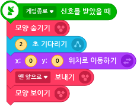

# 22. 무한의계단 게임 

🚩 

🎮  **오늘 만들 게임 완성본**   
 

🎮  **엔트리 템플릿 파일 다운받기**   

## 1. 게임 개요

## 2. 게임 설계하기

## 오브젝트 선정하기 

### 🎞️ 시작화면 

### 🎞️ 게임화면 

  

## 필요한 기능 생각해보기

### 🎞️ 시작화면 

### 🎞️ 게임화면 

  

## 알고리즘 구상하기 

## 3. 게임 제작하기

## 🎞️ 장면1 :시작화면 

### 🧩 오브젝트 코딩하기

 캐릭터 

 시작 버튼 

## 🎞️ 장면2 :게임화면 

### 🧩 오브젝트 코딩하기

 제어자 

 소리재생 

 현재기록 

 제한시간 게이지 

 계단 

 바닥센서 

 캐릭터 

 재시작 

 

 게임종료 

제어자-소리- 현재기록 제한시간게이지 -계단-바닥센서 -캐릭터  - 재 시작 - 게임종료 