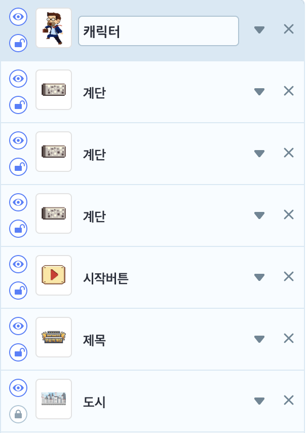

# 22. 무한의계단 게임

🎮 **오늘 만들 게임 완성본**\
[https://naver.me/57VmJZbu](https://naver.me/57VmJZbu)

🎮 **엔트리 템플릿 파일 다운받기**\
[https://naver.me/FdCxUVfs](https://naver.me/FdCxUVfs)

## 1. 게임 개요

## 2. 게임 설계하기

## 오브젝트 선정하기

### 🎞️ 시작화면

> 

### 🎞️ 게임화면

 

## 필요한 기능 생각해보기

### 🎞️ 시작화면

* 캐릭터
  * 계단을 오르는 모션
* 시작버튼
  * 작아졌다 커졌다를 반복하기
  * 버튼을 클릭하면 게임 시작하도록 하기

### 🎞️ 게임화면

* 제어자
  * 장면이 시작되면, 게임시작 신호 보내기
  * 변수 초기값 설정하기
  * 계단복제, 게임시작 신호 보내기
  * 게임 시작 신호를 받으면 소리 재생하기
* 소리
  * 소리재생 신호를 받았을 때 특정 소리 재생하기
  * 게임종료 신호를 받았을 때 모든 소리 멈추기
* 현재기록
  * 게임 중, 현재기록(점수)을 화면에 보여주기
  * 게임 종료 후에도 최종기록(점수)을 화면에 보여주기
* 제한시간게이지
  * 한 계단에 머물러 있는 제한 시간이 줄어드는 모션을 주기
  * 제한 시간에 도달했을 때, 게임 종료 신호 보내기
  * 제한 시간이 끝나기 전, 다음 계단으로 이동했다면 제한 시간 초기화 하기
* 계단
  * 게임을 시작하면 첫 화면에 보여줄 계단 13개 랜덤하게 만들기
  * 캐릭터가 계단을 오르면 계단 높이를 내려주기
  * 가장 아래계단(캐릭터가 올라가있는 계단)위치 확인하기
* 바닥센서
  * 캐릭터의 이동에 따라 함께 움직이기
  * 계단에 닿았는지 안닿았는지 확인하기
* 캐릭터
  * 계단 오르는 모션 만들기
  * 계단에서 떨어지면 떨어지는 모션을 보여주고 게임 끝내기
* 재시작
  * 버튼을 누르면 게임 다시 시작하기
* 게임종료
  * 게임 종료 시 등장하기

## 3. 게임 제작하기

## 🎞️ 장면1 :시작화면

### 🧩 오브젝트 코딩하기

캐릭터

시작 버튼

## 🎞️ 장면2 :게임화면

### 🧩 오브젝트 코딩하기

제어자

소리재생

현재기록

제한시간 게이지

계단

바닥센서

캐릭터

재시작

게임종료

